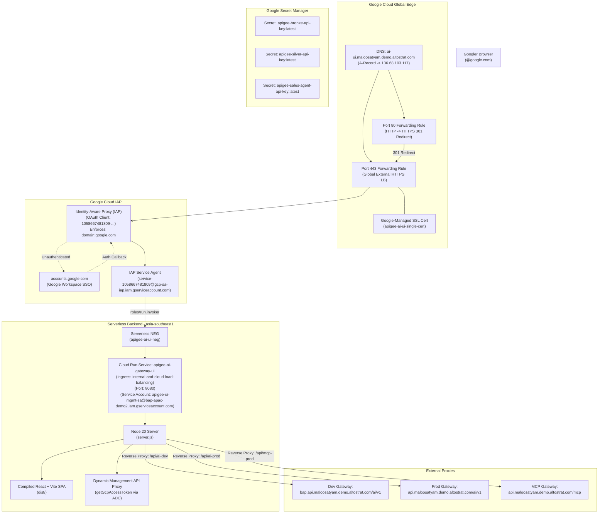

# Cloud Run UI & Identity-Aware Proxy (IAP) Deployment Guide

> **Document Status**: Production / Active Baseline  
> **Last Updated**: 2026-09-08  
> **Environment**: Google Cloud Platform (`bap-apac-demo2`)  
> **Region**: `asia-southeast1` (Cloud Run) / `global` (Load Balancer & IAP)  
> **Primary Domain**: `ai-ui.maloosatyam.demo.altostrat.com`

---

## 1. Architecture Overview

This deployment hosts the **Apigee AI & Tools Gateway Demonstration UI** as an enterprise-hardened, internal-only web application on Google Cloud. 

To satisfy enterprise compliance and prevent public exposure:
1. **Zero Direct Public Access**: The Cloud Run service enforces `--no-allow-unauthenticated` and `--ingress=internal-and-cloud-load-balancing`. The raw `*.run.app` URL returns `403 Forbidden` to the open internet.
2. **Identity-Aware Proxy (IAP)**: All browser sessions are authenticated via Google Workspace SSO and authorized strictly for **`domain:google.com`** accounts.
3. **Dedicated Application Load Balancer**: A Global External HTTPS Application Load Balancer terminates SSL with a Google-managed certificate and forwards authorized traffic to Cloud Run via a Serverless Network Endpoint Group (NEG).
4. **Google Secret Manager Integration (Zero Hardcoded / Plaintext Secrets)**: No API keys or credentials exist in the Git repository or as plaintext environment variables. Cloud Run binds secrets directly from **Google Secret Manager** (`apigee-bronze-api-key`, `apigee-silver-api-key`, `apigee-sales-agent-api-key`). An entrypoint script at container boot reads these injected secrets and exposes them to the frontend runtime in browser memory.
5. **Dedicated IAP Service Agent**: Cloud Run authorizes the Google-managed IAP service agent (`service-[PROJECT_NUMBER]@gcp-sa-iap.iam.gserviceaccount.com`) with `roles/run.invoker` to seamlessly proxy authenticated user sessions.



---

## 2. Infrastructure Inventory & Resources

All resources are provisioned in Google Cloud project **`bap-apac-demo2`**:

| Component | Resource Name / ID | Configuration Details |
| :--- | :--- | :--- |
| **Static External IP** | `apigee-ai-ui-ip` | **`136.68.103.117`** (Global IPv4) |
| **Cloud Run Service** | `apigee-ai-gateway-ui` | Region: `asia-southeast1`<br>Port: `8080`<br>Ingress: `internal-and-cloud-load-balancing`<br>Auth: `--no-allow-unauthenticated` |
| **Cloud Run Management SA** | `apigee-ui-mgmt-sa@bap-apac-demo2.iam.gserviceaccount.com` | Directly queries Apigee Management API via Metadata Server (no static API key env vars required) |
| **Artifact Registry** | `cloud-run-source-deploy` | `asia-southeast1-docker.pkg.dev/bap-apac-demo2/cloud-run-source-deploy/apigee-ai-gateway-ui:latest` |
| **Serverless NEG** | `apigee-ai-ui-neg` | Region: `asia-southeast1`<br>Target: Cloud Run `apigee-ai-gateway-ui` |
| **Backend Service** | `apigee-ai-ui-backend` | Scheme: `EXTERNAL_MANAGED`<br>Backend: `apigee-ai-ui-neg`<br>IAP: **Enabled** |
| **IAP OAuth Client** | `Apigee AI UI` | Client ID: `1058667481809-6skumftl6n16t2r2phgua0i989j4seji.apps.googleusercontent.com` |
| **IAP Service Agent** | `service-1058667481809@gcp-sa-iap.iam.gserviceaccount.com` | Provisioned via `iap.googleapis.com`<br>Role: `roles/run.invoker` on Cloud Run |
| **IAP Access IAM** | `roles/iap.httpsResourceAccessor` | `domain:google.com`<br>`user:maloosatyam@google.com` |
| **SSL Certificate** | `apigee-ai-ui-single-cert` | Google-managed for `ai-ui.maloosatyam.demo.altostrat.com`<br>Status: **ACTIVE** |
| **URL Map (HTTPS)** | `apigee-ai-ui-url-map` | Default service: `apigee-ai-ui-backend` |
| **Target HTTPS Proxy** | `apigee-ai-ui-target-proxy` | Map: `apigee-ai-ui-url-map`<br>Cert: `apigee-ai-ui-single-cert` |
| **HTTPS Forwarding Rule** | `apigee-ai-ui-forwarding-rule` | IP: `136.68.103.117`, Port: `443` |
| **HTTP Redirect URL Map** | `apigee-ai-ui-http-redirect` | `httpsRedirect: true`, `redirectResponseCode: MOVED_PERMANENTLY_DEFAULT` |
| **Target HTTP Proxy** | `apigee-ai-ui-http-proxy` | Map: `apigee-ai-ui-http-redirect` |
| **HTTP Forwarding Rule** | `apigee-ai-ui-http-forwarding-rule` | IP: `136.68.103.117`, Port: `80` |

---

## 3. UI Container & Runtime Architecture

### A. Production Node.js Server & Runtime Injection ([`ui/server.js`](file:///Users/maloosatyam/Codebase/AI%20Code/ui/server.js))
The UI container uses a lightweight Node.js runtime server ([`ui/server.js`](file:///Users/maloosatyam/Codebase/AI%20Code/ui/server.js)) serving static SPA assets and acting as an API gateway proxy & management server.

1. **Dynamic `/env-config.js` Generation**:
   At runtime, GET `/env-config.js` generates JavaScript setting `window.__RUNTIME_CONFIG__` on the client browser.

2. **Management API & User Auto-Provisioning (`/api/me`)**:
   On website load, `/api/me` extracts the SSO identity header (`X-Goog-Authenticated-User-Email`) passed by IAP. Using the Cloud Run Service Account (`apigee-ui-mgmt-sa@bap-apac-demo2.iam.gserviceaccount.com`), it automatically:
   - Verifies/creates the user's Apigee Developer profile (`userName: username`).
   - Provisions a user-specific `Unified Admin <USERNAME> App` attached to `Enterprise AI Tier` and `Enterprise Tools MCP`.
   - Configures `PREPAID` monetization and adds a **$20 USD** initial wallet balance.
   - Fetches shared consumer keys for the global [`Unified Sales App`](https://pantheon.corp.google.com/apigee/apps/view/8d1ec4bd-c872-4764-bf50-c64728fe95ec?e=13802955&mods=monitoring_api_prod&project=bap-apac-demo2) and [`Unified Loans App`](https://pantheon.corp.google.com/apigee/apps/view/c04f8fee-0484-471b-84b6-3c961c79d777?e=13802955&mods=monitoring_api_prod&project=bap-apac-demo2).

3. **Management API Proxy Handlers**:
   Management endpoints (`/api/analytics/fleet-stats`, `/api/monetization/attributions`, `/api/monetization/rateplans`, `/api/monetization/subscriptions`, `/api/monetization/config`, `/api/monetization/credit`, `/api/kvm/rates`) acquire OAuth access tokens directly from the Cloud Run Metadata Server (`http://metadata.google.internal/computeMetadata/v1/instance/service-accounts/default/token`) and execute Apigee REST calls server-side.

4. **Gateway Reverse Proxying & Header Sanitization**:
   - `/api/ai-prod/*` $\rightarrow$ `https://api.maloosatyam.demo.altostrat.com/ai/v1/*`
   - `/api/claude-prod/*` $\rightarrow$ `https://api.maloosatyam.demo.altostrat.com/v1/messages/*`
   - `/api/vertexai-prod/*` $\rightarrow$ `https://api.maloosatyam.demo.altostrat.com/vertexai/v1/*`
   - `/api/mcp-prod/*` $\rightarrow$ `https://api.maloosatyam.demo.altostrat.com/mcp/*`
   - Automatically strips hop-by-hop and encoding headers (`content-encoding`, `content-length`, `transfer-encoding`) to prevent client browser decompression mismatches.

---

## 4. DNS Mapping & Domain Status

The DNS `A` record for **`maloosatyam.demo.altostrat.com`** is active:

| Hostname / Subdomain | Record Type | Value / IPv4 Address | Status |
| :--- | :--- | :--- | :--- |
| **`ai-ui`** | **A** | **`136.68.103.117`** | **Active / Propagated** |

- **HTTPS (Port 443)**: Terminated by `apigee-ai-ui-forwarding-rule` using `apigee-ai-ui-single-cert` (**Status: ACTIVE**).
- **HTTP (Port 80)**: Terminated by `apigee-ai-ui-http-forwarding-rule`, automatically returning `301 Moved Permanently` redirecting to `https://ai-ui.maloosatyam.demo.altostrat.com:443/`.

---

## 5. Operations & Maintenance Playbook

### A. Rebuilding & Updating the UI
Whenever you modify UI code under `ui/`:

1. **Build production SPA assets locally**:
   ```bash
   cd ui
   npm run build
   ```
2. **Submit container build to Google Cloud Build**:
   ```bash
   gcloud builds submit --tag asia-southeast1-docker.pkg.dev/bap-apac-demo2/cloud-run-source-deploy/apigee-ai-gateway-ui:latest ui --project=bap-apac-demo2
   ```
3. **Deploy updated image to Cloud Run**:
   ```bash
   gcloud run deploy apigee-ai-gateway-ui \
     --image=asia-southeast1-docker.pkg.dev/bap-apac-demo2/cloud-run-source-deploy/apigee-ai-gateway-ui:latest \
     --region=asia-southeast1 \
     --platform=managed \
     --no-allow-unauthenticated \
     --ingress=internal-and-cloud-load-balancing \
     --service-account=apigee-ui-mgmt-sa@bap-apac-demo2.iam.gserviceaccount.com \
     --project=bap-apac-demo2
   ```
3. **Deploy the updated container to Cloud Run**:
   ```bash
   gcloud run deploy apigee-ai-gateway-ui \
     --image=asia-southeast1-docker.pkg.dev/bap-apac-demo2/cloud-run-source-deploy/apigee-ai-gateway-ui:latest \
     --region=asia-southeast1 \
     --platform=managed
   ```

### B. Rotating Secrets in Secret Manager
To rotate API keys without touching the repository or rebuilding images:

```bash
# Add a new version of the secret
echo -n "<NEW_BRONZE_API_KEY>" | gcloud secrets versions add apigee-bronze-api-key --data-file=-

# Redeploy or update Cloud Run revision to consume latest version
gcloud run services update apigee-ai-gateway-ui \
  --region=asia-southeast1 \
  --update-annotations="last-updated=$(date +%s)"
```

### C. Modifying IAP Access Permissions
To grant access to additional Google Workspace groups or specific team members:
```bash
# Grant access to a Google Group
gcloud iap web add-iam-policy-binding \
  --resource-type=backend-services \
  --service=apigee-ai-ui-backend \
  --member="group:ai-team@google.com" \
  --role="roles/iap.httpsResourceAccessor"

# Grant access to a specific individual
gcloud iap web add-iam-policy-binding \
  --resource-type=backend-services \
  --service=apigee-ai-ui-backend \
  --member="user:engineer@google.com" \
  --role="roles/iap.httpsResourceAccessor"
```

### D. Viewing Live Logs & Telemetry
```bash
# Tail Cloud Run container logs (NGINX access and errors)
gcloud run services logs tail apigee-ai-gateway-ui --region=asia-southeast1

# Inspect Load Balancer request logs
gcloud logging read 'resource.type="http_load_balancer" AND resource.labels.forwarding_rule_name="apigee-ai-ui-forwarding-rule"' --limit=20
```

---

## 6. Troubleshooting Matrix

| Symptom | Probable Cause | Resolution |
| :--- | :--- | :--- |
| **`The IAP service account is not provisioned`** | The Google-managed IAP service agent does not exist or lacks invocation permissions | 1. Create agent: `gcloud beta services identity create --service=iap.googleapis.com`<br>2. Grant role: `gcloud run services add-iam-policy-binding apigee-ai-gateway-ui --region=asia-southeast1 --member="serviceAccount:service-[PROJECT_NUMBER]@gcp-sa-iap.iam.gserviceaccount.com" --role="roles/run.invoker"`<br>3. Redeploy Cloud Run service revision. |
| **`Permission denied on secret: ... for Revision service account`** | Cloud Run service account lacks Secret Manager read access | Run `gcloud projects add-iam-policy-binding bap-apac-demo2 --member="serviceAccount:1058667481809-compute@developer.gserviceaccount.com" --role="roles/secretmanager.secretAccessor"`. |
| **`403 Forbidden` on raw `*.run.app`** | Normal security behavior | Cloud Run direct public access is blocked. Users must navigate via `https://ai-ui.maloosatyam.demo.altostrat.com`. |
| **`You don't have access` (Google Sign-In page)** | User account not in `@google.com` or missing IAP role | Ensure the user logs in with an authorized `@google.com` account or grant `roles/iap.httpsResourceAccessor`. |
| **SSL Certificate Error (`ERR_SSL_VERSION_OR_CIPHER_MISMATCH` / `ERR_CONNECTION_CLOSED`)** | Certificate still in provisioning state | Verify status via `gcloud compute ssl-certificates describe apigee-ai-ui-single-cert --global`. Must show `status: ACTIVE`. |
| **Network Error calling Apigee in UI** | Apigee proxy down or invalid key | Check Gateway Settings modal in UI or inspect `/api/vertexai-dev` proxy rules in Cloud Run. |
