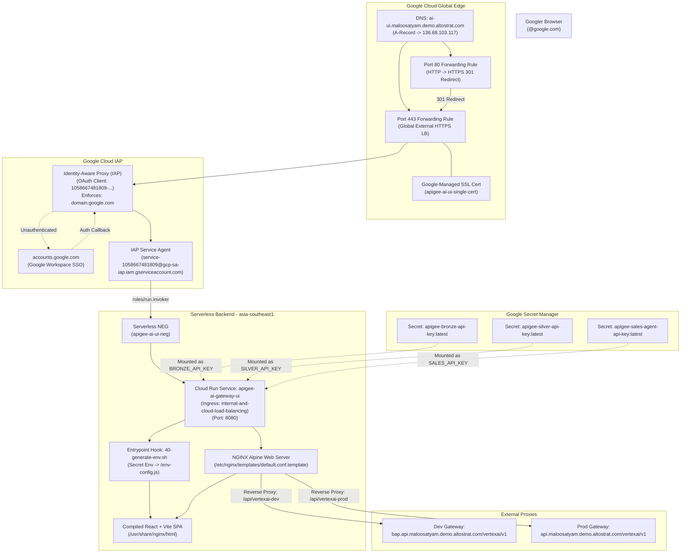

# Cloud Run UI & Identity-Aware Proxy (IAP) Deployment Guide

> **Document Status**: Production / Active Baseline  
> **Last Updated**: 2026-09-08  
> **Environment**: Google Cloud Platform (`bap-apac-demo2`)  
> **Region**: `asia-southeast1` (Cloud Run) / `global` (Load Balancer & IAP)  
> **Primary Domain**: `ai-ui.maloosatyam.demo.altostrat.com`

---

## 1. Architecture Overview

This deployment hosts the **Apigee AI & Tools Gateway Demonstration UI** as an enterprise-hardened, internal-only web application on Google Cloud. 

To satisfy enterprise compliance and prevent public exposure:
1. **Zero Direct Public Access**: The Cloud Run service enforces `--no-allow-unauthenticated` and `--ingress=internal-and-cloud-load-balancing`. The raw `*.run.app` URL returns `403 Forbidden` to the open internet.
2. **Identity-Aware Proxy (IAP)**: All browser sessions are authenticated via Google Workspace SSO and authorized strictly for **`domain:google.com`** accounts.
3. **Dedicated Application Load Balancer**: A Global External HTTPS Application Load Balancer terminates SSL with a Google-managed certificate and forwards authorized traffic to Cloud Run via a Serverless Network Endpoint Group (NEG).
4. **Google Secret Manager Integration (Zero Hardcoded / Plaintext Secrets)**: No API keys or credentials exist in the Git repository or as plaintext environment variables. Cloud Run binds secrets directly from **Google Secret Manager** (`apigee-bronze-api-key`, `apigee-silver-api-key`, `apigee-sales-agent-api-key`). An entrypoint script at container boot reads these injected secrets and exposes them to the frontend runtime in browser memory.
5. **Dedicated IAP Service Agent**: Cloud Run authorizes the Google-managed IAP service agent (`service-[PROJECT_NUMBER]@gcp-sa-iap.iam.gserviceaccount.com`) with `roles/run.invoker` to seamlessly proxy authenticated user sessions.



---

## 2. Infrastructure Inventory & Resources

All resources are provisioned in Google Cloud project **`bap-apac-demo2`**:

| Component | Resource Name / ID | Configuration Details |
| :--- | :--- | :--- |
| **Static External IP** | `apigee-ai-ui-ip` | **`136.68.103.117`** (Global IPv4) |
| **Cloud Run Service** | `apigee-ai-gateway-ui` | Region: `asia-southeast1`<br>Port: `8080`<br>Ingress: `internal-and-cloud-load-balancing`<br>Auth: `--no-allow-unauthenticated` |
| **Cloud Run Runtime SA** | `1058667481809-compute@developer.gserviceaccount.com` | Granted `roles/secretmanager.secretAccessor` |
| **Secret Manager Secrets** | `apigee-bronze-api-key`<br>`apigee-silver-api-key`<br>`apigee-sales-agent-api-key` | Mounted as container environment variables:<br>`BRONZE_API_KEY`, `SILVER_API_KEY`, `SALES_API_KEY` |
| **Artifact Registry** | `cloud-run-source-deploy` | `asia-southeast1-docker.pkg.dev/bap-apac-demo2/cloud-run-source-deploy/apigee-ai-gateway-ui:latest` |
| **Serverless NEG** | `apigee-ai-ui-neg` | Region: `asia-southeast1`<br>Target: Cloud Run `apigee-ai-gateway-ui` |
| **Backend Service** | `apigee-ai-ui-backend` | Scheme: `EXTERNAL_MANAGED`<br>Backend: `apigee-ai-ui-neg`<br>IAP: **Enabled** |
| **IAP OAuth Client** | `Apigee AI UI` | Client ID: `1058667481809-6skumftl6n16t2r2phgua0i989j4seji.apps.googleusercontent.com` |
| **IAP Service Agent** | `service-1058667481809@gcp-sa-iap.iam.gserviceaccount.com` | Provisioned via `iap.googleapis.com`<br>Role: `roles/run.invoker` on Cloud Run |
| **IAP Access IAM** | `roles/iap.httpsResourceAccessor` | `domain:google.com`<br>`user:maloosatyam@google.com` |
| **SSL Certificate** | `apigee-ai-ui-single-cert` | Google-managed for `ai-ui.maloosatyam.demo.altostrat.com`<br>Status: **ACTIVE** |
| **URL Map (HTTPS)** | `apigee-ai-ui-url-map` | Default service: `apigee-ai-ui-backend` |
| **Target HTTPS Proxy** | `apigee-ai-ui-target-proxy` | Map: `apigee-ai-ui-url-map`<br>Cert: `apigee-ai-ui-single-cert` |
| **HTTPS Forwarding Rule** | `apigee-ai-ui-forwarding-rule` | IP: `136.68.103.117`, Port: `443` |
| **HTTP Redirect URL Map** | `apigee-ai-ui-http-redirect` | `httpsRedirect: true`, `redirectResponseCode: MOVED_PERMANENTLY_DEFAULT` |
| **Target HTTP Proxy** | `apigee-ai-ui-http-proxy` | Map: `apigee-ai-ui-http-redirect` |
| **HTTP Forwarding Rule** | `apigee-ai-ui-http-forwarding-rule` | IP: `136.68.103.117`, Port: `80` |

---

## 3. UI Container & Runtime Architecture

### A. Secret Manager Integration & Runtime Injection
To comply with strict security standards prohibiting secrets in source control or plaintext environment variables:

1. **Google Secret Manager Storage**:
   Credentials are stored as encrypted secrets in Google Secret Manager:
   - `apigee-bronze-api-key`
   - `apigee-silver-api-key`
   - `apigee-sales-agent-api-key`

2. **Cloud Run Secret Mounting**:
   Secrets are bound to Cloud Run container environment variables using the `--set-secrets` flag:
   ```bash
   gcloud run services update apigee-ai-gateway-ui \
     --region=asia-southeast1 \
     --set-secrets="BRONZE_API_KEY=apigee-bronze-api-key:latest,SILVER_API_KEY=apigee-silver-api-key:latest,SALES_API_KEY=apigee-sales-agent-api-key:latest"
   ```
   The Cloud Run service account `1058667481809-compute@developer.gserviceaccount.com` is authorized with `roles/secretmanager.secretAccessor`.

3. **Container Boot Generation ([`ui/generate-env.sh`](file:///Users/maloosatyam/Codebase/AI%20Code/ui/generate-env.sh))**:
   At container startup, the NGINX entrypoint executes `/docker-entrypoint.d/40-generate-env.sh`:
   ```sh
   #!/bin/sh
   cat <<EOF > /usr/share/nginx/html/env-config.js
   window.__RUNTIME_CONFIG__ = {
     BRONZE_API_KEY: "${BRONZE_API_KEY:-}",
     SILVER_API_KEY: "${SILVER_API_KEY:-}",
     SALES_API_KEY: "${SALES_API_KEY:-}",
     BRONZE_USER_EMAIL: "${BRONZE_USER_EMAIL:-bronze.user@example.com}",
     SILVER_USER_EMAIL: "${SILVER_USER_EMAIL:-silver.user@example.com}",
     SALES_AGENT_EMAIL: "${SALES_AGENT_EMAIL:-sales.agent@example.com}"
   };
   EOF
   ```

4. **Frontend Dynamic Consumption ([`ui/src/services/defaultSettings.ts`](file:///Users/maloosatyam/Codebase/AI%20Code/ui/src/services/defaultSettings.ts))**:
   ```ts
   export const getRuntimeEnv = (key: string, fallback: string = ''): string => {
     if (typeof window !== 'undefined' && (window as any).__RUNTIME_CONFIG__?.[key]) {
       return (window as any).__RUNTIME_CONFIG__[key];
     }
     const viteVal = (import.meta.env as any)[`VITE_${key}`] || (import.meta.env as any)[key];
     return viteVal !== undefined && viteVal !== '' ? viteVal : fallback;
   };
   ```

5. **HTML Script Injection ([`ui/index.html`](file:///Users/maloosatyam/Codebase/AI%20Code/ui/index.html))**:
   The `/env-config.js` script tag is loaded in `<head>` before the Vite SPA bundles execute.

### B. NGINX Reverse Proxying & SPA Fallback
In **[`ui/nginx.conf.template`](file:///Users/maloosatyam/Codebase/AI%20Code/ui/nginx.conf.template)**:
1. **Dynamic Port Binding**: `listen ${PORT};` substituted automatically by official NGINX entrypoint using `NGINX_ENVSUBST_FILTER="PORT"`.
2. **SPA Routing**: `location / { try_files $uri $uri/ /index.html; }` preserves client-side routing.
3. **Apigee Reverse Proxying**:
   - `/api/vertexai-dev` -> rewrites to `https://bap.api.maloosatyam.demo.altostrat.com/vertexai/v1/$1`
   - `/api/vertexai-prod` -> rewrites to `https://api.maloosatyam.demo.altostrat.com/vertexai/v1/$1`
   - `proxy_ssl_server_name on;` and explicit DNS resolver (`8.8.8.8`) ensure seamless TLS SNI handshakes with Apigee routers.

---

## 4. DNS Mapping & Domain Status

The DNS `A` record for **`maloosatyam.demo.altostrat.com`** is active:

| Hostname / Subdomain | Record Type | Value / IPv4 Address | Status |
| :--- | :--- | :--- | :--- |
| **`ai-ui`** | **A** | **`136.68.103.117`** | **Active / Propagated** |

- **HTTPS (Port 443)**: Terminated by `apigee-ai-ui-forwarding-rule` using `apigee-ai-ui-single-cert` (**Status: ACTIVE**).
- **HTTP (Port 80)**: Terminated by `apigee-ai-ui-http-forwarding-rule`, automatically returning `301 Moved Permanently` redirecting to `https://ai-ui.maloosatyam.demo.altostrat.com:443/`.

---

## 5. Operations & Maintenance Playbook

### A. Rebuilding & Updating the UI
Whenever you modify UI code under `ui/`:

1. **Build the production assets locally**:
   ```bash
   cd ui
   npm run build
   ```
2. **Submit build to Google Cloud Build**:
   ```bash
   gcloud builds submit --tag asia-southeast1-docker.pkg.dev/bap-apac-demo2/cloud-run-source-deploy/apigee-ai-gateway-ui:latest ui
   ```
3. **Deploy the updated container to Cloud Run**:
   ```bash
   gcloud run deploy apigee-ai-gateway-ui \
     --image=asia-southeast1-docker.pkg.dev/bap-apac-demo2/cloud-run-source-deploy/apigee-ai-gateway-ui:latest \
     --region=asia-southeast1 \
     --platform=managed
   ```

### B. Rotating Secrets in Secret Manager
To rotate API keys without touching the repository or rebuilding images:

```bash
# Add a new version of the secret
echo -n "<NEW_BRONZE_API_KEY>" | gcloud secrets versions add apigee-bronze-api-key --data-file=-

# Redeploy or update Cloud Run revision to consume latest version
gcloud run services update apigee-ai-gateway-ui \
  --region=asia-southeast1 \
  --update-annotations="last-updated=$(date +%s)"
```

### C. Modifying IAP Access Permissions
To grant access to additional Google Workspace groups or specific team members:
```bash
# Grant access to a Google Group
gcloud iap web add-iam-policy-binding \
  --resource-type=backend-services \
  --service=apigee-ai-ui-backend \
  --member="group:ai-team@google.com" \
  --role="roles/iap.httpsResourceAccessor"

# Grant access to a specific individual
gcloud iap web add-iam-policy-binding \
  --resource-type=backend-services \
  --service=apigee-ai-ui-backend \
  --member="user:engineer@google.com" \
  --role="roles/iap.httpsResourceAccessor"
```

### D. Viewing Live Logs & Telemetry
```bash
# Tail Cloud Run container logs (NGINX access and errors)
gcloud run services logs tail apigee-ai-gateway-ui --region=asia-southeast1

# Inspect Load Balancer request logs
gcloud logging read 'resource.type="http_load_balancer" AND resource.labels.forwarding_rule_name="apigee-ai-ui-forwarding-rule"' --limit=20
```

---

## 6. Troubleshooting Matrix

| Symptom | Probable Cause | Resolution |
| :--- | :--- | :--- |
| **`The IAP service account is not provisioned`** | The Google-managed IAP service agent does not exist or lacks invocation permissions | 1. Create agent: `gcloud beta services identity create --service=iap.googleapis.com`<br>2. Grant role: `gcloud run services add-iam-policy-binding apigee-ai-gateway-ui --region=asia-southeast1 --member="serviceAccount:service-[PROJECT_NUMBER]@gcp-sa-iap.iam.gserviceaccount.com" --role="roles/run.invoker"`<br>3. Redeploy Cloud Run service revision. |
| **`Permission denied on secret: ... for Revision service account`** | Cloud Run service account lacks Secret Manager read access | Run `gcloud projects add-iam-policy-binding bap-apac-demo2 --member="serviceAccount:1058667481809-compute@developer.gserviceaccount.com" --role="roles/secretmanager.secretAccessor"`. |
| **`403 Forbidden` on raw `*.run.app`** | Normal security behavior | Cloud Run direct public access is blocked. Users must navigate via `https://ai-ui.maloosatyam.demo.altostrat.com`. |
| **`You don't have access` (Google Sign-In page)** | User account not in `@google.com` or missing IAP role | Ensure the user logs in with an authorized `@google.com` account or grant `roles/iap.httpsResourceAccessor`. |
| **SSL Certificate Error (`ERR_SSL_VERSION_OR_CIPHER_MISMATCH` / `ERR_CONNECTION_CLOSED`)** | Certificate still in provisioning state | Verify status via `gcloud compute ssl-certificates describe apigee-ai-ui-single-cert --global`. Must show `status: ACTIVE`. |
| **Network Error calling Apigee in UI** | Apigee proxy down or invalid key | Check Gateway Settings modal in UI or inspect `/api/vertexai-dev` proxy rules in Cloud Run. |
