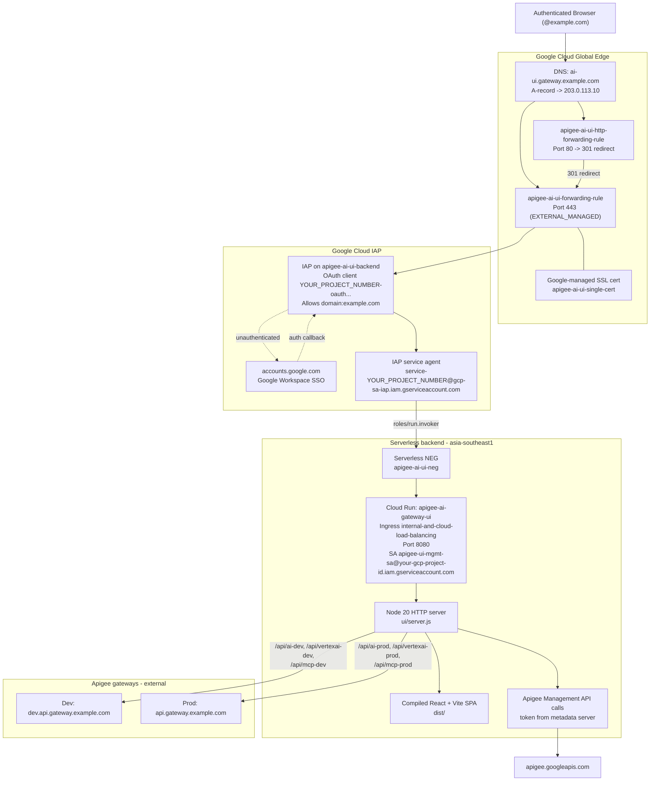
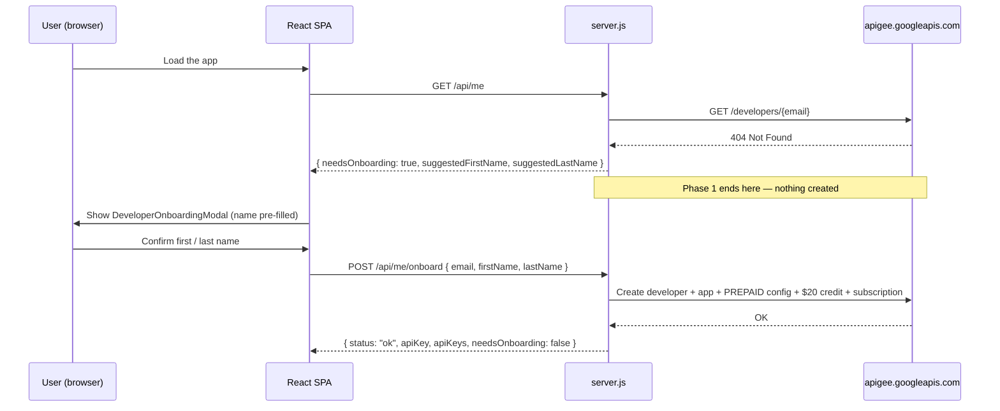

# Cloud Run UI & Identity-Aware Proxy (IAP) Deployment Guide

> **Document status**: Production / active baseline
> **Last verified**: 2026-09-17 (sections 3.B and 3.C re-verified against `ui/server.js`;
> infrastructure inventory last checked against live GCP state on 2026-09-15)
> **Environment**: Google Cloud project `your-gcp-project-id` (project number `YOUR_PROJECT_NUMBER`)
> **Region**: `asia-southeast1` (Cloud Run) / `global` (load balancer, IAP, SSL)
> **Primary domain**: `ai-ui.gateway.example.com`

---

## 1. Architecture Overview

This deployment hosts the **Apigee AI & Tools Gateway demonstration UI** as an internal-only web
application on Google Cloud. Four controls make that true:

1. **No direct public access** — the Cloud Run service runs with `--no-allow-unauthenticated` and
   `--ingress=internal-and-cloud-load-balancing`. The raw `*.run.app` URLs
   (`https://apigee-ai-gateway-ui.a.run.app`) return `403 Forbidden`
   to the open internet.
2. **Identity-Aware Proxy** — browser sessions authenticate via Google Workspace SSO. IAP is enabled
   on the `apigee-ai-ui-backend` backend service and authorization is granted to `domain:example.com`
   plus `user:admin@example.com`.
3. **Dedicated global Application Load Balancer** — a Global External HTTPS ALB terminates TLS with a
   Google-managed certificate and forwards to Cloud Run through a Serverless NEG.
4. **Workload identity, not static keys** — the container holds **no API keys**. The Cloud Run
   service account calls the Apigee Management API using a token obtained from the Cloud Run
   metadata server, and mints per-user Apigee developer credentials on demand.

> [!IMPORTANT]
> The container image is **`node:20-alpine` running `node server.js`**. There is no NGINX, no
> web-server config file, and no entrypoint shell script in the runtime image. Any instruction
> elsewhere that references NGINX access/error logs for this service is stale.



---

## 2. Infrastructure Inventory

All resources are provisioned in project `your-gcp-project-id` and were re-verified with `gcloud` on
2026-09-15.

| Component | Resource name / ID | Configuration |
| :--- | :--- | :--- |
| **Static external IP** | `apigee-ai-ui-ip` | `203.0.113.10` (global IPv4, `IN_USE`) |
| **Cloud Run service** | `apigee-ai-gateway-ui` | Region `asia-southeast1`<br>Port `8080`<br>Ingress `internal-and-cloud-load-balancing`<br>Auth `--no-allow-unauthenticated` |
| **Cloud Run runtime config** | — | CPU `1000m`, memory `512Mi`, container concurrency `80`, min scale `0`, max scale `100`, request timeout `300s`, startup CPU boost on |
| **Cloud Run service account** | `apigee-ui-mgmt-sa@your-gcp-project-id.iam.gserviceaccount.com` | Calls the Apigee Management API via the metadata server; no static key env vars.<br>Requires `roles/apigee.admin`, `roles/apigee.monetizationAdmin`, `roles/secretmanager.secretAccessor`, and **`roles/logging.viewer`** (for the Full Audit Logs view, `GET /api/logs/calls`) |
| **Artifact Registry** | `cloud-run-source-deploy` | `asia-southeast1-docker.pkg.dev/your-gcp-project-id/cloud-run-source-deploy/apigee-ai-gateway-ui:latest` |
| **Serverless NEG** | `apigee-ai-ui-neg` | Region `asia-southeast1`, type `SERVERLESS`, target Cloud Run `apigee-ai-gateway-ui` |
| **Backend service** | `apigee-ai-ui-backend` | Scheme `EXTERNAL_MANAGED`, protocol `HTTP`, `timeoutSec: 30`, backend `apigee-ai-ui-neg`, **IAP enabled** |
| **IAP OAuth client** | — | `YOUR_PROJECT_NUMBER-oauth.apps.googleusercontent.com` |
| **IAP service agent** | `service-YOUR_PROJECT_NUMBER@gcp-sa-iap.iam.gserviceaccount.com` | Holds `roles/run.invoker` on the Cloud Run service |
| **IAP access IAM** | `roles/iap.httpsResourceAccessor` | `domain:example.com`, `user:admin@example.com` |
| **SSL certificate** | `apigee-ai-ui-single-cert` | Google-managed for `ai-ui.gateway.example.com` — status **ACTIVE** |
| **URL map (HTTPS)** | `apigee-ai-ui-url-map` | Default service `apigee-ai-ui-backend` |
| **Target HTTPS proxy** | `apigee-ai-ui-target-proxy` | Map `apigee-ai-ui-url-map`, cert `apigee-ai-ui-single-cert` |
| **HTTPS forwarding rule** | `apigee-ai-ui-forwarding-rule` | `203.0.113.10:443` |
| **HTTP redirect URL map** | `apigee-ai-ui-http-redirect` | `httpsRedirect: true` |
| **Target HTTP proxy** | `apigee-ai-ui-http-proxy` | Map `apigee-ai-ui-http-redirect` |
| **HTTP forwarding rule** | `apigee-ai-ui-http-forwarding-rule` | `203.0.113.10:80` |

Cloud Run `roles/run.invoker` is currently granted to `domain:example.com`,
`user:admin@example.com`, the IAP service agent, and
`YOUR_PROJECT_NUMBER-compute@developer.gserviceaccount.com`.

---

## 3. UI Container & Runtime Architecture

### A. Container image

[ui/Dockerfile](./ui/Dockerfile) is twelve lines and does
no building — it copies a **pre-built** `dist/` directory:

```dockerfile
FROM node:20-alpine

WORKDIR /app
ENV PORT=8080

COPY dist ./dist
COPY server.js ./

EXPOSE 8080

CMD ["node", "server.js"]
```

> [!WARNING]
> `npm run build` must be run in `ui/` **before** `gcloud builds submit`. If `ui/dist` is stale, the
> deployed image silently ships the previous UI. The image contains no `node_modules`,
> so `server.js` uses only Node built-ins (`node:http`, `node:fs`, `node:path`, `node:crypto`,
> `node:child_process`, `node:url`) plus global `fetch`.

`ui/nginx.conf.template` and `ui/generate-env.sh` still exist in the repository but are referenced by
nothing — not the Dockerfile, not any script. They are dead artefacts of an earlier NGINX-based
container.

### B. Production Node server ([ui/server.js](./ui/server.js))

A single `http.createServer` handler listens on `process.env.PORT || 8080` and dispatches on
pathname in the order below. On startup it also reads an optional `.env` file next to `server.js`
and populates `process.env` for any key not already set.

#### 1. Runtime config — `GET /env-config.js`

Returns JavaScript that assigns `window.__RUNTIME_CONFIG__`, built from environment variables with
inline defaults:

| Key | Env var | Default |
| :--- | :--- | :--- |
| `ADMIN_USER_EMAIL` | `ADMIN_USER_EMAIL` | `admin@example.com` |
| `SALES_AGENT_EMAIL` | `SALES_AGENT_EMAIL` | `sales.agent@example.com` |
| `LOANS_AGENT_EMAIL` | `LOANS_AGENT_EMAIL` | `loans.agent@example.com` |
| `SSO_USER_EMAIL` | `SSO_USER_EMAIL` | `admin@example.com` |
| `DEFAULT_ENV` | `DEFAULT_ENV` | `prod` |

No API keys are injected here — keys are fetched at runtime through `/api/me`.

#### 2. Identity and developer lookup — `GET /api/me`

The caller's email is resolved in this order
([server.js#L717-L722](./ui/server.js#L717-L722)):

1. The **`?email=` query parameter** — checked *first*, ahead of the IAP header. Used for local
   testing and persona switching.
2. The `X-Goog-Authenticated-User-Email` header injected by IAP, with the `accounts.google.com:`
   prefix stripped.
3. `VITE_SSO_USER_EMAIL`.
4. `SSO_USER_EMAIL`.
5. The literal fallback `admin@example.com`.

> [!NOTE]
> The old `demo.user@example.com` fallback was **deliberately removed**. Do not reintroduce it, and do
> not document it as current behaviour.

It then acquires a Google access token via
[`getGcpAccessToken()`](./ui/server.js#L38-L131), which
tries, in order:

1. A service-account key file at **`GOOGLE_APPLICATION_CREDENTIALS` only** — self-signs a JWT and
   exchanges it at `https://oauth2.googleapis.com/token`. The repo-local candidates that used to be
   in this list were removed; the candidate array now holds exactly one entry and is annotated
   `never use repo-local key files`
   ([server.js#L44-L47](./ui/server.js#L44-L47)).
2. The **Cloud Run metadata server**
   (`http://metadata.google.internal/computeMetadata/v1/instance/service-accounts/default/token`) —
   this is the path taken in production.
3. `gcloud auth print-access-token` with SA impersonation, then plain `gcloud` — local fallback only.

Tokens are cached in memory: 50 min for key-file JWTs, `max(300, expires_in - 300)` seconds for
metadata tokens, and 4 min for `gcloud` tokens.

With that token, `/api/me` calls
[`provisionUserDeveloperAndApp()`](./ui/server.js#L327-L607)
with **`{ allowCreate: false }`**
([server.js#L736-L744](./ui/server.js#L736-L744)), which
makes this route a *detect-and-repair* probe rather than a creator:

- **If `GET /developers/{email}` returns 404**, the function returns immediately with
  `needsOnboarding: true` and suggested first/last names, and **creates nothing** — no developer, no
  app, no wallet credit, no subscription
  ([server.js#L354-L366](./ui/server.js#L354-L366)).
  Creation happens only through `POST /api/me/onboard` (section 2b).
- **If the developer already exists**, provisioning continues and will:
  - create or repair a developer app named **`Unified Admin <username> App`** attached to the
    `Enterprise AI Tier` and `Enterprise Tools MCP` products, with a `DisplayName` attribute and
    `persona: admin`;
  - fetch the shared consumer keys for the global `Unified Sales App` and `Unified Loans App`
    (owned by `admin@example.com`);
  - set `monetizationConfig.billingType = PREPAID` when it is unset or different;
  - credit a **$20 USD** starting balance if the wallet has never been credited;
  - subscribe the developer to `Enterprise AI Tier` — plus `Standard AI Tier` for
    `admin@example.com` specifically — when no open subscription exists.

The JSON response is:

```json
{
  "email": "user@example.com",
  "token": "",
  "name": "Given Family",
  "username": "user",
  "apiKey": "<admin consumer key>",
  "apiKeys": { "admin": "…", "sales_agent": "…", "loans_agent": "…" },
  "needsOnboarding": false,
  "suggestedFirstName": "Given",
  "suggestedLastName": "Family",
  "provider": "Google Cloud Identity SSO (IAP)",
  "raw": "accounts.google.com:user@example.com"
}
```

`needsOnboarding`, `suggestedFirstName` and `suggestedLastName` are always present
([server.js#L756-L769](./ui/server.js#L756-L769)); the UI
branches on the first and pre-fills the onboarding form with the other two.

> [!NOTE]
> In the production Node server `token` is always the empty string and `provider` is
> `"Google Cloud Identity SSO (IAP)"` when the IAP header is present, otherwise `"Local Default SSO"`.
> Only the Vite dev server shells out to `gcloud auth print-identity-token` and returns a real
> bearer token, which is why the Bearer-JWT test scenarios are local-only.

#### 2b. First-run onboarding gate — `POST /api/me/onboard`

Developer creation is a deliberate **two-phase** flow. Nothing is written to Apigee until the user
has confirmed their own first and last name, which prevents the malformed `Firstname User` /
`Firstname Google` records that automatic creation used to produce.



| Phase | Component | Behaviour |
| :--- | :--- | :--- |
| 1 — detect | `GET /api/me` ([server.js#L713](./ui/server.js#L713-L772)) | Calls provisioning with `allowCreate: false`. On 404 returns `needsOnboarding: true` plus suggested names. **Creates nothing.** |
| 2 — prompt | [DeveloperOnboardingModal.tsx](./ui/src/components/DeveloperOnboardingModal.tsx) | Mounted by [App.tsx#L528](./ui/src/App.tsx#L528) when `needsOnboarding` is true. Pre-fills the two name fields from the suggestions; `firstName` is mandatory, `lastName` defaults to `firstName` when blank. |
| 3 — create | `POST /api/me/onboard` ([server.js#L775](./ui/server.js#L774-L854)) | Re-runs provisioning with `allowCreate: true` and the user-validated names. |

Step 3 creates, in one pass:

- the Apigee developer (`userName` = local part of the email, `firstName` / `lastName` as confirmed);
- the developer app **`Unified Admin <username> App`** on `Enterprise AI Tier` and
  `Enterprise Tools MCP`;
- `monetizationConfig.billingType = PREPAID`;
- a **$20.00 USD** prepaid wallet credit (`transactionId` `init-topup-20-<epoch_ms>`);
- an `Enterprise AI Tier` rate-plan subscription.

It responds with `{ status, email, firstName, lastName, fullName, name, username, apiKey, apiKeys,
needsOnboarding: false }`, so the SPA can continue without a second `/api/me` round-trip.

`/api/me/profile` shares the same handler and is used to rename an existing developer. Both accept
`POST` and `PUT`; any other method returns `405`, a missing `email` or `firstName` returns `400`.

#### 3. Apigee Management API handlers

Each of these acquires a token the same way and performs the Apigee REST call server-side against
organization `your-gcp-project-id`:

| Route | Methods | Upstream |
| :--- | :--- | :--- |
| `/api/kvm/rates` | `GET`, `PUT`, `POST` | KVM `ai-model-rates`, entry `rate_card`, env `prod` or `dev` |
| `/api/monetization/balance` | `GET` | `/developers/{dev}/balance` |
| `/api/monetization/credit` | `POST` | `/developers/{dev}/balance:credit` (USD, default 50 units) |
| `/api/monetization/rateplans` | `GET` | `/apiproducts/{Standard AI Tier,Enterprise AI Tier}/rateplans` |
| `/api/monetization/subscriptions` | `GET`, `POST` | `/developers/{dev}/subscriptions` |
| `/api/monetization/config` | `GET`, `PUT`, `POST` | `/developers/{dev}/monetizationConfig` |
| `/api/analytics/fleet-stats` | `GET` | Analytics `stats/dc_user_email,dc_model_name` and `stats/apiproxy`, plus the KVM rate card for cost maths |
| `/api/monetization/attributions` | `GET` | Developer list joined with balances and `dc_user_email` stats |

The `env` query parameter accepts `dev`, `bap` (mapped to `dev`) or anything else (mapped to `prod`).
Unsupported methods return `405`; a missing token returns `500`.

#### 4. Gateway reverse proxy routes

[`proxyRequest()`](./ui/server.js#L637-L690) forwards the
method, body and headers upstream, dropping `host`, `content-length`, `connection` and
`accept-encoding` on the way out, and dropping `content-encoding`, `content-length`,
`transfer-encoding` and `connection` on the way back before setting an accurate `Content-Length`.
This is what prevents browser decompression mismatches.

| Route prefix | Upstream |
| :--- | :--- |
| `/api/ai-dev/*` | `https://dev.api.gateway.example.com/ai/v1/*` |
| `/api/ai-prod/*` | `https://api.gateway.example.com/ai/v1/*` |
| `/api/vertexai-dev/*` | `https://dev.api.gateway.example.com/vertexai/v1/*` |
| `/api/vertexai-prod/*` | `https://api.gateway.example.com/vertexai/v1/*` |
| `/api/mcp-dev/*` | `https://dev.api.gateway.example.com/mcp/*` |
| `/api/mcp-prod/*` | `https://api.gateway.example.com/mcp/*` |

Query strings are preserved on every route.

#### 5. Static SPA fallback

Anything else is served from `dist/`. Missing paths and directories fall back to `dist/index.html`
so client-side routing works; content type comes from a small extension map
(`.html .js .css .json .png .jpg .gif .svg .ico .woff .woff2`), defaulting to
`application/octet-stream`. A read failure returns `404 Not Found`.

Two `Cache-Control` policies are applied on the way out
([server.js#L1731-L1734](./ui/server.js#L1731-L1734)):

| Match | `Cache-Control` | Why |
| :--- | :--- | :--- |
| Extension is `.html` (so every SPA shell response) | `no-cache, no-store, must-revalidate` | Browsers always re-fetch `index.html`, which references the new content-hashed bundle names |
| Path starts with `/assets/` | `public, max-age=31536000, immutable` | Vite emits content-hashed filenames, so the bundles can be cached for a year |

> [!IMPORTANT]
> This pairing is what makes a redeploy visible **without a hard refresh**: the never-cached shell
> pulls in freshly-hashed, permanently-cached assets. Do not remove either header.

### C. Credentials posture

There are **no API keys in the image, in the repository, or in the Cloud Run environment**. The
deployed revision declares no environment variables and no Secret Manager volumes or references —
only `PORT=8080`, baked in by the Dockerfile.

> [!WARNING]
> **No service-account key file exists in this repository, and none must ever be committed.**
> `apigee-ui-mgmt-sa-key.json` is *not* present at the repository root or anywhere else in the tree —
> verified 2026-09-17. `server.js` will only read a key file from an explicit
> `GOOGLE_APPLICATION_CREDENTIALS` path; the repo-local candidates (`./apigee-ui-mgmt-sa-key.json`,
> `../apigee-ui-mgmt-sa-key.json`, `APIGEE_SA_KEY_PATH`) were deliberately removed, and the code is
> annotated `never use repo-local key files`
> ([server.js#L44-L47](./ui/server.js#L44-L47)).
> Production relies on the metadata server. If you set `GOOGLE_APPLICATION_CREDENTIALS` locally, keep
> the key outside the working tree — it must never be baked into an image or committed to a branch.

---

## 4. DNS Mapping & Domain Status

| Hostname | Record | Value | Status |
| :--- | :--- | :--- | :--- |
| `ai-ui.gateway.example.com` | `A` | `203.0.113.10` | Active |

- **HTTPS (443)** — terminated by `apigee-ai-ui-forwarding-rule` using `apigee-ai-ui-single-cert`
  (managed status `ACTIVE`).
- **HTTP (80)** — `apigee-ai-ui-http-forwarding-rule` returns `301 Moved Permanently` to the HTTPS
  origin.

The separate `apigee-lb-cert` certificate covers the gateway hosts
`api.gateway.example.com` and `dev.api.gateway.example.com`; those are the
Apigee data-plane endpoints, not this UI.

---

## 5. Operations & Maintenance Playbook

### A. Rebuilding and updating the UI

```bash
# 1. Build the SPA — the Dockerfile copies dist/, it does not build it
cd ui
npm run build
cd ..

# 2. Build and push the container image with Cloud Build
gcloud builds submit --tag asia-southeast1-docker.pkg.dev/your-gcp-project-id/cloud-run-source-deploy/apigee-ai-gateway-ui:latest ui --project=your-gcp-project-id

# 3. Deploy the image to Cloud Run
gcloud run deploy apigee-ai-gateway-ui \
  --image=asia-southeast1-docker.pkg.dev/your-gcp-project-id/cloud-run-source-deploy/apigee-ai-gateway-ui:latest \
  --region=asia-southeast1 \
  --platform=managed \
  --no-allow-unauthenticated \
  --ingress=internal-and-cloud-load-balancing \
  --service-account=apigee-ui-mgmt-sa@your-gcp-project-id.iam.gserviceaccount.com \
  --project=your-gcp-project-id
```

Always pass the full flag set on step 3. Omitting `--ingress` or `--no-allow-unauthenticated` on a
redeploy can relax the service's security posture.

### B. Forcing a new revision without an image change

```bash
gcloud run services update apigee-ai-gateway-ui \
  --region=asia-southeast1 \
  --project=your-gcp-project-id \
  --update-annotations="last-updated=$(date +%s)"
```

### C. Modifying IAP access permissions

```bash
# Grant access to a Google Group
gcloud iap web add-iam-policy-binding \
  --resource-type=backend-services \
  --service=apigee-ai-ui-backend \
  --project=your-gcp-project-id \
  --member="group:ai-team@example.com" \
  --role="roles/iap.httpsResourceAccessor"

# Grant access to an individual
gcloud iap web add-iam-policy-binding \
  --resource-type=backend-services \
  --service=apigee-ai-ui-backend \
  --project=your-gcp-project-id \
  --member="user:engineer@example.com" \
  --role="roles/iap.httpsResourceAccessor"

# Review the current policy
gcloud iap web get-iam-policy \
  --resource-type=backend-services \
  --service=apigee-ai-ui-backend \
  --project=your-gcp-project-id
```

### D. Viewing live logs and telemetry

```bash
# Tail Cloud Run container logs — these are Node.js stdout/stderr from server.js
gcloud run services logs tail apigee-ai-gateway-ui --region=asia-southeast1 --project=your-gcp-project-id

# Inspect load balancer request logs
gcloud logging read 'resource.type="http_load_balancer" AND resource.labels.forwarding_rule_name="apigee-ai-ui-forwarding-rule"' --limit=20 --project=your-gcp-project-id
```

Useful log prefixes emitted by `server.js`: `[Server] Production Node server listening on port 8080`
at boot, `[Server] Creating app ...`, `[Server] Adding $20 starting balance ...`,
`[Server] Proxy error to <url>: ...`, and `[Server] Failed to get gcloud auth token: ...`.

### E. Inspecting the deployed configuration

```bash
gcloud run services describe apigee-ai-gateway-ui --region=asia-southeast1 --project=your-gcp-project-id --format=yaml
gcloud compute backend-services describe apigee-ai-ui-backend --global --project=your-gcp-project-id --format="yaml(iap,backends,timeoutSec)"
gcloud compute ssl-certificates describe apigee-ai-ui-single-cert --global --project=your-gcp-project-id
```

---

## 6. Troubleshooting Matrix

| Symptom | Probable cause | Resolution |
| :--- | :--- | :--- |
| `The IAP service account is not provisioned` | The Google-managed IAP service agent is missing or lacks invoke permission | 1. `gcloud beta services identity create --service=iap.googleapis.com --project=your-gcp-project-id`<br>2. `gcloud run services add-iam-policy-binding apigee-ai-gateway-ui --region=asia-southeast1 --member="serviceAccount:service-YOUR_PROJECT_NUMBER@gcp-sa-iap.iam.gserviceaccount.com" --role="roles/run.invoker"`<br>3. Redeploy the service |
| `404 Page not found` (or `403 Forbidden`) on the raw `*.run.app` URL | Expected security behaviour | Direct Cloud Run access is blocked by the ingress policy. Use `https://ai-ui.gateway.example.com`.<br><br>The block is served by the Google Frontend, so the response is a generic HTML error page and is **identical with and without a valid identity token**. Verified 2026-09-20: `--ingress=internal-and-cloud-load-balancing` returns **404**, not 403 — GFE prefers 404 so it does not disclose that the service exists. To tell the three cases apart: an **ingress block** is an unchanging generic GFE page; an **IAM denial** is a 403 that a valid `roles/run.invoker` token would clear; and the **app answering** would serve `index.html` with HTTP 200 at `/`. Do not treat a 404 here as a broken deployment |
| `You don't have access` on the Google sign-in page | Account is outside `@example.com` or missing the IAP role | Sign in with an authorized account or grant `roles/iap.httpsResourceAccessor` (section 5C) |
| `ERR_SSL_VERSION_OR_CIPHER_MISMATCH` / `ERR_CONNECTION_CLOSED` | Managed certificate still provisioning | `gcloud compute ssl-certificates describe apigee-ai-ui-single-cert --global` must report `status: ACTIVE` |
| UI loads but shows stale content after a deploy | `ui/dist` was not rebuilt before `gcloud builds submit` | Run `npm run build` in `ui/`, then rebuild and redeploy |
| `/api/me` returns empty `apiKey` / `apiKeys` | The service account could not obtain a token or the Apigee Management API call failed | Check logs for `[Server] Failed to get gcloud auth token` or `[Server] Error provisioning user developer and apps`. Confirm `apigee-ui-mgmt-sa@your-gcp-project-id.iam.gserviceaccount.com` retains Apigee admin permissions |
| Management or analytics panels return HTTP 500 | Token acquisition failed inside a `/api/...` handler | Same as above — every handler returns `{"error": "Could not obtain GCP access token"}` on token failure |
| Network error calling the gateway from the UI | Apigee proxy unavailable, or an invalid API key | Verify the environment selected in the settings modal, then test the upstream directly: `curl -i https://api.gateway.example.com/ai/v1/...`. The server-side routes are listed in section 3.B.4 |
| HTTP 429 from the gateway | Product-driven LLM token quota breached | Expected for the `claude-haiku-4-5@20251001` demo model, which is capped at 50 tokens/minute in the API product |

---

## 7. Not Implemented — Historical Notes

Earlier revisions of this guide described infrastructure that does not exist. It is recorded here so
the claims are not silently reintroduced.

| Former claim | Actual state |
| :--- | :--- |
| Container runs NGINX; tail "NGINX access and errors" | Container runs `node server.js` on `node:20-alpine`. `ui/nginx.conf.template` is unreferenced dead code |
| Secret Manager binding of `apigee-bronze-api-key`, `apigee-silver-api-key`, `apigee-sales-agent-api-key` | **None of these secrets exist** in project `your-gcp-project-id`, and the Cloud Run revision declares no secret references and no environment variables |
| An entrypoint script reads injected secrets into the frontend runtime at boot | No entrypoint script in the image. `/env-config.js` is generated by `server.js` and contains email/env defaults only — no keys |
| A secret-rotation playbook using `gcloud secrets versions add` | Removed. There are no application secrets to rotate; API keys are minted per user through the Apigee Management API |
| Secret Manager IAM troubleshooting row for the compute default service account | Removed as not applicable to this service |
