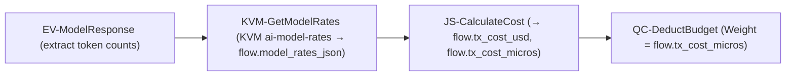
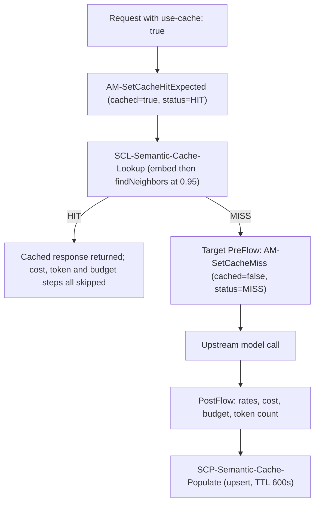

# AI Gateway — Apigee Proxy Architecture

> **Document status**: Reconciled against the proxy bundle source on disk.
> **Primary bundle**: `ai-gateway-v1`
> **Apigee organization**: `bap-apac-demo2` · **Environments**: `dev`, `prod`
> **Base path**: `/ai/v1` (see [default.xml](file:///Users/maloosatyam/Codebase/AI%20Code/apigee/proxies/ai-gateway-v1/apiproxy/proxies/default.xml#L183-L186))
> **Public host**: `https://api.maloosatyam.demo.altostrat.com/ai/v1`
> **Deployed revision**: `2` in `prod`. The revision history was reset on
> 2026-09-15 — all 57 prior revisions were deleted and the bundle re-imported
> as revision 1.

Every policy name, flow condition, header and variable in this document was read
directly out of the bundle. Anything not implemented is in
[Section 11 — Not Implemented](#11-not-implemented--roadmap) and is explicitly
labelled as such.

---

## 1. Bundle Inventory

| Bundle | Path | Status |
| :--- | :--- | :--- |
| `ai-gateway-v1` | [apigee/proxies/ai-gateway-v1](file:///Users/maloosatyam/Codebase/AI%20Code/apigee/proxies/ai-gateway-v1) | **Primary / active.** All AI Gateway work lands here |
| `mcp` | [apigee/proxies/mcp](file:///Users/maloosatyam/Codebase/AI%20Code/apigee/proxies/mcp) | **Active.** Native MCP Tools Gateway (`/mcp`) |
| `vertex-ai-v1` | [apigee/proxies/vertex-ai-v1](file:///Users/maloosatyam/Codebase/AI%20Code/apigee/proxies/vertex-ai-v1) | **Legacy — superseded by `ai-gateway-v1`.** Not maintained; do not extend |

> [!IMPORTANT]
> `vertex-ai-v1` still contains its own `LTQ-TokenEnforce`, `LTQ-TokenCount`,
> `SUP-UserPrompt` and semantic cache policies. Those are **not** the policies
> described in this document. This document describes `ai-gateway-v1` only.

A separate declarative template tree also exists at
[apigee/templates/ai-gateway](file:///Users/maloosatyam/Codebase/AI%20Code/apigee/templates/ai-gateway)
(rendered with `apigee-go-gen`). It is a **different artifact** from the
hand-written `ai-gateway-v1` bundle and has a different policy set. See
[Section 11.1](#111-sse-streaming--not-in-ai-gateway-v1).

### 1.1 `ai-gateway-v1` contents

| Kind | Files |
| :--- | :--- |
| Policies | **36** XML policies (see [Section 9](#9-policy-catalog-36-policies)) |
| Proxy endpoints | `default` (base path `/ai/v1`) |
| Target endpoints | `gemini-vertex-target`, `claude-vertex-target` |
| JavaScript resources | `AutoRouting.js`, `CalculateCost.js`, `ClaudeRequestPrep.js`, `ExtractPromptAndModel.js`, `FormatClaudeResponse.js` |
| Other resources | [openapi.yaml](file:///Users/maloosatyam/Codebase/AI%20Code/apigee/proxies/ai-gateway-v1/apiproxy/resources/oas/openapi.yaml), [model_rates.properties](file:///Users/maloosatyam/Codebase/AI%20Code/apigee/proxies/ai-gateway-v1/apiproxy/resources/properties/model_rates.properties) |

---

## 2. Ingress Endpoints

Paths below are **suffixes** appended to the `/ai/v1` base path. The set is
defined by the conditional flows in
[default.xml](file:///Users/maloosatyam/Codebase/AI%20Code/apigee/proxies/ai-gateway-v1/apiproxy/proxies/default.xml#L88-L132)
and mirrored in
[openapi.yaml](file:///Users/maloosatyam/Codebase/AI%20Code/apigee/proxies/ai-gateway-v1/apiproxy/resources/oas/openapi.yaml#L8-L318),
which `OAS-ValidateRequest` enforces.

| Path suffix | Flow | Behaviour |
| :--- | :--- | :--- |
| `POST /auto`, `POST /auto:generateContent` | `AutoRoutingFlow` | `JS-AutoRouting` picks model + provider from prompt heuristics and product tier |
| `POST /models/gemini-*` | `GeminiDirectFlow` | `AM-PrepGeminiDirect` pins `flow.target_provider = google` |
| `POST /models/claude-haiku-4-5*` | `LLMTokenLimitFlow` (shadows the empty `AnthropicDirectFlow`) | Additionally runs `LTQ-TokenEnforce` — the token-limit demo path |
| `POST /models/claude-*` | `AnthropicDirectFlow` | `AM-PrepClaudeDirect` pins `flow.target_provider = anthropic` |

The OpenAPI spec additionally declares the `:streamGenerateContent` path shape so
that `OAS-ValidateRequest` does not reject it, but there is **no streaming
handling in the bundle** — see [Section 11.1](#111-sse-streaming--not-in-ai-gateway-v1).

> [!NOTE]
> There is **no** `GET /models` model-catalog flow in `ai-gateway-v1`. No such
> flow, policy, or OpenAPI path exists. Earlier revisions of this document
> claimed one; it was never built here.

---

## 3. Request PreFlow — Verified Execution Order

Source: [default.xml#L3-L87](file:///Users/maloosatyam/Codebase/AI%20Code/apigee/proxies/ai-gateway-v1/apiproxy/proxies/default.xml#L3-L87).

**Every** PreFlow step carries `request.verb != "OPTIONS"` as part of its
condition. The extra conditions listed below are the per-step remainder.

| # | Policy | Additional condition |
| :--- | :--- | :--- |
| 1 | `CORS-Headers` | — |
| 2 | `OAS-ValidateRequest` | — |
| 3 | `EV-RequestDetails` | — |
| 4 | `EV-ExtractBearerToken` | — |
| 5 | `DJWT-ExtractUserIdentity` | `flow.rawToken != null` |
| 6 | `AM-SetUserIdentity` | `jwt.DJWT-ExtractUserIdentity.decoded.claim.email != null` **or** `jwt.DJWT-ExtractUserIdentity.claim.email != null` |
| 7 | `RF-MissingUserEmail` | `flow.emailId = null` → raises **HTTP 401** |
| 8 | `JS-ExtractPromptAndModel` | — |
| 9 | `VA-VerifyAPIKey` | — |
| 10 | `SUP-UserPrompt` | `flow.userPrompt != null and flow.userPrompt != ""` |
| 11 | `MLC-EnforceMonetizationLimits` | — |
| 12 | `QC-EnforceBudgetLimit` | — |
| 13 | `AM-RemoveAuthorization` | — |
| 14 | `AM-InitCacheStatus` | — |
| 15 | `JS-AutoRouting` | `proxy.pathsuffix MatchesPath "/auto*"` or `JavaRegex "^/auto.*"` |
| 16 | `AM-PrepGeminiDirect` | `/models/gemini*` or `JavaRegex "^/models/gemini.*"` |
| 17 | `AM-PrepClaudeDirect` | `/models/claude*` or `JavaRegex "^/models/claude.*"` |
| 18 | `AM-SetCacheHitExpected` | `use-cache` **or** `x-use-cache` header is `true` |
| 19 | `SCL-Semantic-Cache-Lookup` | same cache-header condition as #18 |

> [!IMPORTANT]
> Two ordering facts are load-bearing:
> **identity resolution (steps 4–7) completes before `VA-VerifyAPIKey` (step 9)**,
> and **`VA-VerifyAPIKey` (step 9) runs before Model Armor `SUP-UserPrompt`
> (step 10)**. A caller is therefore identified and authorised *before* any
> content inspection happens, and a rejected caller is turned away before any
> monetization, budget, or token counter is touched.

> [!NOTE]
> `VA-VerifyAPIKey` and `SUP-UserPrompt` were **swapped** relative to earlier
> revisions of this proxy, where Model Armor ran first. Authenticating first
> means an unauthenticated or unentitled caller can no longer drive a billable
> external Model Armor evaluation — the request is rejected at the key check.
> The practical consequence for demos: a call to a model the product does not
> entitle now returns **401 at step 9** regardless of prompt content, whereas
> previously a malicious prompt on an unentitled model would surface **400**
> from Model Armor instead.

### 3.1 Identity resolution

1. `EV-ExtractBearerToken` pulls `flow.rawToken` from `Authorization: Bearer <t>`,
   from a bare `Authorization` value, or from `X-Identity-Token`
   ([EV-ExtractBearerToken.xml](file:///Users/maloosatyam/Codebase/AI%20Code/apigee/proxies/ai-gateway-v1/apiproxy/policies/EV-ExtractBearerToken.xml)).
2. `DJWT-ExtractUserIdentity` (`DecodeJWT`, `continueOnError="true"`) decodes it.
   It **decodes only — it does not verify the signature**.
3. `AM-SetUserIdentity` assigns `flow.emailId` and `flow.userEmail` from the
   `email` claim, trying both the `decoded.claim.email` and `claim.email` forms.
4. `RF-MissingUserEmail` returns 401 `UNAUTHENTICATED` if identity is still unset.

> [!NOTE]
> There is **no `X-User-Email` header fallback**. The `AM-SetUserEmailFromHeader`
> policy was removed: the JWT is now the only accepted source of caller identity,
> and a request bearing only `X-User-Email` is rejected with 401.

#### 3.1.1 Trust model — read this before relying on `flow.emailId`

`DJWT-ExtractUserIdentity` is a **`DecodeJWT`**, not a `VerifyJWT`. It parses the token and
exposes its claims; it does not check the signature, the issuer, the audience or the expiry.
This is a deliberate, recorded decision, not an oversight.

**What the JWT is trusted for:** *attribution only*. `flow.emailId` answers "who should this
call be attributed to", and it feeds `dc_user_email`, the Cloud Logging audit trail, the wallet
charge, and the per-user analytics view.

**What the JWT is not trusted for:** *authorization*. Nothing is granted on the strength of the
`email` claim. Entitlement is carried entirely by `x-apikey` through `VA-VerifyAPIKey`, which
is a genuine cryptographic check against Apigee's key store, and the routing tier is derived
from the resolved API **product name** — never from the token.

**Concretely, what a forged token can do.** `DecodeJWT` accepts any well-formed three-segment
token, so this is sufficient to assume an identity:

```
b64url({"alg":"RS256","typ":"JWT"}) . b64url({"email":"someone.else@example.com"}) . b64url("anything")
```

(Note that the degenerate `alg: none` form with an *empty* signature segment is rejected with
401 — `DecodeJWT` requires three non-empty segments. The forgery has to look plausible.)

A caller who does this can **misattribute their own traffic** to another email: skew that user's
dashboard, write a misleading audit record, and charge the wrong wallet.

**What it cannot do.** It cannot obtain access the caller did not already have. Without a valid
`x-apikey` the request is rejected at `VA-VerifyAPIKey` regardless of the claimed email, and the
key determines which models and quotas apply. So the forger must already be a legitimate,
entitled client — this is an integrity-of-attribution problem, not a privilege-escalation one.

> [!IMPORTANT]
> Do not build an authorization decision on `flow.emailId`, and do not add a policy that reads
> the `email` claim to grant or deny anything. If a future requirement needs a trustworthy
> principal, the fix is `VerifyJWT` against IAP's **ES256** JWKS at
> `https://www.gstatic.com/iap/verify/public_key-jwk` — *not* the RS256 `oauth2/v3/certs`
> endpoint — with the audience set to the IAP backend-service path.

> [!NOTE]
> A prerequisite for ever enabling that: the UI currently forwards a locally-minted token, not
> the IAP assertion it receives. `VerifyJWT` would reject it immediately. The UI token flow
> has to be corrected first.

### 3.2 Model Armor at the perimeter

`SUP-UserPrompt` is a `SanitizeUserPrompt` policy with `continueOnError="false"`
pointed at the Model Armor template
`projects/bap-apac-demo2/locations/asia-southeast1/templates/apigee-sanitize-user-prompt`,
reading `{flow.userPrompt}`
([SUP-UserPrompt.xml](file:///Users/maloosatyam/Codebase/AI%20Code/apigee/proxies/ai-gateway-v1/apiproxy/policies/SUP-UserPrompt.xml)).

Placing it at step 11 means a blocked prompt never reaches
`MLC-EnforceMonetizationLimits`, `QC-EnforceBudgetLimit`, `LTQ-TokenEnforce`,
or any upstream model.

Because `VA-VerifyAPIKey` now runs immediately ahead of it at step 10, Model
Armor is only ever invoked for a caller holding a valid key whose API Product
entitles the requested model. An unauthenticated or unentitled caller cannot
drive a billable external Model Armor evaluation.

> [!NOTE]
> The bundle contains **no custom fault-response policy** for Model Armor. There
> is no `RF-ModelArmorViolation` policy. On a filter match, the
> `SanitizeUserPrompt` policy itself fails the request and Apigee returns its
> default policy fault (HTTP 400, `fault.faultstring` mentioning Model Armor).
> The live test at
> [gateway-live.test.mjs#L197-L221](file:///Users/maloosatyam/Codebase/AI%20Code/ui/tests/gateway-live.test.mjs#L197-L221)
> accepts either that default fault shape or a `PROMPT_SAFETY_VIOLATION`
> envelope, so it passes without a custom RaiseFault present.

---

## 4. Conditional Flows — Verified Conditions

Source: [default.xml#L88-L126](file:///Users/maloosatyam/Codebase/AI%20Code/apigee/proxies/ai-gateway-v1/apiproxy/proxies/default.xml#L88-L126).

| Flow | Steps | Condition (verbatim) |
| :--- | :--- | :--- |
| `OptionsPreFlight` | `CORS-Headers` | `request.verb == "OPTIONS" AND request.header.origin != null AND request.header.Access-Control-Request-Method != null` |
| `LLMTokenLimitFlow` | `LTQ-TokenEnforce` | `(proxy.pathsuffix MatchesPath "/models/claude-haiku-4-5@20251001:generateContent") or (flow.model == "claude-haiku-4-5@20251001") or (proxy.pathsuffix JavaRegex "^/models/claude-haiku-4-5.*")` |
| `AutoRoutingFlow` | *(empty)* | `(proxy.pathsuffix MatchesPath "/auto*") or (proxy.pathsuffix JavaRegex "^/auto.*")` |
| `GeminiDirectFlow` | *(empty)* | `(proxy.pathsuffix MatchesPath "/models/gemini*") or (proxy.pathsuffix JavaRegex "^/models/gemini.*")` |
| `AnthropicDirectFlow` | *(empty)* | `(proxy.pathsuffix MatchesPath "/models/claude*") or (proxy.pathsuffix JavaRegex "^/models/claude.*")` |

> [!NOTE]
> `AutoRoutingFlow`, `GeminiDirectFlow` and `AnthropicDirectFlow` have **empty
> `<Request/>` and `<Response/>` bodies**.
> They exist purely as named routing buckets for Apigee analytics and trace
> readability. The work those names suggest is actually done by the conditional
> PreFlow steps 16–18 in [Section 3](#3-request-preflow--verified-execution-order).
> `LLMTokenLimitFlow` is the only conditional flow that executes a policy.

---

## 5. LLM Token Quota — Product-Driven

Both LLM token quota policies are `LLMTokenQuota` type, `rollingwindow`, and
read their limits **dynamically from the API Product bound to the verified API
key**. Nothing is hardcoded in the proxy.

```xml
<!-- LTQ-TokenEnforce.xml -->
<LLMTokenQuota continueOnError="false" enabled="true" name="LTQ-TokenEnforce" type="rollingwindow">
  <Allow count="1000" countRef="verifyapikey.VA-VerifyAPIKey.apiproduct.developer.llmQuota.limit"/>
  <Interval ref="verifyapikey.VA-VerifyAPIKey.apiproduct.developer.llmQuota.interval">1</Interval>
  <TimeUnit ref="verifyapikey.VA-VerifyAPIKey.apiproduct.developer.llmQuota.timeunit">minute</TimeUnit>
  <Distributed>true</Distributed>
  <Synchronous>true</Synchronous>
  <Identifier ref="verifyapikey.VA-VerifyAPIKey.client_id"/>
  <LLMModelSource>{flow.model}</LLMModelSource>
  <EnforceOnly>true</EnforceOnly>
  <SharedName>common-counter</SharedName>
</LLMTokenQuota>
```

```xml
<!-- LTQ-TokenCount.xml -->
<LLMTokenQuota continueOnError="true" enabled="true" name="LTQ-TokenCount" type="rollingwindow">
  <Allow count="1000" countRef="verifyapikey.VA-VerifyAPIKey.apiproduct.developer.llmQuota.limit"/>
  <Interval ref="verifyapikey.VA-VerifyAPIKey.apiproduct.developer.llmQuota.interval">1</Interval>
  <TimeUnit ref="verifyapikey.VA-VerifyAPIKey.apiproduct.developer.llmQuota.timeunit">minute</TimeUnit>
  <Distributed>true</Distributed>
  <Synchronous>true</Synchronous>
  <Identifier ref="verifyapikey.VA-VerifyAPIKey.client_id"/>
  <LLMTokenUsageSource>{jsonPath('$.usageMetadata.totalTokenCount',response.content,true)}</LLMTokenUsageSource>
  <LLMModelSource>{flow.model}</LLMModelSource>
  <CountOnly>true</CountOnly>
  <SharedName>common-counter</SharedName>
</LLMTokenQuota>
```

### 5.1 Why the split

| Aspect | `LTQ-TokenEnforce` | `LTQ-TokenCount` |
| :--- | :--- | :--- |
| Mode | `<EnforceOnly>true</EnforceOnly>` | `<CountOnly>true</CountOnly>` |
| Where it runs | Request side, `LLMTokenLimitFlow` | Response side, PostFlow |
| What it does | Checks the counter, rejects when exhausted. Consumes nothing | Adds the actual consumed tokens to the counter. Never rejects |
| Token source | n/a | `$.usageMetadata.totalTokenCount` from the response body |
| `continueOnError` | `false` (must be able to block) | `true` (accounting must not break a good response) |

Real token consumption is only knowable **after** the model responds. The
enforce/count split lets the request side gate on the running total while the
response side reconciles it with actual usage. Both policies declare
`<SharedName>common-counter</SharedName>`, so they read and write the **same
distributed counter**, keyed by `verifyapikey.VA-VerifyAPIKey.client_id`.

### 5.2 Where the limit actually comes from

The `count="1000"`, `<Interval>1</Interval>` and `<TimeUnit>minute</TimeUnit>`
literals are **fallback defaults only**. The `countRef` / `ref` attributes take
precedence and resolve from the API Product's
`llmOperationGroup.operationConfigs[].llmTokenQuota` block after
`VA-VerifyAPIKey` runs.

No `operationConfig` may carry more than one `llmOperation` — the Management API
rejects more than one with `Operations must contain exactly one entity`. Standard
AI Tier declares **6 `llmOperations` across 5 models**, and Enterprise AI Tier
**8 `llmOperations` across 7 models**.

Each entitled model gets **one** resource, the gateway-shaped path:

```
/models/<model>:*
```

`auto` is the exception — it gets two resources, because bare `/auto` has to be
granted as an exact string (see [Section 5.3](#53-apigee-resource-glob-semantics)):

```
/auto          /auto:*
```

> [!NOTE]
> The paired native Vertex-shaped grant
> (`/v1/projects/*/locations/*/publishers/<google|anthropic>/models/<model>:*`)
> that each model used to carry has been **removed**, along with `/models/auto`
> and `/models/auto:*`, because the proxy no longer exposes those ingress paths.
> The `operationConfig` wrappers that held them were removed too — Apigee rejects
> an `operationConfig` with an empty `llmOperations` array with
> `400 Operations must contain exactly one entity but found 0 entities`. Standard
> therefore contains exactly 6 `operationConfigs` and Enterprise exactly 8, each
> carrying exactly one operation.

Verified in [standard_ai_tier.json](file:///Users/maloosatyam/Codebase/AI%20Code/apigee/products/standard_ai_tier.json)
and [enterprise_ai_tier.json](file:///Users/maloosatyam/Codebase/AI%20Code/apigee/products/enterprise_ai_tier.json):

| Model | Resources | Standard | Enterprise |
| :--- | :--- | :--- | :--- |
| `auto` | `/auto`, `/auto:*` | 2000 / 1 min | 10000 / 1 min |
| **`claude-haiku-4-5@20251001`** | `/models/claude-haiku-4-5@20251001:*` | **50 / 1 min** | **50 / 1 min** |
| `gemini-3.1-flash-lite` | `/models/gemini-3.1-flash-lite:*` | 2000 / 1 min | 10000 / 1 min |
| `gemini-3-flash-preview` | `/models/gemini-3-flash-preview:*` | 2000 / 1 min | 10000 / 1 min |
| `claude-haiku-4-5@20251001` | `/models/claude-haiku-4-5@20251001:*` | 2000 / 1 min | 10000 / 1 min |
| `gemini-3.1-pro-preview` | `/models/gemini-3.1-pro-preview:*` | *not granted* | 10000 / 1 min |
| `claude-opus-4-5@20251101` | `/models/claude-opus-4-5@20251101:*` | *not granted* | 10000 / 1 min |

Enterprise grants 10000 / 1 min everywhere **except** `claude-haiku-4-5@20251001`, which
is pinned to **50 / 1 min** in both tiers.

Neither product contains a catch-all entitlement any more: there is no `/v1/**`,
no `/models/*`, no `/*`, and no `model="*"` operation in either JSON. Access is
model-by-model.

`gemini-3.1-ultra` appears in **no** API product — a grep of
[apigee/products](file:///Users/maloosatyam/Codebase/AI%20Code/apigee/products)
returns nothing. That is deliberate: it powers the "Restricted Model" demo, where
even an Enterprise key is rejected at `VA-VerifyAPIKey` with 401 before any
upstream call is made.

`/models/auto` is no longer entitled by either product and no proxy flow routes
it. `AutoRoutingFlow` and the `JS-AutoRouting` PreFlow step both key off bare
`/auto`, which is what the UI calls. A call to `/models/auto` is now rejected at
`OAS-ValidateRequest` with 400, because the path is absent from the OpenAPI spec.

> [!IMPORTANT]
> `claude-haiku-4-5@20251001` is the deliberate **token-limit demo model** at
> **50 tokens/minute**, in both tiers. This is why `LLMTokenLimitFlow` exists
> and is conditioned on exactly that model. To change the demo limit, edit the
> **API Product JSON** and re-provision — do **not** edit the policy XML.

> [!WARNING]
> Any documentation referring to `LTQ-*-100` policy variants (e.g.
> `LTQ-TokenEnforce-100`) is stale. Those variants do not exist in this bundle.
> There are exactly two LLM token quota policies: `LTQ-TokenEnforce` and
> `LTQ-TokenCount`.

### 5.3 Apigee resource glob semantics

API Product `resource` strings are **not** regular expressions and they are not
prefix matches. Two properties of the glob syntax decide whether an entitlement
works, and both have bitten this demo.

| Glob | Meaning | Consequence here |
| :--- | :--- | :--- |
| `*` | Matches within a single path segment and requires **at least one character** | `/auto*` does **not** match a bare `/auto` |
| `**` | Matches across segments | Not used by either product — a `**` grant is effectively a catch-all |
| `:*` | Matches the `:` verb suffix only | Absorbs `:generateContent` / `:streamGenerateContent` without leaking siblings |

**Trap 1 — `*` needs a trailing character.** Because `*` will not match the empty
string, a product holding only `/auto*` rejects `POST /ai/v1/auto` with 401 while
`POST /ai/v1/auto:generateContent` succeeds. That is exactly how the Auto button
broke: the UI calls bare `/auto`. Both products now grant `/auto` as an **exact**
resource in addition to `/auto:*`.

> [!CAUTION]
> The proxy side is more forgiving than the product side, which is what makes
> this failure mode confusing. `AutoRoutingFlow` and the `JS-AutoRouting` step
> are conditioned on `(proxy.pathsuffix MatchesPath "/auto*") or
> (proxy.pathsuffix JavaRegex "^/auto.*")` — the regex alternative matches bare
> `/auto`, so the flow runs and the trace looks correct, yet `VA-VerifyAPIKey`
> still returns 401 if the product lacks the exact `/auto` resource.

**Trap 2 — a bare trailing `*` after a model name leaks siblings.** The old
`/models/gemini-2.5-flash*` form also granted `gemini-2.5-flash-lite`, confirmed
reaching the backend, because `-lite` is just more characters in the same
segment. Every model resource therefore now uses the tightened `:*` form, which
can only absorb the method suffix.

```diff
- /models/gemini-2.5-flash*     # also matched gemini-2.5-flash-lite
+ /models/gemini-2.5-flash:*    # only matches :generateContent, :streamGenerateContent
```

---

## 6. Target Endpoints & Routing

Route rules ([default.xml#L181-L187](file:///Users/maloosatyam/Codebase/AI%20Code/apigee/proxies/ai-gateway-v1/apiproxy/proxies/default.xml#L181-L187)):

```xml
<RouteRule name="claude-target">
  <Condition>flow.target_provider == "anthropic"</Condition>
  <TargetEndpoint>claude-vertex-target</TargetEndpoint>
</RouteRule>
<RouteRule name="gemini-target">
  <TargetEndpoint>gemini-vertex-target</TargetEndpoint>
</RouteRule>
```

Both targets point at the **same host** `https://aiplatform.googleapis.com` and
authenticate with `<GoogleAccessToken>` scoped to
`https://www.googleapis.com/auth/cloud-platform`. The upstream URL is built by
an `AssignMessage` in the target PreFlow, not by the target `<URL>`.

| Target | Target PreFlow request steps | Upstream URL template | Location |
| :--- | :--- | :--- | :--- |
| `gemini-vertex-target` | `AM-SetCacheMiss` *(cache header true)* → `AM-RouteGeminiTarget` | `.../v1/projects/{flow.projectId}/locations/{flow.location}/publishers/google/models/{flow.target_model}:generateContent` | `global` |
| `claude-vertex-target` | `AM-SetCacheMiss` *(cache header true)* → `AM-RouteClaudeTarget` → `JS-ClaudeRequestPrep` | `.../v1/projects/{flow.projectId}/locations/{flow.location}/publishers/anthropic/models/{flow.target_model}:rawPredict` | `global` |

Both `AM-Route*Target` policies set `flow.projectId = bap-apac-demo2`,
`flow.location = global`, and `target.copy.pathsuffix = false` (so the client
path suffix is not appended to the constructed URL).
`AM-RouteClaudeTarget` additionally sets the `anthropic_version: vertex-2023-10-16`
header.

`claude-vertex-target` also has one target PreFlow **response** step:
`JS-FormatClaudeResponse`, conditioned on
`flow.convert_claude_to_gemini_resp == "true"`.

> [!NOTE]
> Claude runs in the **`global`** location, not `us-east5`. Both
> [AM-RouteClaudeTarget.xml](file:///Users/maloosatyam/Codebase/AI%20Code/apigee/proxies/ai-gateway-v1/apiproxy/policies/AM-RouteClaudeTarget.xml)
> and the target `<Description>` say `global`. Earlier revisions of this
> document claimed a `us-east5` upstream; that is no longer accurate.

Both targets declare `<FaultRules/>` — **empty**. There is no failover logic.

---

## 7. Response Flow — Verified Order

Source: [default.xml#L127-L176](file:///Users/maloosatyam/Codebase/AI%20Code/apigee/proxies/ai-gateway-v1/apiproxy/proxies/default.xml#L127-L176).

The proxy `PostFlow` has a **request** side too: it runs `CORS-Headers`
unconditionally before the target is invoked.

PostFlow **response** steps, in order:

| # | Policy | Condition |
| :--- | :--- | :--- |
| 1 | `EV-ModelResponse` | *(none)* |
| 2 | `KVM-GetModelRates` | `response.status.code = 200` |
| 3 | `JS-CalculateCost` | `response.status.code = 200` |
| 4 | `QC-DeductBudget` | `flow.tx_cost_micros != null and flow.cached != "true"` |
| 5 | `LTQ-TokenCount` | `response.status.code = 200 and flow.cached != "true"` |
| 6 | `DC-ModelAnalytics` | `response.status.code = 200` |
| 7 | `SCP-Semantic-Cache-Populate` | `200` **and** cache header true **and** `flow.cached != "true"` |
| 8 | `SMR-SanitizeModelResponse` | `200 and (flow.target_provider != "anthropic" or flow.convert_claude_to_gemini_resp == "true")` |
| 9 | `AM-SetResponseHeaders` | *(none)* |

Then `PostClientFlow` response: `ML-CloudLogging` (unconditional).

### 7.1 Costing runs on a cache hit; spending does not

`AM-InitCacheStatus` sets `flow.cached = false` at PreFlow step 15. If
`SCL-Semantic-Cache-Lookup` serves a hit, `AM-SetCacheHitExpected` has already
set `flow.cached = true` and `flow.cacheStatus = HIT`, and no upstream call is
made.

The gate is deliberately split in two:

| Runs on a hit | Excluded on a hit |
| :--- | :--- |
| `KVM-GetModelRates`, `JS-CalculateCost` | `QC-DeductBudget`, `LTQ-TokenCount`, `SCP-Semantic-Cache-Populate` |

**Why costing runs.** `JS-CalculateCost` is the single costing authority and it
also derives `flow.costTier`. When it was excluded on a hit, nothing set the
tier and `x-gateway-cost-tier` came back **empty** — verified on prod: the seed
call returned `low` and the hit returned an empty header. It now runs, sets the
tier from the KVM rate, and writes `flow.tx_cost_usd = 0.000000` and
`flow.tx_cost_micros = 0` itself. It deliberately leaves the token variables and
the monetization block alone on a hit, because `DC-ModelAnalytics` runs on hits
too and the reported token counts must not change.

**Why spending is still excluded.** A cache hit must stay genuinely **free**: no
dollars deducted from the prepaid wallet, and no tokens charged against the
rolling quota window.

> [!IMPORTANT]
> `AM-SetCacheHitExpected` used to hardcode `flow.tx_cost_usd = 0.000000`. That
> made it a *second* costing source. It now sets cache state only. Do not add a
> cost assignment back into it.

If the request does reach a target, `AM-SetCacheMiss` in the target PreFlow flips
`flow.cached` back to `false` with `flow.cacheStatus = MISS` — but only when a
cache header was supplied, so non-cache requests stay at `DISABLED`.

### 7.2 Cost pipeline



- `EV-ModelResponse` extracts `flow.promptTokenCount`,
  `flow.candidatesTokenCount`, `flow.totalTokenCount`, `flow.thoughtsTokenCount`
  (Gemini shape) **and** `flow.claudePromptTokens` / `flow.claudeCandidatesTokens`
  (`$.usage.input_tokens` / `$.usage.output_tokens`, Anthropic shape). It also
  captures `$.modelVersion` — but into **`flow.responseModelVersion`, never
  `flow.model`**.

  > [!WARNING]
  > This variable was originally named `model`, and with
  > `<VariablePrefix>flow</VariablePrefix>` that silently overwrote `flow.model`
  > (the *requested* model) with the provider's reported `modelVersion` part-way
  > through the response flow. Vertex reports Anthropic models with a hyphen
  > instead of the `@` revision separator, so a request for
  > `claude-haiku-4-5@20251001` returned `claude-haiku-4-5-20251001`.
  > `LTQ-TokenCount` resolves `LLMModelSource` from `{flow.model}`, so it looked
  > up a model present in no API Product `operationConfig` and failed with
  > `keymanagement.service.InvalidAPICallAsNoApiProductMatchFound`. Because that
  > policy is `continueOnError="true"` the fault was swallowed: the counter never
  > incremented and the 50 tok/min quota **never tripped**, no matter how many
  > calls were made. Gemini masked the bug entirely, since its `modelVersion`
  > equals the requested id. Do not reintroduce a response-flow variable named
  > `model` under the `flow` prefix.
- `KVM-GetModelRates` is a `KeyValueMapOperations` against the
  **environment-scoped** KVM `ai-model-rates`, reading key `rate_card` into
  `flow.model_rates_json`.
- `JS-CalculateCost` computes cost and micro-dollars (see
  [Section 8.2](#82-calculatecostjs)).
- `QC-DeductBudget` is a `Quota` with
  `<Weight ref="flow.tx_cost_micros"/>`, identified by
  `verifyapikey.VA-VerifyAPIKey.developer.id`, sharing counter
  `developer-budget-counter` with `QC-EnforceBudgetLimit`. Both read the limit
  from `verifyapikey.VA-VerifyAPIKey.apiproduct.developer.budget.limit`
  (fallback `100000000` micro-dollars = $100 / month).
- `JS-AuditBudgetAccounting` ([AuditBudgetAccounting.js](file:///Users/maloosatyam/Codebase/AI%20Code/apigee/proxies/ai-gateway-v1/apiproxy/resources/jsc/AuditBudgetAccounting.js)) runs immediately
  after `QC-DeductBudget` and is **deliberately unconditional**. It writes
  `flow.budget_status`, `flow.budget_exceeded` and the USD-formatted
  `flow.budget_{used,limit,available}_usd`, all read from the `ratelimit.*`
  variables of the two quota policies. It is pure observability: it changes no
  failure behaviour and is itself `continueOnError="true"`.

#### 7.2.1 Why the audit policy exists

Every way the budget counter can go wrong is silent:

1. `QC-DeductBudget` is `continueOnError="true"`, so a fault there is swallowed.
2. Its step condition is `flow.tx_cost_micros != null`, so a `JS-CalculateCost`
   failure skips it entirely — with **no fault raised anywhere**.

A conditional audit would inherit exactly that blind spot, which is why the step
carries no `<Condition>`. The status values are:

| `flow.budget_status` | Meaning |
| :--- | :--- |
| `ok` | Cost was computed and the counter was incremented |
| `skipped_cached` | Semantic cache hit — deliberately not charged |
| `skipped_no_cost` | **Silent failure.** `JS-CalculateCost` produced no weight, so the step was skipped with no fault raised |
| `skipped_not_run` | The step condition matched nothing, or the policy is disabled |
| `violation` | The Quota raised, but the spend *was* recorded — the cap is now crossed |
| `error` | **Silent failure.** The Quota faulted before counting; this request's spend is lost permanently |

> [!WARNING]
> **The budget cap is not enforced.** `QC-EnforceBudgetLimit` is also
> `continueOnError="true"` and nothing inspects
> `ratelimit.QC-EnforceBudgetLimit.exceeded`, so exceeding the counter raises a
> `QuotaViolation` that is swallowed and the request proceeds. The counter is
> **accounting, not a control**. `flow.budget_exceeded` now reports the condition;
> no policy acts on it. Contrast `LTQ-TokenEnforce`, which is
> `continueOnError="false"` and genuinely returns 429.

> [!NOTE]
> `QC-EnforceBudgetLimit` has no `<Weight>` and no `<EnforceOnly>`, so it also
> *counts* — adding a flat **1 micro-dollar per request** to the same shared
> counter on top of the real cost. Measured on dev: a call costing `0.000001`
> advanced the counter by `0.000002`. Against the $100 fallback the distortion is
> negligible, but the counter is not a pure sum of `tx_cost_micros`.

### 7.3 Response headers emitted by `AM-SetResponseHeaders`

| Header | Source variable |
| :--- | :--- |
| `x-gateway-model` | `flow.target_model` |
| `x-gateway-provider` | `flow.target_provider` |
| `x-auto-routed` | `flow.autoRouted` |
| `x-gateway-cost-tier` | `flow.costTier` |
| `x-gateway-cost-usd` | `flow.tx_cost_usd` |
| `x-gateway-currency` | literal `USD` |
| `x-gateway-cached` | `flow.cached` |
| `x-gateway-cache-status` | `flow.cacheStatus` |
| `x-gateway-prompt-tokens` | `flow.promptTokenCount` |
| `x-gateway-completion-tokens` | `flow.candidatesTokenCount` |
| `x-gateway-total-tokens` | `flow.totalTokenCount` |
| `x-gateway-budget-status` | `flow.budget_status` |
| `x-gateway-budget-used-usd` | `flow.budget_used_usd` |
| `x-gateway-budget-limit-usd` | `flow.budget_limit_usd` |
| `x-gateway-monetization-status` | `mint.limitscheck.status_message` |
| `x-gateway-prepaid-balance` | `mint.limitscheck.prepaid_developer_balance` |
| `x-gateway-prepaid-currency` | `mint.limitscheck.prepaid_developer_currency` |
| `x-gateway-balance-remaining` | `flow.prepaid_balance_remaining` |

> [!NOTE]
> There is no `x-gateway-budget-remaining` header. The remaining-balance header
> is **`x-gateway-balance-remaining`**, and it reflects the *prepaid
> monetization wallet*, not the `QC-*` dollar quota.

### 7.4 Telemetry

- `DC-ModelAnalytics` (`DataCapture`) writes data collectors `dc_user_email`,
  `dc_model_name`, `dc_candidates_token_count`, `dc_prompt_token_count`,
  `dc_total_token_count`, `dc_cache_status`, plus monetization-scoped
  `perUnitPriceMultiplier`, `currency`, `transactionSuccess`. It runs in the
  **response flow**, so it only fires for requests that actually reached a model.

  `dc_cache_status` records `flow.cacheStatus` — `HIT`, `MISS` or `DISABLED` — and is
  what makes the dashboard's cache hit rate a measurement. Before it existed the UI
  displayed a hardcoded `29.4%` and claimed savings of exactly 35% of total spend,
  regardless of whether anything had been cached. The rate is computed as
  `HIT / (HIT + MISS)`; `DISABLED` and `(not set)` are excluded from the denominator
  rather than counted as misses, because neither is a cache miss. Data collectors are
  **org-level** resources, so `dc_cache_status` had to be registered via
  `POST /v1/organizations/{org}/datacollectors` before the policy could write to it.
- `DC-FaultAnalytics` (`DataCapture`) is its fault-path twin, invoked from the
  proxy's `DefaultFaultRule`. It writes only `dc_user_email` and `dc_model_name`.
  Faults bypass the response flow entirely, so without it a blocked request was
  counted in the fleet-wide `sum(is_error)` but attributed to no caller — which
  made every per-user success rate report a false 100%.

  > [!IMPORTANT]
  > It deliberately omits the three `scope="monetization"` collectors.
  > `transactionSuccess` defaults to `true`, so reusing `DC-ModelAnalytics` here
  > would have recorded a successful billable transaction for a request that was
  > never served. It also omits token counts, which do not exist on a fault.

  `flow.emailId` is assigned in PreFlow ahead of Model Armor, the LLM token quota
  and the budget check, so it is populated for every fault except the
  missing-identity 401 itself — that one correctly stays unattributed.

  **The model collector must reference `flow.model`, not `flow.target_model`.**
  `flow.target_model` is only populated by `AutoRouting.js` (PreFlow step 15) or
  from an explicit `payload.model`, and this gateway takes the model from the URI
  path rather than the body. Every guardrail fault is raised at PreFlow steps
  10-12, *before* auto-routing, so `flow.target_model` is still unset there.
  `flow.model` is set from the URI much earlier and is the only variable reliably
  available on the fault path.

  > [!CAUTION]
  > `DataCapture`'s `default` attribute is a **string literal** and performs no
  > message-template substitution. `default="{flow.model}"` does not resolve the
  > variable — it records the eleven characters `{flow.model}` into the dimension.
  > Both collectors previously carried that value; it was invisible on the success
  > path (where `flow.target_model` is always set, so the default never fired) but
  > polluted every single fault row until it was corrected in **rev 13**. Use an
  > empty default, which Apigee reports as `(not set)`.

  Because a dimension captured from an unresolved variable is reported as the
  literal string `null` rather than `(not set)`, the UI server treats `(not set)`,
  `null`, `undefined` and empty as equivalent when bucketing rows.
- `ML-CloudLogging` writes a structured JSON record to
  `projects/{organization.name}/logs/apigee` in `PostClientFlow`, including
  `userEmail`, `model`, `targetProvider`, `autoRouted`, `cached`, `costUsd`,
  token counts, `prompt`, `response` / `responseClaude`, target timing stamps,
  `faultName` and `errorMessage`. Because it runs in `PostClientFlow`, it fires
  after the response is flushed **and still fires on faults** — so blocked and
  failed calls are audited alongside successful ones.
  - `prompt`, `response` and `responseClaude` come from `flow.userPrompt` and
    the `responseText` / `claudeResponseText` variables extracted by
    `EV-ModelResponse`. Exactly one of the two response fields resolves per call
    depending on the provider.
  - All three content fields **must** stay wrapped in `escapeJSON(...)`. The
    `<Message>` body is a hand-built JSON template, so an unescaped quote or
    newline in model output would corrupt the whole log entry.

> [!CAUTION]
> The `prompt` and `response` fields persist **full, untruncated** user content
> to Cloud Logging. This is a deliberate choice for demo fidelity — it is what
> makes the Full Audit Logs view compelling. Any deployment handling real user
> data should truncate, redact, or drop these two fields and rely on
> `SCL-ScrubPII` upstream.

These fields back the **Full Audit Logs** drill-down in the UI; see
[§7.5](#75-full-audit-logs-api) for the read path.

### 7.5 Full Audit Logs API

`GET /api/logs/calls` ([server.js](file:///Users/maloosatyam/Codebase/AI%20Code/ui/server.js))
reads the records above back out of Cloud Logging for a single
`(userEmail, model)` pair. It backs the **View logs** link in the Model
Consumption Ledger.

| Param | Values | Notes |
| --- | --- | --- |
| `user` | email address | Validated against a strict pattern |
| `model` | model ID | Validated against a strict pattern |
| `window` | `1h`, `24h`, `7d`, `30d` | Defaults to `24h`. The UI always sends an explicit value — whichever range is selected on the Analytics & Cost tab. |

> [!IMPORTANT]
> `user` and `model` are interpolated into a Cloud Logging filter expression, so
> they are validated against **allowlist regexes** rather than escaped. A stray
> quote or boolean operator would otherwise let a caller rewrite the filter and
> read other users' log entries.

The response returns at most the 100 most recent entries plus a `consoleUrl`
deep link into Cloud Logging for anything beyond that. The calling identity
(`apigee-ui-mgmt-sa@bap-apac-demo2.iam.gserviceaccount.com`) requires
`roles/logging.viewer`.

---

## 8. JavaScript Resources — What They Actually Do

All five live in
[resources/jsc](file:///Users/maloosatyam/Codebase/AI%20Code/apigee/proxies/ai-gateway-v1/apiproxy/resources/jsc).

### 8.1 `AutoRouting.js`

[AutoRouting.js](file:///Users/maloosatyam/Codebase/AI%20Code/apigee/proxies/ai-gateway-v1/apiproxy/resources/jsc/AutoRouting.js) ·
invoked by `JS-AutoRouting` (`continueOnError="false"`).

Reads `flow.userPrompt` and `verifyapikey.VA-VerifyAPIKey.apiproduct.name`. The
routing tier is derived **solely from the API Product name**. The AI products
carry **no custom attributes** — `tier`, `description` and `domain` were all
removed, leaving only `access: private`, which Apigee itself interprets — so
there is no `verifyapikey.VA-VerifyAPIKey.apiproduct.tier` variable to read and
the script does not attempt to.

Tier resolution **fails closed**
([AutoRouting.js#L6-L19](file:///Users/maloosatyam/Codebase/AI%20Code/apigee/proxies/ai-gateway-v1/apiproxy/resources/jsc/AutoRouting.js#L6-L19)):
a request is treated as *enterprise* only on a positive signal — the lowercased
product name contains `"enterprise"`. Everything else, including a product name
that does not resolve at all, falls to the constrained Standard branch rather
than handing out the expensive models by default.

Three heuristics drive the decision:

| Signal | Test (case-insensitive regex) |
| :--- | :--- |
| `isCoding` | code keywords — `def`, `class`, `function`, `import`, `const`, `let`, `var`, SQL verbs, fenced code blocks, `refactor`, `regex`, `async` |
| `isDeepReasoning` | `compare`, `architect`, `deep`, `reasoning`, `evaluate`, `trade-off`, `multi-step`, `benchmark`, `optimize`, `root cause` |
| `isSimple` | prompt length < 200 **and** not coding **and** not deep reasoning |

Routing table as implemented
([AutoRouting.js#L29-L53](file:///Users/maloosatyam/Codebase/AI%20Code/apigee/proxies/ai-gateway-v1/apiproxy/resources/jsc/AutoRouting.js#L29-L53)):

| Tier | Signal | `flow.target_model` | Provider |
| :--- | :--- | :--- | :--- |
| Standard | simple | `gemini-3.1-flash-lite` | google |
| Standard | anything else | `gemini-3-flash-preview` | google |
| Enterprise | coding | `claude-opus-4-5@20251101` | anthropic |
| Enterprise | deep reasoning | `gemini-3.1-pro-preview` | google |
| Enterprise | simple | `gemini-3.1-flash-lite` | google |
| Enterprise | anything else | `gemini-3-flash-preview` | google |

Sets `flow.target_model`, `flow.model`, `flow.target_provider`,
`flow.autoRouted = "true"`, and `flow.routingTier` (`enterprise` / `standard`)
so a downgrade caused by unresolved entitlement is visible in trace rather than
silent.

> [!IMPORTANT]
> **Routing selects a model. It does not do costing.** Each branch above used to
> also assign a `costTier` string literal, and `CalculateCost.js` only derived
> the tier when the variable was still unset — so on the `/auto` path the literal
> always won and the KVM rate card was never consulted. The literals happened to
> agree with the card, so nothing was visibly wrong, but a reprice would have
> silently desynchronised the two. `flow.costTier` is now set in exactly one
> place: [CalculateCost.js](file:///Users/maloosatyam/Codebase/AI%20Code/apigee/proxies/ai-gateway-v1/apiproxy/resources/jsc/CalculateCost.js).
> [autorouting.unit.test.mjs](file:///Users/maloosatyam/Codebase/AI%20Code/ui/tests/autorouting.unit.test.mjs)
> asserts the router sets no costing variable at all.

> [!NOTE]
> The standard tier is deliberately **capped at flash models** — it can never
> route to Claude or to Pro. The enterprise coding branch targets
> `claude-opus-4-5@20251101`.

### 8.2 `CalculateCost.js`

[CalculateCost.js](file:///Users/maloosatyam/Codebase/AI%20Code/apigee/proxies/ai-gateway-v1/apiproxy/resources/jsc/CalculateCost.js) ·
invoked by `JS-CalculateCost`.

Token inputs fall back across providers:
`flow.promptTokenCount || flow.claudePromptTokens`, and
`flow.candidatesTokenCount || flow.claudeCandidatesTokens`.

#### Thinking tokens count as output

Reasoning models report a third bucket, `usageMetadata.thoughtsTokenCount`, which is **billed at
the output rate** but is *not* included in `candidatesTokenCount`. The billable completion count
is therefore `candidatesTokenCount + thoughtsTokenCount`.

Measured on `gemini-3.7-flash` for the prompt *"Reply with exactly the word: ok"*:

| | prompt | candidates | thoughts | total |
| :--- | ---: | ---: | ---: | ---: |
| Provider reported | 7 | 1 | **102** | 110 |
| Billed before the fix | 7 | 1 | — | **8** |
| Billed after the fix | 7 | **103** | *(folded in)* | **110** |

Cost moved from `$0.000018` to `$0.000783` — the earlier figure accounted for 8 of the 110
tokens actually consumed. The under-count propagated into `x-gateway-cost-usd`, the
`QC-DeductBudget` wallet deduction, and the `dc_candidates_token_count` /
`dc_total_token_count` analytics dimensions.

`flow.totalTokenCount` prefers the provider's own reported total whenever it exceeds
`prompt + completion`, so any future token category is captured even before it is broken out
explicitly here.

> [!NOTE]
> This is not specific to the 3.7/3.8 models — it applies to every reasoning model. The fix is
> generic; nothing keys off a model name.

#### Cost tier

`flow.costTier` is set **here and nowhere else**, unconditionally, from the resolved
**output rate** (`>= 5.00` high, `<= 0.30` low, otherwise medium) — never from the model
name, and never from a literal set upstream.

This is the whole point of the consolidation. Three places used to contribute to costing:

| Was | Now |
| :--- | :--- |
| `AutoRouting.js` assigned a `costTier` literal beside each routing decision | removed — routing selects a model only |
| `CalculateCost.js` derived the tier, but only `if (!flow.costTier)` — so the literal beat it on `/auto` | derives it always, from the KVM rate |
| `AM-SetCacheHitExpected.xml` hardcoded `flow.tx_cost_usd = 0.000000` | removed — `CalculateCost.js` now runs on hits and zeroes the cost itself |

Because the tier is derived from the rate, repricing a model in
[model_rate_card.json](file:///Users/maloosatyam/Codebase/AI%20Code/apigee/config/model_rate_card.json)
and pushing it with `sync_rate_card.sh` moves the tier with no code change.
[calculatecost.unit.test.mjs](file:///Users/maloosatyam/Codebase/AI%20Code/ui/tests/calculatecost.unit.test.mjs)
asserts the derived tier matches the `tier` field declared on every entry in the card,
so the KVM cannot drift away from the header the proxy emits.

Rate resolution is a cascade against the KVM rate card, then the same cascade
again against the bundled property set:

1. **KVM** — parse `flow.model_rates_json`; exact model key match.
2. **KVM, version-stripped** — `claude-opus-4-5@20251101` → `claude-opus-4-5`.
3. **KVM, prefix match** — against a fixed list
   ([CalculateCost.js#L35-L40](file:///Users/maloosatyam/Codebase/AI%20Code/apigee/proxies/ai-gateway-v1/apiproxy/resources/jsc/CalculateCost.js#L35-L40)):
   `gemini-3.1-flash-lite`, `gemini-3-flash-preview`,
   `gemini-3.7-flash`, `gemini-3.8-flash`,
   `gemini-3.1-pro-preview`, `gemini-2.5-pro`, `gemini-2.5-flash`,
   `claude-opus-4-5`, `claude-opus`, `claude-haiku-4-5`.
4. **KVM `default` key.**
5. If still unresolved, repeat exact → version-stripped → prefix → `default`
   against `propertyset.model_rates.*` (same prefix list —
   [CalculateCost.js#L72-L77](file:///Users/maloosatyam/Codebase/AI%20Code/apigee/proxies/ai-gateway-v1/apiproxy/resources/jsc/CalculateCost.js#L72-L77))
   ([model_rates.properties](file:///Users/maloosatyam/Codebase/AI%20Code/apigee/proxies/ai-gateway-v1/apiproxy/resources/properties/model_rates.properties)).
6. Hard floor: `inputRate = 0.15`, `outputRate = 0.60` if everything fails.

Cost formula (rates are USD per **1,000,000** tokens):

$$\text{TxCostUSD} = \frac{\text{PromptTokens}}{10^6}\times\text{Rate}_{in} + \frac{\text{CompletionTokens}}{10^6}\times\text{Rate}_{out}$$

Then `costMicros = Math.max(1, Math.round(TxCostUSD * 1000000))` — note the
**floor of 1 micro-dollar**, so every billable call deducts something.

Variables written: `flow.promptTokenCount`, `flow.candidatesTokenCount`,
`flow.totalTokenCount`, `flow.tx_cost_usd` (6 dp), `flow.tx_cost_micros`,
the monetization rating variables `perUnitPriceMultiplier` / `currency` /
`transactionSuccess`, and — if `mint.limitscheck.prepaid_developer_balance`
is present — `flow.prepaid_balance_remaining`.

#### Bundled fallback rate card

From `model_rates.properties` (USD per 1M tokens):

| Model key | Input | Output |
| :--- | ---: | ---: |
| `gemini-2.0-flash` | 0.10 | 0.40 |
| `gemini-2.5-flash` *(retired; rate kept for historical analytics)* | 0.30 | 2.50 |
| `gemini-3.1-flash-lite` | 0.075 | 0.30 |
| `gemini-3-flash-preview` | 0.15 | 0.60 |
| `gemini-3.1-pro-preview` | 1.25 | 5.00 |
| `gemini-2.5-pro` | 1.25 | 5.00 |
| `claude-haiku-4-5` | 1.00 | 5.00 |
| `claude-opus-4-5` | 15.00 | 75.00 |
| `claude-opus` | 15.00 | 75.00 |
| `default` | 0.15 | 0.60 |

The file also carries a `currency=USD` entry. The `claude-3-5-*` / `claude-3-7-*`
generation has been removed from the rate card — those models are not published
to Vertex in this project.

> [!NOTE]
> This property set is the **fallback**. The environment KVM `ai-model-rates`
> (key `rate_card`) wins when populated, which is what makes the rate card
> editable at runtime without redeploying the bundle. Versioned IDs resolve via
> the version-stripped key, so `claude-opus-4-5@20251101` bills off
> `claude-opus-4-5` and `claude-haiku-4-5@20251001` bills off `claude-haiku-4-5`.

### 8.3 `ClaudeRequestPrep.js`

[ClaudeRequestPrep.js](file:///Users/maloosatyam/Codebase/AI%20Code/apigee/proxies/ai-gateway-v1/apiproxy/resources/jsc/ClaudeRequestPrep.js) ·
invoked by `JS-ClaudeRequestPrep` in the `claude-vertex-target` PreFlow request.

1. **Model normalisation.** If `flow.target_model` is empty, contains
   `claude-3-` (the whole legacy generation, which is no longer published to
   Vertex in this project), or contains `claude-default`, it is rewritten to
   `claude-opus-4-5@20251101`
   ([ClaudeRequestPrep.js#L3-L9](file:///Users/maloosatyam/Codebase/AI%20Code/apigee/proxies/ai-gateway-v1/apiproxy/resources/jsc/ClaudeRequestPrep.js#L3-L9)).
2. **Gemini → Claude translation.** If the body has `contents[]`, each entry is
   mapped to a Claude message (`role: "model"` → `"assistant"`, all `parts[].text`
   joined with a space). The new body is
   `{ anthropic_version: "vertex-2023-10-16", messages, max_tokens: 1024 }`,
   carrying over `generationConfig.temperature` if present. It then sets
   **`flow.convert_claude_to_gemini_resp = "true"`**, which is the flag that
   later triggers response translation back to Gemini shape.
3. **Native Anthropic passthrough.** If the body already has `messages[]`, it
   only backfills `anthropic_version` and `max_tokens: 1024`, and **deletes
   `model`** (Vertex takes the model from the URL). The conversion flag is
   *not* set, so the native Anthropic response is returned untouched.

Wrapped in `try/catch` that swallows errors; the policy is
`continueOnError="true"`.

### 8.4 `ExtractPromptAndModel.js`

[ExtractPromptAndModel.js](file:///Users/maloosatyam/Codebase/AI%20Code/apigee/proxies/ai-gateway-v1/apiproxy/resources/jsc/ExtractPromptAndModel.js) ·
invoked by `JS-ExtractPromptAndModel` at PreFlow step 9.

Parses `request.content` and extracts the prompt from the **last** message in
whichever of three shapes it finds:

1. Gemini — `contents[last].parts[*].text`, joined with a space.
2. Anthropic / OpenAI — `messages[last].content`, either a string or an array of
   `{text}` blocks joined with a space.
3. Flat — `payload.prompt` (stringified if not already a string).

Writes `flow.userPrompt`. If the body carries `model`, it writes
`flow.payloadModel` and **only backfills** `flow.model` / `flow.target_model`
when they are not already set (so a URI-derived model always wins).

> [!IMPORTANT]
> This is the policy that produces `flow.userPrompt`, and it is why it must run
> at step 9 — ahead of `SUP-UserPrompt` (step 11) and well before
> `SCL-Semantic-Cache-Lookup` (step 20), both of which read `{flow.userPrompt}`.
> `EV-RequestDetails` does **not** extract the prompt; it only extracts the model
> from the URI path and `$.model` from the body.

### 8.5 `FormatClaudeResponse.js`

[FormatClaudeResponse.js](file:///Users/maloosatyam/Codebase/AI%20Code/apigee/proxies/ai-gateway-v1/apiproxy/resources/jsc/FormatClaudeResponse.js) ·
invoked by `JS-FormatClaudeResponse` in the `claude-vertex-target` PreFlow
response, only when `flow.convert_claude_to_gemini_resp == "true"`.

Rewrites the Anthropic response into a Gemini `generateContent` envelope:
concatenates all `content[].text` blocks where `type === "text"`, and emits

```json
{
  "candidates": [{ "content": { "role": "model", "parts": [{ "text": "..." }] }, "finishReason": "STOP" }],
  "usageMetadata": {
    "promptTokenCount": 0, "candidatesTokenCount": 0,
    "totalTokenCount": 0, "trafficType": "ON_DEMAND"
  },
  "modelVersion": "claude-opus-4-5"
}
```

with token counts taken from `usage.input_tokens` / `usage.output_tokens` and
`modelVersion` from `claudeJson.model`, falling back to `flow.target_model`, then
to the literal `claude-opus-4-5`.

This is what lets a client POST a Gemini-shaped body to `/models/claude-*` and
receive a Gemini-shaped response. It is also what makes
`SMR-SanitizeModelResponse` applicable to Claude traffic — see the condition in
[Section 7](#7-response-flow--verified-order).

---

## 9. Policy Catalog (36 Policies)

Complete and exhaustive. Verified against both the policy directory and the
`<Policies>` manifest in
[ai-gateway-v1.xml](file:///Users/maloosatyam/Codebase/AI%20Code/apigee/proxies/ai-gateway-v1/apiproxy/ai-gateway-v1.xml).

| # | Policy | Type | Where it runs | Purpose |
| ---: | :--- | :--- | :--- | :--- |
| 1 | `AM-InitCacheStatus` | AssignMessage | PreFlow 14 | `flow.cached=false`, `flow.cacheStatus=DISABLED`, `flow.autoRouted=false` |
| 2 | `AM-PrepClaudeDirect` | AssignMessage | PreFlow 17 | `target_provider=anthropic`, model from `flow.model`, adds `anthropic_version` |
| 3 | `AM-PrepGeminiDirect` | AssignMessage | PreFlow 16 | `target_provider=google`, model from `flow.model` |
| 4 | `AM-RemoveAuthorization` | AssignMessage | PreFlow 13 | Strips `x-apikey`, `Authorization`, `X-Identity-Token`, `X-User-Email` |
| 5 | `AM-RouteClaudeTarget` | AssignMessage | Claude target PreFlow | Builds `:rawPredict` URL, sets `anthropic_version` |
| 6 | `AM-RouteGeminiTarget` | AssignMessage | Gemini target PreFlow | Builds `:generateContent` URL |
| 7 | `AM-SetCacheHitExpected` | AssignMessage | PreFlow 18 | `flow.cached=true`, `cacheStatus=HIT` (cache state only — no cost) |
| 8 | `AM-SetCacheMiss` | AssignMessage | Both target PreFlows | `flow.cached=false`, `cacheStatus=MISS` |
| 9 | `AM-SetResponseHeaders` | AssignMessage | PostFlow resp 9 | 15 `x-gateway-*` / `x-auto-routed` headers |
| 10 | `AM-SetUserIdentity` | AssignMessage | PreFlow 6 | JWT `email` claim → `flow.emailId` |
| 11 | `CORS-Headers` | CORS | PreFlow 1, PostFlow req, `OptionsPreFlight` | CORS + preflight generation |
| 12 | `DC-FaultAnalytics` | DataCapture | `DefaultFaultRule` | `dc_user_email` + `dc_model_name` on blocked calls; no monetization scope |
| 13 | `DC-ModelAnalytics` | DataCapture | PostFlow resp 6 | Analytics + monetization data collectors (success path only) |
| 14 | `DJWT-ExtractUserIdentity` | DecodeJWT | PreFlow 5 | Decodes `flow.rawToken` (no signature check) |
| 15 | `EV-ExtractBearerToken` | ExtractVariables | PreFlow 4 | `flow.rawToken` from `Authorization` / `X-Identity-Token` |
| 16 | `EV-ModelResponse` | ExtractVariables | PostFlow resp 1 | Gemini + Anthropic token counts, `modelVersion` |
| 17 | `EV-RequestDetails` | ExtractVariables | PreFlow 3 | `flow.model` from URI patterns, `flow.payloadModel` from `$.model` |
| 18 | `JS-AutoRouting` | Javascript | PreFlow 15 | `AutoRouting.js` |
| 19 | `JS-CalculateCost` | Javascript | PostFlow resp 3 | `CalculateCost.js` |
| 20 | `JS-ClaudeRequestPrep` | Javascript | Claude target PreFlow | `ClaudeRequestPrep.js` |
| 21 | `JS-ExtractPromptAndModel` | Javascript | PreFlow 8 | `ExtractPromptAndModel.js` |
| 22 | `JS-FormatClaudeResponse` | Javascript | Claude target PreFlow resp | `FormatClaudeResponse.js` |
| 23 | `KVM-GetModelRates` | KeyValueMapOperations | PostFlow resp 2 | KVM `ai-model-rates` key `rate_card` |
| 24 | `LTQ-TokenCount` | LLMTokenQuota | PostFlow resp 5 | `CountOnly`, shares `common-counter` |
| 25 | `LTQ-TokenEnforce` | LLMTokenQuota | `LLMTokenLimitFlow` | `EnforceOnly`, shares `common-counter` |
| 26 | `ML-CloudLogging` | MessageLogging | PostClientFlow | Structured Cloud Logging record, incl. `prompt` / `response` / `cached`; fires on faults too |
| 27 | `MLC-EnforceMonetizationLimits` | MonetizationLimitsCheck | PreFlow 11 | 403 on rate-plan / prepaid-wallet exhaustion |
| 28 | `OAS-ValidateRequest` | OASValidation | PreFlow 2 | Validates against `oas://openapi.yaml` |
| 29 | `QC-DeductBudget` | Quota | PostFlow resp 4 | Deducts `flow.tx_cost_micros` |
| 30 | `QC-EnforceBudgetLimit` | Quota | PreFlow 12 | Pre-call dollar budget check |
| 31 | `RF-MissingUserEmail` | RaiseFault | PreFlow 7 | 401 `UNAUTHENTICATED` |
| 32 | `SCL-Semantic-Cache-Lookup` | SemanticCacheLookup | PreFlow 19 | Vector Search lookup, threshold 0.95 |
| 33 | `SCP-Semantic-Cache-Populate` | SemanticCachePopulate | PostFlow resp 7 | Upsert datapoints, TTL 600 s |
| 34 | `SMR-SanitizeModelResponse` | SanitizeModelResponse | PostFlow resp 8 | Model Armor response inspection |
| 35 | `SUP-UserPrompt` | SanitizeUserPrompt | PreFlow 10 | Model Armor prompt guardrails |
| 36 | `VA-VerifyAPIKey` | VerifyAPIKey | PreFlow 9 | Validates `request.header.x-apikey` |

> [!WARNING]
> The following policies were described in earlier revisions of this document
> and **do not exist** in `ai-gateway-v1`: `RF-ModelArmorViolation`,
> `AM-RouteModel`, `DC-CaptureTokenCountsStreaming`, `JS-FailoverRouting`, and
> any `LTQ-*-100` variant. They have been removed from this catalog.

---

## 10. Semantic Caching — Implemented

Semantic caching **ships** in `ai-gateway-v1`. It is opt-in per request.

| Aspect | Verified value |
| :--- | :--- |
| Activation | Request header `use-cache: true` **or** `x-use-cache: true` |
| Prompt source | `{flow.userPrompt}` |
| Embeddings | Vertex AI `text-embedding-004:predict`, `asia-southeast1` |
| Index endpoint | `indexEndpoints/3889166141490200576:findNeighbors` |
| Deployed index ID | `semantic_cache` |
| Similarity threshold | **0.95** |
| Populate target | `indexes/3211563513570918400:upsertDatapoints` |
| Cache TTL | **600 seconds** |
| Error behaviour | Both policies are `continueOnError="true"` — a cache outage degrades to a normal model call |

Full config:
[SCL-Semantic-Cache-Lookup.xml](file:///Users/maloosatyam/Codebase/AI%20Code/apigee/proxies/ai-gateway-v1/apiproxy/policies/SCL-Semantic-Cache-Lookup.xml),
[SCP-Semantic-Cache-Populate.xml](file:///Users/maloosatyam/Codebase/AI%20Code/apigee/proxies/ai-gateway-v1/apiproxy/policies/SCP-Semantic-Cache-Populate.xml).

Both `use-cache` and `x-use-cache` are formally declared in the OpenAPI spec as
`components.parameters.UseCacheHeader` and
`components.parameters.XUseCacheHeader`, with the response headers declared under
`components.headers` (`XGatewayCached`, `XGatewayCacheStatus`, `XGatewayModel`,
`XGatewayCostUsd`, and the monetization/prepaid header set).



> [!NOTE]
> Cache state is signalled to clients with `x-gateway-cached`
> (`true` / `false`) and `x-gateway-cache-status` (`HIT` / `MISS` / `DISABLED`).
> `DISABLED` is the default when no cache header was sent.

---

## 11. Not Implemented / Roadmap

Everything in this section is **absent from `ai-gateway-v1`**. It is retained as
design intent only. Do not describe any of it as shipping.

### 11.1 SSE streaming — not in `ai-gateway-v1`

Both target endpoints declare an **empty `<Properties/>`** block. There is no
`response.streaming.enabled`, no `request.streaming.enabled`, no
`:streamGenerateContent` routing behaviour, and no streaming token capture
policy in this bundle.

The OpenAPI spec does declare `:streamGenerateContent` paths, but only so that
`OAS-ValidateRequest` will not reject such a request — the proxy has no
streaming-specific handling behind them.

> [!NOTE]
> Streaming **is** present in the separate declarative template at
> [apigee/templates/ai-gateway](file:///Users/maloosatyam/Codebase/AI%20Code/apigee/templates/ai-gateway),
> which defines `response.streaming.enabled` and a
> `DC-CaptureTokenCountsStreaming` policy. That template is a **different
> proxy definition** with a different policy set, rendered via `apigee-go-gen`.
> It is not what `apigee/scripts/package_bundle.sh ai-gateway-v1` packages by
> default — the hand-written `apigee/proxies/ai-gateway-v1/apiproxy` directory
> takes precedence unless `--template` is passed.

Design sketch, if it were ported into this bundle:

```xml
<HTTPTargetConnection>
  <Properties>
    <Property name="response.streaming.enabled">true</Property>
    <Property name="request.streaming.enabled">true</Property>
  </Properties>
  <URL>https://aiplatform.googleapis.com</URL>
</HTTPTargetConnection>
```

The open problem is token accounting: `LTQ-TokenCount` reads
`$.usageMetadata.totalTokenCount` from a buffered response body, which does not
exist in a streamed response. `usageMetadata` would have to be captured from the
terminating chunk.

### 11.2 Automated model failover — not implemented

Both target endpoints declare `<FaultRules/>` — **empty**
([gemini-vertex-target.xml#L4](file:///Users/maloosatyam/Codebase/AI%20Code/apigee/proxies/ai-gateway-v1/apiproxy/targets/gemini-vertex-target.xml#L4),
[claude-vertex-target.xml#L4](file:///Users/maloosatyam/Codebase/AI%20Code/apigee/proxies/ai-gateway-v1/apiproxy/targets/claude-vertex-target.xml#L4)).
A recursive grep of the bundle for `failover`, `429` and `503` matches nothing
outside those two empty `<FaultRules/>` elements: there is no failover policy, no
failover JavaScript resource, no fallback cascade and no `x-gateway-failover`
header. An upstream 429 or 503 is returned to the client as-is.

### 11.3 Model catalog endpoint — not implemented

No `GET /models` flow, policy, or OpenAPI path exists in this bundle.

---

## 12. MCP Tools Gateway (`mcp` Bundle)

A separate, much smaller bundle at
[apigee/proxies/mcp](file:///Users/maloosatyam/Codebase/AI%20Code/apigee/proxies/mcp).

**Policies (6):** `AM-RemoveAuthorization`, `CORS-Allow`, `ML-CloudLogging`,
`PP-MCP`, `Q-Limit`, `VA-VerifyAPIKey`.

**Proxy endpoints (2):**

| Endpoint | Base path |
| :--- | :--- |
| `default` | `/mcp` |
| `oauth-prm-endpoint` | `/.well-known/oauth-protected-resource/mcp` |

**`default` PreFlow request order**
([mcp/proxies/default.xml](file:///Users/maloosatyam/Codebase/AI%20Code/apigee/proxies/mcp/apiproxy/proxies/default.xml)):

| # | Policy | Condition |
| :--- | :--- | :--- |
| 1 | `CORS-Allow` | *(none)* |
| 2 | `PP-MCP` | `request.verb != "OPTIONS"` |
| 3 | `VA-VerifyAPIKey` | JSON-RPC method is `tools/list` or `tools/call` |
| 4 | `Q-Limit` | same JSON-RPC condition |
| 5 | `AM-RemoveAuthorization` | same JSON-RPC condition |

`PP-MCP` parses the JSON-RPC body first so that
`parsepayload.PP-MCP.json-rpc.request.method` is available to gate the
subsequent steps. `initialize` and other handshake methods therefore bypass API
key verification and quota. `ML-CloudLogging` runs in `PostClientFlow`.

The `oauth-prm-endpoint` proxy endpoint runs only `CORS-Allow` and routes to its
matching target — it serves OAuth Protected Resource Metadata.

---

## 13. Build & Deploy Scripts

All in [apigee/scripts](file:///Users/maloosatyam/Codebase/AI%20Code/apigee/scripts).

| Script | Purpose |
| :--- | :--- |
| [deploy_all.sh](file:///Users/maloosatyam/Codebase/AI%20Code/apigee/scripts/deploy_all.sh) | Orchestrator: proxy deploy + product/app provisioning |
| [deploy_proxy.sh](file:///Users/maloosatyam/Codebase/AI%20Code/apigee/scripts/deploy_proxy.sh) | Package, import a revision, deploy to an environment |
| [package_bundle.sh](file:///Users/maloosatyam/Codebase/AI%20Code/apigee/scripts/package_bundle.sh) | Zip `apiproxy/` → `apigee/dist/<name>.zip`, or render a template |
| [validate_bundle.py](file:///Users/maloosatyam/Codebase/AI%20Code/apigee/scripts/validate_bundle.py) | XML well-formedness, structure, policy-reference checks |
| [provision_unified_credentials.py](file:///Users/maloosatyam/Codebase/AI%20Code/apigee/scripts/provision_unified_credentials.py) | Creates API products, developer, and apps |
| [provision_unified_credentials.sh](file:///Users/maloosatyam/Codebase/AI%20Code/apigee/scripts/provision_unified_credentials.sh) | Thin wrapper around the Python provisioner |
| [test_autorouting.sh](file:///Users/maloosatyam/Codebase/AI%20Code/apigee/scripts/test_autorouting.sh) | Runs `ui/tests/autorouting.unit.test.mjs`, optionally the live suite |
| [test_token_limit.sh](file:///Users/maloosatyam/Codebase/AI%20Code/apigee/scripts/test_token_limit.sh) | Token rate-limit integration check (see [Section 14](#14-known-discrepancies)) |

### 13.1 `deploy_all.sh` flags

```bash
bash apigee/scripts/deploy_all.sh \
  [--org <ORG>]            # default: bap-apac-demo2
  [--env <ENV>]            # default: prod
  [--dev <EMAIL>]          # default: maloosatyam@google.com
  [--proxy <NAME>]         # default: ai-gateway-v1
  [--skip-proxy]           # provision products & apps only
  [--skip-credentials]     # deploy proxy only
  [--dry-run]              # validate without mutating API calls
```

### 13.2 `deploy_proxy.sh` flags

```bash
bash apigee/scripts/deploy_proxy.sh \
  --org <APIGEE_ORG> \
  --proxy <PROXY_NAME> \
  [--env <APIGEE_ENV>]             # default: dev
  [--service-account <SA_EMAIL>]   # default: ai-client@bap-apac-demo2.iam.gserviceaccount.com
```

### 13.3 `package_bundle.sh` modes

```bash
bash apigee/scripts/package_bundle.sh <proxy_name> [--template|--bundle]
```

When `apigee/proxies/<name>/apiproxy` exists it is zipped directly. Only with
`--template` (or when no such directory exists) does the script fall back to
rendering `apigee/templates/<name>/apiproxy.yaml` with `apigee-go-gen`. Names
matching `ai-gateway*` resolve their template to `apigee/templates/ai-gateway`.

---

## 14. Known Discrepancies

Recorded rather than silently fixed, because resolving them means changing code,
not documentation.

| Item | Detail |
| :--- | :--- |
| Semantic cache infrastructure IDs are hardcoded | Index endpoint, index ID, and project are literals in the SCL/SCP policy XML — not parameterised per environment |
| `AM-PrepGeminiDirect` hardcodes a default model | Its `<Value>` fallback is `gemini-3-flash-preview`, which must be updated by hand whenever the default Gemini model changes |

Previously listed here and now **resolved in code**, verified today:

- **Anthropic native Vertex paths misrouting to the Gemini target** — resolved by
  **deleting the surface**, not by patching the condition. `AM-PrepGeminiDirect`
  no longer matches `/v1/projects/**` and `VertexPassthroughFlow` has been removed
  from `default.xml` entirely, so there is no `/v1/projects/...` *ingress* path
  left to misroute. (`/v1/projects/...` remains the **upstream** URL that both
  target endpoints build — see [Section 6](#6-target-endpoints--routing).)
- **`/v1/messages` advertised but entitled by no product** — resolved by
  **deleting the surface**. `AM-PrepClaudeDirect` and `AnthropicDirectFlow` no
  longer match `/v1/messages/**`, and the OpenAPI spec no longer declares the
  path. Anthropic models are reached only through
  `/models/claude-…:generateContent`, with a Gemini-shaped body.
- **`/models/auto` entitled but unroutable** — resolved by **dropping the
  entitlement**. Neither AI product grants `/models/auto` or `/models/auto:*` any
  more, so there is no longer an entitlement without a matching flow.
- [test_token_limit.sh](file:///Users/maloosatyam/Codebase/AI%20Code/apigee/scripts/test_token_limit.sh)
  targets `/models/claude-haiku-4-5@20251001:generateContent` — the model
  `LLMTokenLimitFlow` is conditioned on — no longer sends the meaningless
  `x-enforce-token-limit` header, and now requires `API_KEY` in the environment,
  exiting 1 if it is unset.
- `model_rates.properties` now carries a `gemini-2.5-flash` rate
  (0.30 / 2.50), so the headline demo model no longer bills at the `default` rate.
- `AM-PrepClaudeDirect` now falls back to `claude-opus-4-5@20251101`, matching
  what `ClaudeRequestPrep.js` would coerce it to anyway.
