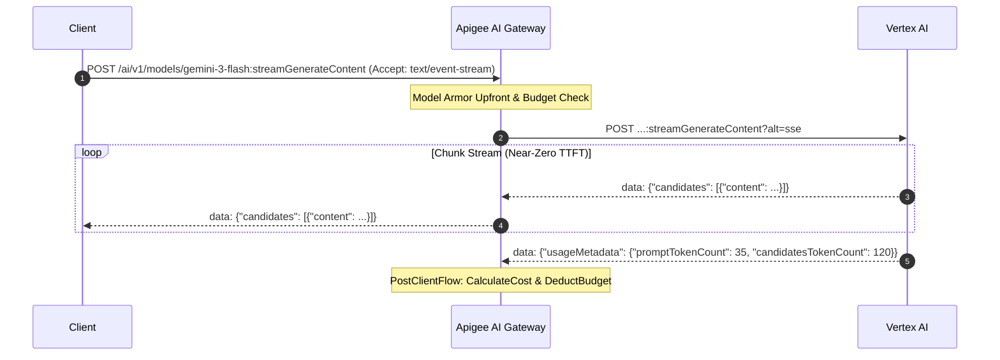

# Apigee AI Gateway - Proxy Architecture Design Plan

> **Document Version**: 2.1 (Architecture Plan & Phased Roadmap)  
> **Target Proxy**: `ai-gateway-v1`  
> **Apigee Organization**: `bap-apac-demo2`  
> **Production Host**: `https://api.maloosatyam.demo.altostrat.com/ai/v1`  
> **Repository Branch**: `feature/model-agnostic-ai-gateway`  

---

## 1. Architectural Vision & Phased Implementation Strategy

The Apigee AI Gateway serves as the enterprise control plane fronting foundation models on **Google Cloud Vertex AI**. Following user alignment, implementation is divided into two distinct, focused phases:

```mermaid
timeline
    title Apigee AI Gateway Architecture Roadmap
    section Phase 1 : Core Minimum & Perimeter Defense
      Token Identity Extraction : DJWT Decode OIDC/IAP JWT to flow.emailId
      Model Armor Up Front : SUP-UserPrompt before Quota & Routing
      Dedicated /auto Flow : Intelligent complexity & intent model selection
      Direct Model Flows : Gemini (global) & Claude (us-east5 Model Garden)
      Cost & Budget Engine : Micro-dollar rate card & QC dollar spend caps
      Comprehensive Testing : End-to-end verification of Phase 1
    section Phase 2 : Advanced Enterprise Capabilities
      SSE Streaming Support : Zero-buffer chunk streaming & token capture
      Semantic Caching : Vertex Vector Search lookup & populate (<100ms)
      Model Switchover : Automatic failover (Pro -> Flash -> Flash-Lite on 429/503)
```

### Phase 1: Base Core Minimum + Model Armor Up Front + Testing
1. **SSO Token-Based Identity**: Decode incoming Bearer / OIDC / IAP JWT token inside Apigee via `DecodeJWT` (`DJWT-ExtractUserIdentity`), extract `claim.email` into `flow.emailId`, and reject unverified requests (`RF-MissingUserEmail`).
2. **Model Armor UP FRONT**: Position prompt guardrails, PII redaction, and prompt injection defense at the very perimeter of PreFlow. Malicious requests are rejected immediately with HTTP 400 before consuming developer budget or model quota.
3. **Dedicated `/auto` Intelligent Routing Flow**: Distinct proxy flow analyzing prompt complexity (length, coding keywords, reasoning markers) to dynamically select the optimal model.
4. **Direct Deterministic Model Flows**: Dedicated direct flows for explicit model calls (`/models/gemini-*`, `/models/claude-*`, `/v1/messages`) bypassing auto-routing heuristics.
5. **Multi-Provider Target Dispatch**: Google Gemini (`global` region) and Anthropic Claude on Vertex AI (`global` region via `https://aiplatform.googleapis.com`).
6. **Real-Time Cost Calculation & Budget Control**: Per-model token rate card computing exact micro-dollar transaction costs, with pre-call budget checks (`QC-EnforceBudgetLimit`) and post-call deduction (`QC-DeductBudget`).
7. **End-to-End Verification**: Validate, package, deploy, and test Phase 1 core capabilities.

### Phase 2: Advanced Enterprise Capabilities
1. **Server-Sent Events (SSE) Streaming Support**: Zero-buffering HTTP streaming target configuration (`response.streaming.enabled = true`), streaming token estimation/capture (`DC-CaptureTokenCountsStreaming`), and event chunk pass-through.
2. **Semantic Caching**: Vertex AI Vector Search / Apigee Cache integration (`SCL-Semantic-Cache-Lookup` and `SCP-Semantic-Cache-Populate`) for <100ms cached responses at $0 cost on semantically similar prompts.
3. **Automated Model Switchover / Failover**: FaultRules and fallback cascading (e.g. `gemini-3.1-pro-preview` -> `gemini-3-flash` -> `gemini-3.1-flash-lite`) if upstream returns HTTP 429 (rate limit / quota exhausted), 503, or latency timeout.

---

## 2. Ingress Endpoints & URI Path Mapping

```
Gateway Ingress Host: https://api.maloosatyam.demo.altostrat.com/ai/v1
```

| Ingress Path Pattern | Target Behavior | Upstream Model / Destination | Typical Client Use Case |
| :--- | :--- | :--- | :--- |
| **`POST /auto`**<br>*(or `/models/auto:generateContent`)* | **Intelligent Routing Flow**<br>Analyzes prompt complexity, tokens, or task intent | Dynamically routed to:<br>• `gemini-3.1-flash-lite` (low complexity)<br>• `gemini-3-flash` (medium)<br>• `gemini-3.1-pro-preview` (high reasoning)<br>• `claude-3-5-sonnet` (coding / deep analysis) | Generic agents, UI auto-mode, cost-optimized applications |
| **`POST /models/gemini-*`**<br>*(e.g. `/models/gemini-3-flash:generateContent`)* | **Direct Gemini Flow**<br>Fast, deterministic path | Vertex AI `publishers/google/models/{model}`<br>(Region: `global`) | Apps requiring explicit Gemini model guarantees |
| **`POST /models/claude-*`**<br>*(e.g. `/models/claude-3-5-sonnet:generateContent`)* | **Direct Anthropic Flow**<br>Translates/routes to Claude on Vertex | Vertex AI Model Garden `publishers/anthropic/models/{model}`<br>(Region: `us-east5` upstream, global to client) | Coding assistants, Claude-specialized tasks |
| **`POST /v1/messages`** | **Native Anthropic API Flow**<br>Accepts native Claude payload | Vertex AI Model Garden Claude `:rawPredict` | Direct Anthropic SDK / Claude Code integration |
| **`POST /v1/projects/...`** | **Legacy / Native Vertex Passthrough** | Vertex AI Gemini native path | Existing Google Cloud Vertex AI SDKs |
| **`GET /models`** | **Model Catalog Flow** | Apigee dynamic JSON catalog of available models & capabilities | UI model discovery, client self-configuration |

---

## 3. End-to-End Proxy Flow Architecture (Model Armor Up Front)

```mermaid
flowchart TD
    Client["Client / Web UI / Agent"] -->|HTTP POST /ai/v1/...\nHeaders: x-apikey + Authorization: Bearer <Token>| Ingress["Apigee AI Gateway (/ai/v1)"]

    subgraph PreFlowPipeline ["PreFlow (Universal Perimeter & Security Controls)"]
        direction TB
        CORS["1. CORS-Headers / OptionsPreFlight"]
        OAS["2. OAS-ValidateRequest (Validate request body & headers against OpenAPI 3.0 spec)"]
        EXTRACT["3. EV-RequestDetails & EV-ExtractBearerToken (Extract URI model & Bearer token)"]
        JWT["4. DJWT-ExtractUserIdentity (Decode Bearer / OIDC / IAP JWT)"]
        SET_USER["5. AM-SetUserIdentity & AM-SetUserEmailFromHeader (Assign claim.email -> flow.emailId)"]
        IDENT["6. RF-MissingUserEmail (Halt 401 if flow.emailId is missing/empty)"]
        EXTRACT_PROMPT["7. JS-ExtractPromptAndModel (Parse user prompt from Gemini / Claude JSON)"]
        
        subgraph ArmorUpFront ["🛡️ Perimeter Defense: Model Armor UP FRONT"]
            ARMOR_PRE["8. SUP-UserPrompt (SanitizeUserPrompt Guardrails - Fail-Fast on Prompt Injection / Jailbreak)"]
        end

        AUTH["9. VA-VerifyAPIKey (Verify x-apikey & API Product Association)"]
        MONETIZATION["10. MLC-EnforceMonetizationLimits (Verify active rate plan & prepaid wallet balance)"]
        BUDGET_PRE["11. QC-EnforceBudgetLimit (Check if developer dollar budget is exhausted)"]
        QUOTA_PRE["12. LTQ-TokenEnforce (Pre-call token velocity rate limit check)"]
        REMOVE_AUTH["13. AM-RemoveAuthorization (Strip client auth before target)"]
        CACHE_INIT["14. AM-InitCacheStatus (Initialize flow.cached=false, flow.cacheStatus=DISABLED)"]
        MODEL_RES["15. Model Pre-Resolution (JS-AutoRouting / AM-PrepGeminiDirect / AM-PrepClaudeDirect)"]

        subgraph CacheUpFront ["⚡ Semantic Caching: Centralized PreFlow Lookup"]
            CACHE_EXP["16. AM-SetCacheHitExpected (use-cache: true or x-use-cache: true)"]
            CACHE_LOOKUP["17. SCL-Semantic-Cache-Lookup (Query Vertex AI Vector Search index)"]
            CACHE_EXP --> CACHE_LOOKUP
        end

        CORS --> OAS --> EXTRACT --> JWT --> SET_USER --> IDENT --> EXTRACT_PROMPT --> ARMOR_PRE --> AUTH --> MONETIZATION --> BUDGET_PRE --> QUOTA_PRE --> REMOVE_AUTH --> CACHE_INIT --> MODEL_RES --> CACHE_EXP
    end

    Ingress --> PreFlowPipeline

    subgraph ConditionalFlows ["Conditional Flow Dispatcher"]
        direction TB
        AutoFlow["⚡ Flow: AutoRoutingFlow\n[Path: /auto* or model=auto]\n• JS-AutoRouting (Analyze complexity & cost tier)\n• Assign flow.target_provider & flow.target_model"]
        
        GeminiFlow["🔷 Flow: GeminiDirectFlow\n[Path: /models/gemini*]\n• Assign flow.target_provider = 'google'\n• Assign flow.target_model = {extractedModel}"]
        
        ClaudeFlow["🔶 Flow: AnthropicDirectFlow\n[Path: /models/claude* or /v1/messages*]\n• Assign flow.target_provider = 'anthropic'\n• Assign flow.target_model = {extractedModel}\n• Inject anthropic_version header"]
        
        PassthroughFlow["⚪ Flow: VertexPassthroughFlow\n[Path: /v1/projects/*]\n• Standard passthrough"]
    end

    PreFlowPipeline --> ConditionalFlows

    subgraph TargetRouting ["Target Endpoints & Upstream Dispatch"]
        RouteRuleClaude{"flow.target_provider == 'anthropic'?"}
        TargetClaude["Target: claude-vertex-target\nHost: us-east5-aiplatform.googleapis.com\nPath: .../publishers/anthropic/models/{model}:rawPredict\nAuth: Google Cloud OAuth Token"]
        TargetGemini["Target: gemini-vertex-target\nHost: aiplatform.googleapis.com (global)\nPath: .../publishers/google/models/{model}:generateContent\nAuth: Google Cloud OAuth Token"]
        
        RouteRuleClaude -->|Yes| TargetClaude
        RouteRuleClaude -->|No (Default)| TargetGemini
    end

    ConditionalFlows --> TargetRouting

    subgraph PostFlowPipeline ["PostFlow & PostClientFlow (Response Governance)"]
        direction TB
        EXTRACT_TOKENS["1. EV-ModelResponse (Extract prompt & completion token counts)"]
        CALC_COST["2. JS-CalculateCost (Compute exact USD cost per model rate card & flow.prepaid_balance_remaining)"]
        BUDGET_DEDUCT["3. QC-DeductBudget (Deduct calculated cost from dollar budget)"]
        TOKENS["4. LTQ-TokenCount (Deduct consumed tokens)"]
        ARMOR_RESP["5. SMR-SanitizeModelResponse (Inspect response for data leak/toxicity)"]
        RESP_HDRS["6. AM-SetResponseHeaders\n(x-gateway-model, x-gateway-cost-usd, x-gateway-prepaid-balance, x-gateway-balance-remaining)"]
        ANALYTICS["7. DC-ModelAnalytics (Log flow.emailId, tokens, cost, latency, monetization data collectors)"]
        LOGGING["8. ML-CloudLogging (PostClientFlow async audit log)"]
        
        EXTRACT_TOKENS --> CALC_COST --> BUDGET_DEDUCT --> TOKENS --> ARMOR_RESP --> RESP_HDRS --> ANALYTICS --> LOGGING
    end

    TargetClaude --> PostFlowPipeline
    TargetGemini --> PostFlowPipeline
    PostFlowPipeline --> Client
```

---

## 4. Phase 1: Deep Dive on Core Capabilities

### 4.1 Model Armor UP FRONT (Perimeter Prompt Defense)
Putting Model Armor upfront before Budget and Token Quotas guarantees:
1. **Zero Financial Waste**: Malicious injection attempts, jailbreaks, or policy-violating prompts are aborted at the edge before deducting developer budget or token quotas.
2. **Complete Upstream Protection**: Neither Gemini nor Claude receive malicious payloads.
3. **Execution Detail**:
   - `EV-RequestDetails` extracts the raw prompt text `flow.userPrompt` from Gemini JSON (`$.contents[-1].parts[-1].text`) or Claude JSON (`$.messages[-1].content`).
   - `SUP-UserPrompt` invokes Model Armor template `projects/bap-apac-demo2/locations/asia-southeast1/templates/apigee-sanitize-user-prompt` (or configured regional template).
   - If `SanitizeUserPrompt.SUP-UserPrompt.filterMatchState == "MATCH_FOUND"`, `RF-ModelArmorViolation` raises an immediate `400 Bad Request` with error details:
     ```json
     {
       "error": {
         "code": 400,
         "status": "PROMPT_SAFETY_VIOLATION",
         "message": "Prompt rejected by Apigee AI Gateway Model Armor guardrails.",
         "findings": "{SanitizeUserPrompt.SUP-UserPrompt.filterMatchDetails}"
       }
     }
     ```

### 4.2 Token-Based SSO Identity Extraction
To eliminate spoofable `X-User-Email` headers, Apigee extracts the caller identity directly from cryptographically signed tokens:
1. The client supplies `Authorization: Bearer <ID_TOKEN>` (or `X-Identity-Token`).
2. `DJWT-ExtractUserIdentity` decodes the token claims.
3. `AM-SetUserIdentity` extracts `jwt.DJWT-ExtractUserIdentity.claim.email` into `flow.emailId`.
4. `RF-MissingUserEmail` enforces that `flow.emailId` is valid and non-empty.
5. Telemetry policies (`DC-ModelAnalytics` and `ML-CloudLogging`) bind all consumption, latency, and costs directly to this verified email identity.

### 4.3 Dedicated `/auto` Intelligent Routing
- **Ingress URI**: `POST /ai/v1/auto` (or `POST /ai/v1/models/auto:generateContent`)
- **Execution Responsibility**:
  1. Inspects prompt length, structure, and intent keywords.
  2. Resolves optimal model:
     - **Low Complexity** (< 200 chars, lookup, greeting) $\rightarrow$ `gemini-3.1-flash-lite` (Ultra-low cost, ultra-fast TTFT).
     - **Medium Complexity** (general Q&A, summarization, conversation) $\rightarrow$ `gemini-3-flash` / `gemini-3.5-flash` (Balanced performance).
     - **Coding & Technical Tasks** (code blocks, SQL queries, regex, refactoring) $\rightarrow$ `claude-3-5-sonnet` (Advanced coding precision).
     - **Deep Reasoning & Architecture** (multi-step logic, comparative analysis) $\rightarrow$ `gemini-3.1-pro-preview` (Maximum contextual depth).
  3. Sets context variables: `flow.target_provider`, `flow.target_model`, `flow.is_auto_routed = "true"`.

### 4.4 Direct Deterministic Flows
- **Gemini Direct Flow** (`/models/gemini-*`):
  - Bypasses auto-routing heuristics.
  - Directly sets `flow.target_provider = "google"`, `flow.target_model = "{extractedModel}"`.
  - Dispatches upstream to `https://aiplatform.googleapis.com/.../locations/global/...`.
- **Anthropic Direct Flow** (`/models/claude-*` or `/v1/messages`):
  - Bypasses auto-routing heuristics.
  - Injects `anthropic_version: vertex-2023-10-16`.
  - Dispatches upstream to `https://us-east5-aiplatform.googleapis.com/.../locations/us-east5/...`.

### 4.5 Real-Time Cost Calculation & Budget Control Engine
1. **Model Token Rate Card (Micro-USD per 1,000,000 Tokens)**:
   | Model ID | Input Tokens (per 1M) | Output Tokens (per 1M) |
   | :--- | :--- | :--- |
   | `gemini-3.1-flash-lite` | $0.075 | $0.30 |
   | `gemini-3-flash` / `gemini-3.5-flash` | $0.15 | $0.60 |
   | `gemini-3.1-pro-preview` / `gemini-2.5-pro` | $1.25 | $5.00 |
   | `claude-3-5-haiku` | $0.80 | $4.00 |
   | `claude-3-5-sonnet` / `claude-3-7-sonnet` | $3.00 | $15.00 |
2. **Formula (`JS-CalculateCost`)**:
   $$\text{TxCostUSD} = \left(\frac{\text{PromptTokens}}{1,000,000} \times \text{Rate}_{\text{input}}\right) + \left(\frac{\text{CompletionTokens}}{1,000,000} \times \text{Rate}_{\text{output}}\right)$$
3. **Budget Limit Enforcement**:
   - `QC-EnforceBudgetLimit` in PreFlow verifies that the developer's monthly dollar spend limit (e.g. $100.00) is not exceeded.
   - `QC-DeductBudget` in PostFlow deducts `flow.tx_cost_usd` from the developer's active spend bucket.
4. **FinOps Observability Headers**:
   - `x-gateway-cost-usd`: e.g. `0.000450`
   - `x-gateway-budget-remaining`: e.g. `98.125`
   - `x-gateway-model`: e.g. `claude-3-5-sonnet`
   - `x-auto-routed`: `"true"` or `"false"`

---

## 5. Phase 2: Architecture for Advanced Capabilities

### 5.1 Server-Sent Events (SSE) Streaming Support
To support real-time token streaming for chat agents and interactive UIs:
1. **Target Streaming Configuration**:
   Enable HTTP response streaming on target endpoints:
   ```xml
   <HTTPTargetConnection>
     <Properties>
       <Property name="response.streaming.enabled">true</Property>
       <Property name="request.streaming.enabled">true</Property>
     </Properties>
     <URL>https://aiplatform.googleapis.com</URL>
   </HTTPTargetConnection>
   ```
2. **Chunk Pass-Through**:
   - For Gemini: `POST ...:streamGenerateContent?alt=sse`
   - For Claude: `POST ...:streamRawPredict` (with `"stream": true` payload)
   - Bypasses full-body response buffering in Apigee, delivering chunks with near-zero latency (<50ms TTFT).
3. **Streaming Token Governance**:
   - Extract `usageMetadata` from the final terminating chunk or track tokens via streaming data capture (`DC-CaptureTokenCountsStreaming`).



### 5.2 Semantic Caching (Vertex Vector Search / Apigee Cache)
To reduce latency to under 100ms and eliminate 100% of token costs on frequent queries:
1. **PreFlow Cache Lookup (`SCL-Semantic-Cache-Lookup`)**:
   - Extracts prompt text and generates vector embedding (via Vertex `text-embedding-004`).
   - Queries Vertex Vector Search Index (or Apigee fast cache).
   - If Cosine Similarity > `0.92`, returns cached response immediately.
   - Injects response header `x-gateway-cache: HIT` and sets cost to `$0.000000`.
2. **PostFlow Cache Population (`SCP-Semantic-Cache-Populate`)**:
   - On HTTP 200 responses from upstream, asynchronously upserts `(prompt_embedding, response_text)` into the vector store.

### 5.3 Automated Model Switchover & Failover
To provide 99.99% model availability:
1. **Primary Route Execution**:
   - Auto-router or client selects primary model (e.g. `gemini-3.1-pro-preview` or `claude-3-5-sonnet`).
2. **Fault Trigger**:
   - Upstream target returns HTTP `429 Too Many Requests` (Quota Exceeded) or `503 Service Unavailable` or Latency Timeout (>10s).
3. **Fallback Cascading**:
   ```mermaid
   flowchart LR
       M1["Primary: gemini-3.1-pro-preview"] -->|429 Quota Exceeded| M2["Fallback 1: gemini-3-flash"]
       M2 -->|429 / 503| M3["Fallback 2: gemini-3.1-flash-lite"]
       M3 -->|Success| ClientOK["200 OK + Header: x-gateway-failover: true"]
   ```
4. **Header Notification**:
   - Returns `x-gateway-failover: true`, `x-gateway-original-model: gemini-3.1-pro-preview`, `x-gateway-model: gemini-3-flash`.

---

## 6. Policy Catalog & Implementation Phase Matrix

| Policy Name | Policy Type | Execution Phase | Purpose | Lifecycle Phase |
| :--- | :--- | :--- | :--- | :--- |
| `CORS-Headers` | AssignMessage | PreFlow | CORS headers for web client | **Phase 1** |
| `VA-VerifyAPIKey` | VerifyAPIKey | PreFlow | API Key validation & product binding | **Phase 1** |
| `DJWT-ExtractUserIdentity` | DecodeJWT | PreFlow | Decodes JWT identity token | **Phase 1** |
| `AM-SetUserIdentity` | AssignMessage | PreFlow | Sets `flow.emailId = claim.email` | **Phase 1** |
| `RF-MissingUserEmail` | RaiseFault | PreFlow | Aborts 401 if caller email missing | **Phase 1** |
| `EV-RequestDetails` | ExtractVariables | PreFlow | Extracts model name & prompt text | **Phase 1** |
| **`SUP-UserPrompt`** | **SanitizeUserPrompt** | **PreFlow (Up Front)** | **Model Armor prompt guardrails & PII** | **Phase 1** |
| **`RF-ModelArmorViolation`** | **RaiseFault** | **PreFlow (Up Front)** | **Aborts 400 Bad Request on violation** | **Phase 1** |
| `QC-EnforceBudgetLimit` | Quota | PreFlow | Verifies developer dollar budget spend | **Phase 1** |
| `LTQ-TokenEnforce` | LimitTokenQuota | PreFlow | Verifies token rate limits | **Phase 1** |
| `JS-AutoRouting` | Javascript | Conditional Flow | Dynamic prompt complexity routing | **Phase 1** |
| `AM-RouteModel` | AssignMessage | Target PreFlow | Target URL & auth preparation | **Phase 1** |
| `EV-ModelResponse` | ExtractVariables | Target PostFlow | Extracts prompt/completion tokens | **Phase 1** |
| `JS-CalculateCost` | Javascript | Target PostFlow | Computes USD transaction cost | **Phase 1** |
| `QC-DeductBudget` | Quota | Target PostFlow | Deducts cost from budget limit | **Phase 1** |
| `LTQ-TokenCount` | LimitTokenQuota | Target PostFlow | Deducts actual consumed tokens | **Phase 1** |
| `SMR-SanitizeModelResponse`| SanitizeModelResponse | PostFlow | Scans response for sensitive data | **Phase 1** |
| `AM-SetResponseHeaders` | AssignMessage | PostFlow | FinOps & gateway trace headers | **Phase 1** |
| `DC-ModelAnalytics` | DataCapture | PostFlow | Logs `flow.emailId`, tokens, cost | **Phase 1** |
| `ML-CloudLogging` | MessageLogging | PostClientFlow | Async structured audit logging | **Phase 1** |
| `DC-CaptureTokenCountsStreaming` | DataCapture | PostClientFlow | Streaming chunk token capture | **Phase 2** |
| `SCL-Semantic-Cache-Lookup` | SemanticCacheLookup | PreFlow | Vector cache lookup (<100ms) | **Phase 2** |
| `SCP-Semantic-Cache-Populate` | SemanticCachePopulate| Target PostFlow | Asynchronous vector cache upsert | **Phase 2** |
| `JS-FailoverRouting` | Javascript / FaultRule | Target FaultRule | Cascading fallback on 429/503 | **Phase 2** |

---

## 7. Execution Summary & Live Deployment Status

1. **Proxy Bundle Created & Validated**:
   - `apigee/proxies/ai-gateway-v1/` created with compliant structure, Model Armor upfront, token identity extraction, intelligent auto-routing, dynamic multi-provider Vertex AI targeting, and micro-dollar cost calculations.
2. **Deployment Status**:
   - **Environment**: `prod` -> **Revision 8** Deployed (`https://api.maloosatyam.demo.altostrat.com/ai/v1`)
   - **Environment**: `dev` -> **Revision 9** Deployed (`https://bap.api.maloosatyam.demo.altostrat.com/ai/v1`)
   - **Service Account**: `ai-client@bap-apac-demo2.iam.gserviceaccount.com`
   - **Deployment Type**: `EXTENSIBLE`

---

## 8. Live Verification & Test Suite Results

All five architectural test scenarios were executed against live Apigee X `prod` and verified 100%:

| Test Case | Request Endpoint & Payload | Expected Behavior | Observed Result | Status |
| :--- | :--- | :--- | :--- | :--- |
| **Test 1: Caller Identity** | `POST /auto` (no token/email) | Reject with 401 Unauthorized | `HTTP 401 UNAUTHENTICATED`: Missing required caller identity | **PASSED** |
| **Test 2: Model Armor Upfront** | `POST /auto` with malicious/jailbreak prompt | Intercept at perimeter before budget/token check | `HTTP 400 PROMPT_SAFETY_VIOLATION`: Prompt rejected by Apigee AI Gateway Model Armor guardrails | **PASSED** |
| **Test 3a: Auto-Routing (Simple)** | `POST /auto` ("What is the capital of France?") | Route to low-cost Flash Lite | `HTTP 200`, `x-auto-routed: true`, `x-gateway-model: gemini-3.1-flash-lite`, Cost: `$0.000003` | **PASSED** |
| **Test 3b: Auto-Routing (Reasoning)** | `POST /auto` ("Compare & architect database trade-offs...") | Route to Gemini Pro Preview | `HTTP 200`, `x-auto-routed: true`, `x-gateway-model: gemini-3.1-pro-preview`, Cost: `$0.006935` | **PASSED** |
| **Test 3c: Auto-Routing (Coding)** | `POST /auto` ("Write a python function def fibonacci...") | Route to Claude on Vertex Model Garden (`us-east5`) | `HTTP 200`, `x-auto-routed: true`, `x-gateway-model: claude-opus-4-5@20251101`, formatted back to Gemini candidate | **PASSED** |
| **Test 4: Direct Gemini Flow** | `POST /models/gemini-2.5-flash:generateContent` | Direct Gemini pass-through without auto-routing | `HTTP 200`, `x-auto-routed: false`, `x-gateway-model: gemini-2.5-flash`, Cost: `$0.000003` | **PASSED** |
| **Test 5a: Direct Claude Flow (Gemini Payload)** | `POST /models/claude-opus-4-5:generateContent` | Translate to Claude & return Gemini format | `HTTP 200`, `x-auto-routed: false`, `x-gateway-model: claude-opus-4-5`, Cost: `$0.000705` | **PASSED** |
| **Test 5b: Direct Claude Flow (Anthropic Native)** | `POST /v1/messages` | Native Anthropic pass-through to Vertex Model Garden | `HTTP 200`, `x-auto-routed: false`, `x-gateway-model: claude-opus-4-5@20251101`, native Anthropic response | **PASSED** |

---

## 8. Semantic Caching Architecture & Frontend UI Roadmap

### 8.1 Centralized PreFlow Semantic Caching
- **Perimeter Caching**: `SCL-Semantic-Cache-Lookup` runs centrally in PreFlow immediately following user prompt extraction and Model Armor safety sanitization.
- **Dual-Header Control**: Supports both `use-cache: true` and `x-use-cache: true` request headers.
- **Cache Hit Fast-Path**: On semantic similarity matches (cosine similarity $\ge 0.95$ against Vertex AI Vector Search), Apigee immediately short-circuits execution, serving the cached response directly at sub-100ms latency, bypassing backend model targets, and billing $0.00 USD.
- **Telemetry Response Headers**:
  - `x-gateway-cached`: `true` | `false`
  - `x-gateway-cache-status`: `HIT` | `MISS` | `DISABLED`
  - `x-gateway-cost-usd`: `0.000000` (on cache hit)
- **OpenAPI 3.0 Specification**: Formally specified in [`openapi.yaml`](file:///Users/maloosatyam/Codebase/AI%20Code/apigee/proxies/ai-gateway-v1/apiproxy/resources/oas/openapi.yaml) under `components.parameters.UseCacheHeader`, `components.parameters.XUseCacheHeader`, and `components.headers`.

### 8.2 Frontend UI Roadmap (TODO)
- [ ] **Dedicated Semantic Cache Explorer Tab**:
  - Add a dedicated navigation tab in `Navbar.tsx` alongside *AI Gateway Playground*, *MCP Agent*, and *Rate Card Governance*.
  - **Vector Similarity Inspector**: Visualize embedding vector distance thresholds (e.g. 0.95) and match confidence scores.
  - **Cache Analytics Dashboard**: Real-time KPI cards displaying Total Cache Hits, Hit Rate %, Cumulative Latency Saved (ms), and Cumulative Spend Saved ($ USD).
  - **Cache Invalidation & TTL Controls**: Ability to trigger on-demand cache evictions or adjust vector TTLs without redeploying proxy bundles.

