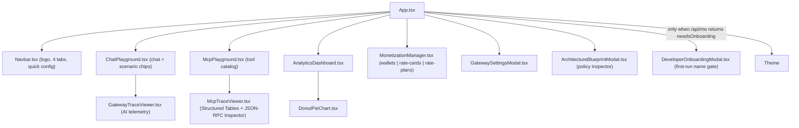

# Frontend UI Reference: Gateway Governance & Semantic Cache Surfaces

> **Repository path**: `ui/`
> **Status**: Reconciled against source on 2026-09-17. Sections are explicitly labelled
> **Implemented** or **Proposal (not built)**.
> **Associated proxies**: [`apigee/proxies/ai-gateway-v1`](file:///Users/maloosatyam/Codebase/AI%20Code/apigee/proxies/ai-gateway-v1),
> [`apigee/proxies/mcp`](file:///Users/maloosatyam/Codebase/AI%20Code/apigee/proxies/mcp)

> [!IMPORTANT]
> This document previously specified a `SemanticCacheView.tsx` component and a fifth
> `semantic-cache` studio tab. **Neither was ever implemented.** Semantic cache behaviour
> ships today through the [ChatPlayground](file:///Users/maloosatyam/Codebase/AI%20Code/ui/src/components/ChatPlayground.tsx)
> scenario chips and the Semantic Cache card in
> [GatewayTraceViewer](file:///Users/maloosatyam/Codebase/AI%20Code/ui/src/components/GatewayTraceViewer.tsx#L217-L266).
> The unbuilt design is preserved — clearly marked — in [Section 9](#9-proposal--not-built-semanticcacheviewtsx).

---

## 1. What ships today

| Capability | Where it actually lives | Built? |
| --- | --- | --- |
| Semantic cache demo (seed → hit) | Two-step chip in `ChatPlayground` + `useCache` setting | ✅ |
| Cache outcome display | `GatewayTraceViewer` "Semantic Cache" + "Latency" cards | ✅ |
| Cache on/off toggle | `GatewayTraceViewer` header pill and `ChatPlayground` footer pill | ✅ |
| MCP JSON-RPC tracing | `McpPlayground` + `McpTraceViewer` | ✅ |
| Prepaid wallet balance readout | `GatewayTraceViewer` "Wallet" card (from response headers) | ✅ |
| Wallet top-up | `MonetizationManager` "Top-Up Prepaid Wallet" modal | ✅ |
| Dedicated cache explorer screen | — | ❌ never built |
| Cache KPI dashboard / vector entries table | — | ❌ never built |
| Fifth `semantic-cache` navigation tab | — | ❌ never built |

---

## 2. Component inventory (Implemented)

**Sixteen** components exist under
[`ui/src/components/`](file:///Users/maloosatyam/Codebase/AI%20Code/ui/src/components).

| Component | Purpose | Mounted today? |
| --- | --- | --- |
| [AnalyticsDashboard.tsx](file:///Users/maloosatyam/Codebase/AI%20Code/ui/src/components/AnalyticsDashboard.tsx) | Fleet consumption / cost KPIs | Yes — `analytics` tab |
| [ApigeeLogo.tsx](file:///Users/maloosatyam/Codebase/AI%20Code/ui/src/components/ApigeeLogo.tsx) | Exports `ApigeeLogo` and `ApigeeColorSymbol` | Yes — Navbar, ChatPlayground |
| [ArchitectureBlueprintModal.tsx](file:///Users/maloosatyam/Codebase/AI%20Code/ui/src/components/ArchitectureBlueprintModal.tsx) | Interactive AI Gateway, MCP Tools Gateway & ADK Dual-Pattern architecture pipeline diagram with clickable XML policy inspector, live trace correlation, and dynamic short-circuit `Tested Request Flow` mode | Yes — App (`Architecture` button in Navbar + inline `Request Flow` button next to Target URL / MCP Operation) |
| [CallLogsModal.tsx](file:///Users/maloosatyam/Codebase/AI%20Code/ui/src/components/CallLogsModal.tsx) | **Full Audit Logs** — per-call Cloud Logging table for one `(user, model)` pair, with window selector, expandable rows and a Cloud Logging deep link | Yes — AnalyticsDashboard (`View logs` link in the consumption ledger) |
| [ChatPlayground.tsx](file:///Users/maloosatyam/Codebase/AI%20Code/ui/src/components/ChatPlayground.tsx) | Chat pane + scenario chips + trace pane | Yes — `ai-gateway` tab |
| [DeveloperOnboardingModal.tsx](file:///Users/maloosatyam/Codebase/AI%20Code/ui/src/components/DeveloperOnboardingModal.tsx) | First-run name-confirmation gate; collects first/last name and `POST`s to `/api/me/onboard` to create the developer, app, prepaid wallet and subscription | Yes — App, conditionally: rendered only when `GET /api/me` returns `needsOnboarding: true` ([App.tsx#L528](file:///Users/maloosatyam/Codebase/AI%20Code/ui/src/App.tsx#L528)) |
| [DonutPieChart.tsx](file:///Users/maloosatyam/Codebase/AI%20Code/ui/src/components/DonutPieChart.tsx) | Chart primitive | Yes — AnalyticsDashboard |
| [GatewaySettingsModal.tsx](file:///Users/maloosatyam/Codebase/AI%20Code/ui/src/components/GatewaySettingsModal.tsx) | Settings modal, heading **"Gateway Configuration"** | Yes — App |
| [GatewayTraceViewer.tsx](file:///Users/maloosatyam/Codebase/AI%20Code/ui/src/components/GatewayTraceViewer.tsx) | AI Gateway telemetry panel | Yes — ChatPlayground |
| [McpPlayground.tsx](file:///Users/maloosatyam/Codebase/AI%20Code/ui/src/components/McpPlayground.tsx) | MCP tool catalog + execution | Yes — `mcp-gateway` tab |
| [McpTraceViewer.tsx](file:///Users/maloosatyam/Codebase/AI%20Code/ui/src/components/McpTraceViewer.tsx) | Structured result tables + collapsible JSON-RPC/headers inspector | Yes — McpPlayground |
| [ModelRateCardView.tsx](file:///Users/maloosatyam/Codebase/AI%20Code/ui/src/components/ModelRateCardView.tsx) | Standalone KVM rate-card screen | **No — not imported anywhere** |
| [MonetizationManager.tsx](file:///Users/maloosatyam/Codebase/AI%20Code/ui/src/components/MonetizationManager.tsx) | Wallets, rate cards, rate plans | Yes — `monetization` tab |
| [Navbar.tsx](file:///Users/maloosatyam/Codebase/AI%20Code/ui/src/components/Navbar.tsx) | Header, tabs, quick config | Yes — App |
| [ScenarioPresets.tsx](file:///Users/maloosatyam/Codebase/AI%20Code/ui/src/components/ScenarioPresets.tsx) | Grid renderer for `SCENARIO_PRESETS` | **No — not imported anywhere** |

> [!NOTE]
> `ModelRateCardView.tsx` and `ScenarioPresets.tsx` compile but are never rendered. Rate cards
> are served by the `rate-cards` sub-tab inside `MonetizationManager`, and the chat scenario grid
> is built inline in `ChatPlayground` from the `sampleChips` array. Treat both files as dead code
> pending a decision to wire them up or delete them.

### 2.1 Component graph



---

## 3. Tab routing (Implemented)

### 3.1 `AppTab` type

[`ui/src/types/index.ts#L131`](file:///Users/maloosatyam/Codebase/AI%20Code/ui/src/types/index.ts#L131):

```ts
export type AppTab =
  | 'ai-gateway'
  | 'mcp-gateway'
  | 'kvm-pricing'
  | 'monetization'
  | 'analytics'
  | 'rate-cards';
```

`kvm-pricing` and `rate-cards` are legacy aliases: all three monetization-family values render the
same [MonetizationManager](file:///Users/maloosatyam/Codebase/AI%20Code/ui/src/App.tsx#L350-L351).

The initial tab can be deep-linked with `?tab=`, but
[App.tsx#L169-L177](file:///Users/maloosatyam/Codebase/AI%20Code/ui/src/App.tsx#L169-L177) only accepts
`ai-gateway`, `mcp-gateway`, `monetization`, `kvm-pricing`, `analytics` — `rate-cards` is **not**
accepted from the URL. Anything else falls back to `ai-gateway`.

Non-admin personas are bounced off the monetization family back to a permitted tab
([App.tsx#L294-L298](file:///Users/maloosatyam/Codebase/AI%20Code/ui/src/App.tsx#L294-L298)).

### 3.2 Navbar tabs

[Navbar.tsx#L120-L178](file:///Users/maloosatyam/Codebase/AI%20Code/ui/src/components/Navbar.tsx#L120-L178)
renders the 4-colour logo symbol (no wordmark) followed by these buttons:

| Order | Visible label | Target tab | Icon | Visibility |
| --- | --- | --- | --- | --- |
| 1 | `AI Gateway` | `ai-gateway` | `Sparkles` | Always |
| 2 | `MCP Gateway` | `mcp-gateway` | `Terminal` | Always |
| 3 | `Analytics & Cost` | `analytics` | `BarChart3` | Always |
| 4 | `Monetization` | `monetization` | `Coins` | Admin view only |

Admin view is `analyticsControls?.viewMode === 'admin'` on the analytics tab, otherwise
`settings.activeUser === 'admin'`
([Navbar.tsx#L107-L110](file:///Users/maloosatyam/Codebase/AI%20Code/ui/src/components/Navbar.tsx#L107-L110)).

### Analytics tab defaults

| Control | Default | Override |
| --- | --- | --- |
| View mode | **User** | `Admin` / `User` toggle, or `?view=admin` |
| Time range | **24H** | `24H` / `7D` / `30D` selector |
| User filter | `All Users (Fleet)` — admin view only | `?userFilter=<email>` |

> [!IMPORTANT]
> Because `Monetization` is gated on admin view *while the analytics tab is active*, the default
> User view hides that tab until the toggle is switched to **Admin**. This is expected, not a
> regression — the tab reappears immediately on switching.

The **View logs** modal opens on whichever time range is selected here, so the audit drill-down
always covers the same period as the ledger row behind it.

### Navbar layout and identity chip

| Element | Behaviour |
| --- | --- |
| Tab labels | Collapse to icon-only below **1400px**; the `title` tooltip still names each tab |
| Persona pills (`Admin` / `Sales` / `Loans`) | Rendered on the **MCP Gateway tab only** |
| Active persona elsewhere | Pinned back to `admin` on leaving the MCP tab |
| Controls drawer (`☰`) | Below **1024px**, matching its toggle button |
| SSO chip + popover | Read-only; no identity field, no OIDC token row |

Persona selects an agent's *tool* entitlements, which is an MCP concern. The AI Gateway
tab therefore always runs on the Enterprise (`admin`) key, and model entitlement is
demonstrated by selecting a model no API product grants.

> [!WARNING]
> Two CSS traps caused the SSO popover to render detached off the top-right of the
> viewport. Do not reintroduce either:
> 1. The popover needs an explicit **`top-full`**. With `top: auto` an absolutely
>    positioned child falls back to its static position, which inside an `items-center`
>    flex row is *vertically centred* — placing the panel ~95px above the navbar.
> 2. Every navbar group was `shrink-0`, so the row had a fixed **1487px** intrinsic
>    width and simply overflowed the viewport, carrying the whole SSO block off-screen
>    below that width. Anything added to the navbar must stay within the budget.

> [!CAUTION]
> The word "Apigee" is deliberately absent from all rendered UI text; only the logo symbol remains.
> Quote only the strings above. Code identifiers (`ApigeeLogo`, `sendPromptToApigee`,
> `apigeeClient.ts`) intentionally retain the name and are not user-facing.

---

## 4. Request header contract (Implemented)

### 4.1 AI Gateway — [`apigeeClient.ts`](file:///Users/maloosatyam/Codebase/AI%20Code/ui/src/services/apigeeClient.ts#L149-L167)

```ts
const headersSent: Record<string, string> = {
  'Content-Type': 'application/json',
  'x-apikey': effectiveApiKey,
};
// Identity is the JWT only. The X-User-Email fallback was removed from the proxy.
if (!settings.omitEmailHeader && effectiveIdToken) {
  headersSent['Authorization'] = `Bearer ${effectiveIdToken}`;
}
if (settings.useCache) headersSent['use-cache'] = 'true';
```

| Header | Sent when | Notes |
| --- | --- | --- |
| `Content-Type: application/json` | Always | — |
| `x-apikey` | Always | Resolved from `settings.apiKey`, the active persona, or `/api/me` |
| `Authorization: Bearer <id_token>` | SSO token present **and** `omitEmailHeader` false | The **only** identity the AI Gateway accepts |
| `use-cache: true` | `settings.useCache === true` | Only emitted when true; never sent as `false` |

> [!NOTE]
> The `ai-gateway-v1` proxy also accepts `x-use-cache` as an alias
> ([default.xml#L79-L83](file:///Users/maloosatyam/Codebase/AI%20Code/apigee/proxies/ai-gateway-v1/apiproxy/proxies/default.xml#L79-L83)),
> but the UI never sends it. Do not document `x-use-cache` as a UI behaviour.

[`exhaustLlmQuota()`](file:///Users/maloosatyam/Codebase/AI%20Code/ui/src/services/apigeeClient.ts#L380-L400)
fires a large `gemini-3.1-flash-lite` prompt with `Content-Type`, `x-apikey` and
`Authorization: Bearer …`. It previously sent `X-User-Email` instead of the token, which meant
every one of its calls was 401'd by `RF-MissingUserEmail` and the quota was never actually
consumed — the demo appeared to fire requests while doing nothing.

### 4.2 MCP Gateway — [`mcpClient.ts`](file:///Users/maloosatyam/Codebase/AI%20Code/ui/src/services/mcpClient.ts#L27-L48)

`Content-Type`, `x-apikey`, optional `Authorization: Bearer …`, **and** optional
`X-User-Email`. Both `tools/list` and `tools/call` POST JSON-RPC 2.0 envelopes to the resolved
MCP endpoint.

> [!IMPORTANT]
> **The MCP identity contract deliberately differs from the AI Gateway's, and this is not
> drift.** The MCP demo is built around three personas — Admin, Sales Agent and Loans Agent —
> which exist to show *tool-level* authorization: the same `tools/list` call returns a
> different tool set per persona. Those personas are not real signed-in humans, so there is no
> SSO-derived JWT to carry them; the persona travels in `X-User-Email` and the corresponding
> product entitlement travels in `x-apikey`.
>
> The AI Gateway has the opposite requirement. It demonstrates *per-user* attribution, cost and
> quota against the real signed-in identity, so it takes identity from the JWT only and rejects
> the header. Migrating MCP to JWT-only would mean minting a JWT per synthetic persona, which
> buys symmetry and nothing else.

Consequence to keep in mind: an `X-User-Email` value sent to MCP is caller-asserted and
unverified. It selects which tools are offered, so the real access control there is the API
key and its product, not the header.

---

## 5. Response headers the UI consumes (Implemented)

### 5.0 What the gateway actually sets

[`AM-SetResponseHeaders.xml`](file:///Users/maloosatyam/Codebase/AI%20Code/apigee/proxies/ai-gateway-v1/apiproxy/policies/AM-SetResponseHeaders.xml)
sets **exactly fifteen** headers, and no others:

`x-gateway-model`, `x-gateway-provider`, `x-auto-routed`, `x-gateway-cost-tier`,
`x-gateway-cost-usd`, `x-gateway-currency`, `x-gateway-cached`, `x-gateway-cache-status`,
`x-gateway-prompt-tokens`, `x-gateway-completion-tokens`, `x-gateway-total-tokens`,
`x-gateway-monetization-status`, `x-gateway-prepaid-balance`, `x-gateway-prepaid-currency`,
`x-gateway-balance-remaining`.

The policy has `IgnoreUnresolvedVariables=true`, so a header whose source flow variable is unset is
emitted empty rather than omitted.

`apigeeClient` lower-cases and stores **every** response header in `telemetry.headersReceived`, then
reads the following explicitly:

| Header | Read at | Used for |
| --- | --- | --- |
| `x-gateway-cache-status` | [apigeeClient.ts#L212-L222](file:///Users/maloosatyam/Codebase/AI%20Code/ui/src/services/apigeeClient.ts#L212-L222) | `telemetry.cacheStatus` (`HIT` / `MISS` / `DISABLED`) |
| `x-gateway-cached` | [L217](file:///Users/maloosatyam/Codebase/AI%20Code/ui/src/services/apigeeClient.ts#L217) | Fallback when `x-gateway-cache-status` is absent |
| `x-gateway-model` | [L266](file:///Users/maloosatyam/Codebase/AI%20Code/ui/src/services/apigeeClient.ts#L266), [L308](file:///Users/maloosatyam/Codebase/AI%20Code/ui/src/services/apigeeClient.ts#L308) | Resolved model name |
| `x-gateway-provider` | [L260](file:///Users/maloosatyam/Codebase/AI%20Code/ui/src/services/apigeeClient.ts#L260) | Upstream provider |
| `x-auto-routed` | [L265](file:///Users/maloosatyam/Codebase/AI%20Code/ui/src/services/apigeeClient.ts#L265), [L310](file:///Users/maloosatyam/Codebase/AI%20Code/ui/src/services/apigeeClient.ts#L310) | Auto-routing badge |
| `x-gateway-cost-usd` | [L261](file:///Users/maloosatyam/Codebase/AI%20Code/ui/src/services/apigeeClient.ts#L261) | Cost readout (client-side estimate if absent) |
| `x-gateway-cost-tier` | [L262](file:///Users/maloosatyam/Codebase/AI%20Code/ui/src/services/apigeeClient.ts#L262) | Cost tier label |
| `x-gateway-prompt-tokens` | [L257](file:///Users/maloosatyam/Codebase/AI%20Code/ui/src/services/apigeeClient.ts#L257) | Prompt tokens when the body has no usage block |
| `x-gateway-completion-tokens` | [L258](file:///Users/maloosatyam/Codebase/AI%20Code/ui/src/services/apigeeClient.ts#L258) | Completion tokens |
| `x-gateway-total-tokens` | [L259](file:///Users/maloosatyam/Codebase/AI%20Code/ui/src/services/apigeeClient.ts#L259) | Total tokens |
| `x-gateway-prepaid-balance` | [L280](file:///Users/maloosatyam/Codebase/AI%20Code/ui/src/services/apigeeClient.ts#L280), [GatewayTraceViewer.tsx#L340](file:///Users/maloosatyam/Codebase/AI%20Code/ui/src/components/GatewayTraceViewer.tsx#L340) | Session-ledger baseline and the "Start Balance" tile |
| `x-gateway-monetization-status` | [GatewayTraceViewer.tsx#L309](file:///Users/maloosatyam/Codebase/AI%20Code/ui/src/components/GatewayTraceViewer.tsx#L309) | Wallet-depleted (403) styling |
| `x-gateway-balance-remaining` | [GatewayTraceViewer.tsx#L346](file:///Users/maloosatyam/Codebase/AI%20Code/ui/src/components/GatewayTraceViewer.tsx#L346) | "Remaining" tile |

The proxy also emits `x-gateway-currency` and `x-gateway-prepaid-currency`; the UI does not read
them today, though both appear in the raw headers accordion.

### 5.0.1 Headers the UI reads that the gateway never sets (dead reads)

> [!WARNING]
> Every lookup below resolves to `undefined` on every request. No policy in
> [`ai-gateway-v1`](file:///Users/maloosatyam/Codebase/AI%20Code/apigee/proxies/ai-gateway-v1) sets
> any of them — a repository-wide search of `apigee/` returns zero matches. Do not present these as
> gateway telemetry, and do not "fix" a blank value by looking for a proxy bug: the writer does not
> exist.

| Header | Read at | Actual effect |
| --- | --- | --- |
| `x-gateway-category` | [apigeeClient.ts#L263](file:///Users/maloosatyam/Codebase/AI%20Code/ui/src/services/apigeeClient.ts#L263) | Always `undefined`. First term of `effectiveCategory`. |
| `x-gateway-intent` | [apigeeClient.ts#L263](file:///Users/maloosatyam/Codebase/AI%20Code/ui/src/services/apigeeClient.ts#L263) | Always `undefined`. Second term of the same expression, so `effectiveCategory` is always `undefined` too. |
| `x-gateway-quota-remaining` | [ArchitectureBlueprintModal.tsx#L84](file:///Users/maloosatyam/Codebase/AI%20Code/ui/src/components/ArchitectureBlueprintModal.tsx#L84) | Always `undefined`; falls through to `x-ratelimit-remaining`, which the gateway does not set either, so `remainingTokens` is permanently empty. |

Because both intent headers are dead, the `Model Routing` card's intent label is **always** produced
by the client-side heuristic at
[apigeeClient.ts#L264-L275](file:///Users/maloosatyam/Codebase/AI%20Code/ui/src/services/apigeeClient.ts#L264-L275):
when the request was auto-routed, the model name is string-matched to yield `General / Fast`
(`flash`), `Deep Reasoning` (`pro`), or `Coding` (`claude` / `opus`), defaulting to `General / Fast`.
When the request was *not* auto-routed, `intent` stays `undefined`.

### 5.1 `GatewayTelemetry` type contract

[`ui/src/types/index.ts#L40-L81`](file:///Users/maloosatyam/Codebase/AI%20Code/ui/src/types/index.ts#L40-L81)
mixes fields that come from the gateway with fields the client computes. The distinction matters
when judging whether a number in the trace pane is authoritative.

| Field | Source | Notes |
| --- | --- | --- |
| `status`, `statusText` | Gateway | HTTP response line |
| `model` | Gateway, with fallback | `x-gateway-model`, else the requested model |
| `provider` | Gateway, with fallback | `x-gateway-provider`, else inferred from the model prefix |
| `autoRouted` | Gateway, with fallback | `x-auto-routed === 'true'`, else the client's `isAuto` flag |
| `costUsd` | **Gateway only** | `x-gateway-cost-usd`, else `undefined` — see the note below |
| `costTier` | **Gateway only** | `x-gateway-cost-tier`, else `undefined` — see the note below |
| `promptTokens`, `candidatesTokens`, `totalTokens` | Body first, then gateway | Response `usageMetadata` / `usage`, falling back to the token headers |
| `cacheStatus` | Gateway | `x-gateway-cache-status`, else derived from `x-gateway-cached` |
| `headersReceived` | Gateway | Every response header, lower-cased — **except** the two wallet keys, which the debit ledger overwrites |
| **`latencyMs`** | **Client** | `Math.round(performance.now() - startTime)` ([apigeeClient.ts#L195](file:///Users/maloosatyam/Codebase/AI%20Code/ui/src/services/apigeeClient.ts#L195)) — full browser round-trip including the local proxy hop |
| **`intent`** | **Client** | Always the heuristic in §5.0.1; the gateway sets no intent header |
| **`guardrailStatus`, `guardrailMessage`** | **Client** | Inferred by string-matching the 400 response body for `model armor` / `sanitize` / `blocked` / `sup-userprompt` ([L199-L204](file:///Users/maloosatyam/Codebase/AI%20Code/ui/src/services/apigeeClient.ts#L199-L204)) |
| `headersSent`, `rawRequest`, `endpointUrl`, `targetUrl`, `environment`, `user`, `userEmail`, `ssoUser`, `requestedModel` | Client | Request-side context |

> [!IMPORTANT]
> **The client never computes cost.** Both cost fields used to fall back to a client-side
> guess — a flat `$0.20 / 1M` blended rate, and a cost tier inferred by substring-matching the
> model name. The name heuristic was actively wrong: it labelled `gemini-3.7-flash` and
> `gemini-3.8-flash` *medium* when they bill at `7.50`, above `gemini-3.1-pro-preview`'s `5.00`.
> Both fallbacks are gone. `JS-CalculateCost` in the gateway is the single costing authority and
> now populates the headers on cache hits too, so the fallbacks had no legitimate caller left.
> When a header is genuinely absent the field stays `undefined` and `GatewayTraceViewer` hides
> the chip rather than showing a fabricated number.

The `x-*` keys at the bottom of the interface are **backwards-compatibility aliases**, not headers.
They are assigned from already-resolved values
([apigeeClient.ts#L331-L341](file:///Users/maloosatyam/Codebase/AI%20Code/ui/src/services/apigeeClient.ts#L331-L341)),
so reading `telemetry['x-gateway-cached']` gives the client's `cacheStatus === 'HIT'` verdict, not
the raw header.

> [!CAUTION]
> `x-gateway-latency-ms` is **not** a gateway header. It is `String(durationMs)` from the client
> stopwatch ([apigeeClient.ts#L340](file:///Users/maloosatyam/Codebase/AI%20Code/ui/src/services/apigeeClient.ts#L340)).
> The name is misleading — it measures browser round-trip, not gateway processing time.
>
> `x-pii-redacted` ([types/index.ts#L77](file:///Users/maloosatyam/Codebase/AI%20Code/ui/src/types/index.ts#L77))
> is **fully dead**: no policy sets it, nothing assigns it, and no component reads it. It is the only
> occurrence of the string in the entire repository. Delete it or implement it; do not document it as
> a capability.

> [!WARNING]
> Both balance tiles fall back to the hardcoded literal `109.988` when the headers are missing, so a
> plausible-looking balance can render even with no monetization data. Do not read those tiles as
> authoritative during a demo without confirming the headers are present.

MCP responses are filtered — [`extractResponseHeaders()`](file:///Users/maloosatyam/Codebase/AI%20Code/ui/src/services/mcpClient.ts#L53-L75)
keeps only: `content-type`, `x-request-id`, `x-cloud-trace-context`, `x-b3-traceid`, `x-b3-spanid`,
`date`, `server`, `via`, `x-powered-by`. `x-gateway-*` headers are therefore **not** visible in the
MCP trace even if the gateway sends them.

---

## 6. Backend proxy endpoints (Implemented)

Two equivalent implementations exist: Vite dev middleware in
[`ui/vite.config.ts`](file:///Users/maloosatyam/Codebase/AI%20Code/ui/vite.config.ts#L667-L1588)
(the `configureServer` hook) and the production Node server
[`ui/server.js`](file:///Users/maloosatyam/Codebase/AI%20Code/ui/server.js).
Both mint a GCP access token server-side and call the Apigee Management API.

| Route | Methods | Server handler | Client wrapper |
| --- | --- | --- | --- |
| `/env-config.js` | GET | [server.js#L698](file:///Users/maloosatyam/Codebase/AI%20Code/ui/server.js#L698-L710) | `window.__RUNTIME_CONFIG__`, read by `defaultSettings.ts` |
| `/api/me` | GET (`?email=`) | [server.js#L713](file:///Users/maloosatyam/Codebase/AI%20Code/ui/server.js#L713-L772) | inline `fetch` in `apigeeClient` and `App.tsx` |
| `/api/me/onboard` | POST, PUT | [server.js#L775](file:///Users/maloosatyam/Codebase/AI%20Code/ui/server.js#L774-L854) | `DeveloperOnboardingModal` inline `fetch` |
| `/api/me/profile` | POST, PUT | [server.js#L778](file:///Users/maloosatyam/Codebase/AI%20Code/ui/server.js#L774-L854) | same handler as `/api/me/onboard`; used to rename an existing developer |
| `/api/kvm/rates` | GET, PUT, POST | [server.js#L857](file:///Users/maloosatyam/Codebase/AI%20Code/ui/server.js#L857-L958) | `fetchModelRates`, `updateModelRates` |
| `/api/monetization/balance` | GET (`?dev=`) | [server.js#L960](file:///Users/maloosatyam/Codebase/AI%20Code/ui/server.js#L960-L1015) | `fetchDeveloperBalance` |
| `/api/monetization/debit` | POST only | [server.js#L1017](file:///Users/maloosatyam/Codebase/AI%20Code/ui/server.js#L1017-L1061) | inline `fetch` in `apigeeClient` ([L282](file:///Users/maloosatyam/Codebase/AI%20Code/ui/src/services/apigeeClient.ts#L282)) |
| `/api/monetization/credit` | POST | [server.js#L1064](file:///Users/maloosatyam/Codebase/AI%20Code/ui/server.js#L1064-L1127) | `creditDeveloperBalance` |
| `/api/monetization/rateplans` | GET | [server.js#L1129](file:///Users/maloosatyam/Codebase/AI%20Code/ui/server.js#L1129-L1179) | `fetchRatePlans` |
| `/api/monetization/subscriptions` | GET, POST | [server.js#L1181](file:///Users/maloosatyam/Codebase/AI%20Code/ui/server.js#L1181-L1248) | `fetchDeveloperSubscriptions`, `subscribeDeveloper` |
| `/api/monetization/config` | GET, PUT, POST | [server.js#L1250](file:///Users/maloosatyam/Codebase/AI%20Code/ui/server.js#L1250-L1306) | `fetchDeveloperMonetizationConfig`, `updateDeveloperMonetizationConfig` |
| `/api/analytics/fleet-stats` | GET (`?timeRange=&env=`) | [server.js#L1308](file:///Users/maloosatyam/Codebase/AI%20Code/ui/server.js#L1308-L1532) | `fetchFleetAnalytics` |
| `/api/monetization/attributions` | GET | [server.js#L1534](file:///Users/maloosatyam/Codebase/AI%20Code/ui/server.js#L1534-L1680) | `fetchDeveloperAttributions` |

> [!IMPORTANT]
> `/api/monetization/debit` is **not** an Apigee route. It is a local session ledger:
>
> - **POST only** — any other method returns `405 Method Not Allowed. Use POST.`
>   ([server.js#L1020-L1024](file:///Users/maloosatyam/Codebase/AI%20Code/ui/server.js#L1020-L1024)).
> - It never calls the Apigee Management API and never acquires a GCP token. All state lives in the
>   in-memory `Map` `sessionLedgerByDev`
>   ([server.js#L36](file:///Users/maloosatyam/Codebase/AI%20Code/ui/server.js#L36)), keyed by
>   lower-cased developer email, and is lost on every container restart or new revision.
> - It takes `{ developer, amountUsd, rawApigeeBalanceUsd }` and returns
>   `{ status, developer, debitedThisRequestUsd, totalDebitedSessionUsd, startBalanceUsd,
>   remainingBalanceUsd }`.
> - `apigeeClient` calls it after every 2xx gateway response and **overwrites**
>   `headersReceived['x-gateway-prepaid-balance']` and `['x-gateway-balance-remaining']` with the
>   ledger's values ([apigeeClient.ts#L294-L295](file:///Users/maloosatyam/Codebase/AI%20Code/ui/src/services/apigeeClient.ts#L294-L295)),
>   so the Wallet tiles chain continuously across requests. The values shown are therefore a session
>   simulation layered on the real gateway balance, not a live Apigee wallet read.

Pass-through proxies (prefix match,
[server.js#L1683-L1717](file:///Users/maloosatyam/Codebase/AI%20Code/ui/server.js#L1683-L1717)):
`/api/ai-dev`, `/api/ai-prod`, `/api/vertexai-dev`, `/api/vertexai-prod`,
`/api/mcp-dev`, `/api/mcp-prod`. Each prefix is stripped and the remainder is
appended to the environment's upstream base (`/ai/v1`, `/vertexai/v1` or `/mcp`),
query string preserved. Anything else falls through to static file serving.

> [!WARNING]
> `/api/analytics/fleet-stats` can return **more than one `consumptionRows` entry for the same
> `(userEmail, model)` pair**. One comes from the Analytics-indexed traffic, the other from the
> wallet reconciliation block
> ([server.js#L1418-L1488](file:///Users/maloosatyam/Codebase/AI%20Code/ui/server.js#L1418-L1488)),
> which synthesises `gemini-2.5-flash` / `gemini-3.1-pro-preview` rows for prepaid spend that
> analytics has not indexed yet. `AnalyticsDashboard` therefore **merges duplicate pairs** in
> `allConsumptionRecords` before anything else consumes them. Do not remove that merge: the ledger
> table keys its rows on `` `${userEmail}__${model}` ``, so duplicate pairs produce duplicate React
> keys, and React then fails to unmount rows when the list shrinks — the symptom was the **User**
> filter updating the ledger title, model dropdown and KPI cards while leaving other users' rows
> visibly stranded in the table.

### Request Success Rate — how it is derived per scope

| Scope | Numerator source | Denominator |
| :--- | :--- | :--- |
| Admin · All Users | `kpis.isErrorCount` — `sum(is_error)` on the `apiproxy` dimension | `kpis.totalCalls` (server computes `kpis.slaHealth`) |
| Admin · single user | `errorCount` summed over that user's `consumptionRows` | `totalTraffic` of the same rows |
| User view | same, scoped to the signed-in email | same |

Per-user error data only exists because the proxy's `DefaultFaultRule` runs `DC-FaultAnalytics`,
which emits `dc_user_email` on the fault path. The server selects `sum(is_error)` on the
`dc_user_email,dc_model_name` dimension and returns it as `errorCount` on each row, plus
`kpis.attributedErrorCount` as the total.

**The query must be filtered to `(apiproxy eq 'ai-gateway-v1')`.** `dc_user_email` is an
environment-wide dimension, so an unfiltered query also returns `mcp` and any other proxy's
traffic. Those proxies never set the dimension, so their calls arrive bucketed as `(not set)`
and would be rendered in the AI Gateway ledger as anonymous AI callers. Measured on prod:
unfiltered 126 calls / 45 errors versus filtered 76 / 39, the latter matching the `apiproxy`
dimension exactly. Without the filter `attributedErrorCount` can exceed `isErrorCount`, which
is the symptom to look for if this regresses.

**Placeholder normalisation.** Apigee reports a dimension that was never written as
`(not set)`, but a dimension captured from an *unresolved variable* as the literal string
`null`. The fault path produces the latter whenever a request dies before
`DJWT-ExtractUserIdentity` — a malformed body rejected by `OAS-ValidateRequest`, or a request
with no JWT. The server therefore treats `(not set)`, `null`, `undefined` and empty as
equivalent, mapping the user to `anonymous.caller@external.client` and the model to
`unknown-model`. Matching only `(not set)` would surface a user literally named "null" in the
ledger.

> [!NOTE]
> The **dev environment has no Analytics add-on** — every stats query against it returns
> `400 invalid argument: Analytics add-on is disabled for dev environment`. Dev therefore has
> no real `consumptionRows` at all and falls back entirely to synthetic wallet-derived rows,
> which correctly renders the success-rate card as an em dash. Verify analytics behaviour
> against **prod** only.

> [!WARNING]
> Two failure modes this design exists to prevent:
>
> 1. **Never substitute a flattering default.** `slaHealth` and `faultCount` are `null` when the
>    scope has no error data, and the card renders an em dash with "Not recorded for this window".
>    The panel previously hardcoded `slaHealth: 100, faultCount: 0` for every non-fleet view, so an
>    individual user displayed a perfect 100% while the fleet displayed 54% — and deliberately
>    triggering Model Armor or a token-limit block changed nothing.
> 2. **Report only what was measured.** Where no measurement exists, the API returns `null` and
>    the UI renders an em dash. It does not interpolate, extrapolate or assume.

### No fabricated analytics

Every invented value has been removed. For the record, because each was load-bearing in a
customer-facing screen:

| Value | What it used to be | Now |
| :--- | :--- | :--- |
| `cacheHitRate` (fleet) | hardcoded `29.4` | `HIT / (HIT + MISS)` from `dc_cache_status` |
| `cacheHitRate` (per user) | hardcoded `33` whenever calls > 0 | `null` — the dimension is not broken down per user |
| `cacheCostSavingsUsd` | `totalSpend * 0.35` | priced from measured hits, `null` when none |
| Cache sparkline | literal `[8,11,14…38]`, always rising | removed |
| Routing "savings" badge | `flashPercent * 0.55` | the measured share routed to the low-cost tier |
| `flashPercent` with no traffic | `78.5` | `null` |
| Consumption rows | two rows per developer synthesised from wallet drift — call count `spend x 16`, tokens `spend x 48500`, a 65/35 token split and a 60/40 model mix | removed; the ledger shows only recorded traffic |
| Monetization `totalCalls` / `totalTokens` | `Math.max(measured, walletDrift x 16 / x 48500)` | measured only |
| Monetization spend | flat `$0.75` per million tokens | per-model input/output rates from the `ai-model-rates` KVM |

> [!CAUTION]
> Removing the synthetic consumption rows changes what **dev** looks like. Because the dev
> environment has no Analytics add-on, those rows were its *only* source of data — the dashboard
> reported 110 entirely imaginary calls. Dev now correctly shows an empty ledger. Use **prod**
> to demonstrate analytics.

A consequence worth stating plainly: a developer whose prepaid wallet was debited by traffic
Apigee never indexed will now show fewer calls than their wallet spend implies. That gap is
real. The previous code hid it by inventing calls to match the money.

> [!NOTE]
> The **Model Split Across Catalog** card shows every model with `cost > 0` in the Spend ($) view,
> formatting sub-cent values with four decimals. It previously required `cost >= 0.01`, which
> silently dropped cheap models from Spend while they remained visible under Tokens.

### 6.1 Actual payload shapes

`GET /api/monetization/balance` returns the raw Apigee response nested under `data` — **not** a
flattened `balance` number:

```json
{
  "status": "ok",
  "developer": "maloosatyam@google.com",
  "org": "bap-apac-demo2",
  "data": {
    "wallets": [
      { "balance": { "currencyCode": "USD", "units": "109", "nanos": 996920000 } }
    ]
  }
}
```

`POST /api/monetization/credit` takes `{ "units": "50", "developer": "…" }` (units is a **string**;
there is no `amount` or `currency` field) and returns:

```json
{
  "status": "ok",
  "developer": "maloosatyam@google.com",
  "credited": "50",
  "transactionId": "topup-1726309876",
  "data": { }
}
```

Currency is hardcoded to `USD` server-side
([server.js#L1099-L1103](file:///Users/maloosatyam/Codebase/AI%20Code/ui/server.js#L1099-L1103)). A
successful top-up also clears that developer's `sessionLedgerByDev` entry
([server.js#L1109](file:///Users/maloosatyam/Codebase/AI%20Code/ui/server.js#L1109)), so the Wallet
tiles restart from the freshly credited balance.

---

## 7. How semantic cache is actually demonstrated (Implemented)

### 7.1 Gateway side

| Policy | Detail |
| --- | --- |
| [`SCL-Semantic-Cache-Lookup`](file:///Users/maloosatyam/Codebase/AI%20Code/apigee/proxies/ai-gateway-v1/apiproxy/policies/SCL-Semantic-Cache-Lookup.xml) | Embeddings via `text-embedding-004`; `findNeighbors` on index endpoint `3889166141490200576`; deployed index `semantic_cache`; `Threshold` `0.95` |
| [`SCP-Semantic-Cache-Populate`](file:///Users/maloosatyam/Codebase/AI%20Code/apigee/proxies/ai-gateway-v1/apiproxy/policies/SCP-Semantic-Cache-Populate.xml) | `upsertDatapoints` on index `3211563513570918400`; `TTLInSeconds` `600` |

Both run only when `use-cache` (or `x-use-cache`) is `true`.

### 7.2 UI side — the two-step chip

[ChatPlayground.tsx#L276-L289](file:///Users/maloosatyam/Codebase/AI%20Code/ui/src/components/ChatPlayground.tsx#L276-L289)
renders a single **Semantic Cache** chip whose label flips with `cacheStep`:

| Step | Chip label | Prompt source | Effect |
| --- | --- | --- | --- |
| 0 | `⚡ Cache: Seed (Miss)` | `CACHE_EXAMPLES[0]` | Long zero-trust security prompt, executed live and seeded |
| 1 | `⚡ Cache: Instant Hit ($0)` | `CACHE_EXAMPLES[1]` | Semantically equivalent paraphrase, expected to hit |

[`handleCacheStep()`](file:///Users/maloosatyam/Codebase/AI%20Code/ui/src/components/ChatPlayground.tsx#L359-L376)
forces `useCache: true`, `model: 'gemini-3.1-flash-lite'`, `omitEmailHeader: false` before executing,
and clicking the chip body auto-advances 0 → 1 → 0. Two sub-buttons labelled `Seed (Miss)` and
`Instant Hit ($0)` let a presenter jump directly to either step
([L641-L666](file:///Users/maloosatyam/Codebase/AI%20Code/ui/src/components/ChatPlayground.tsx#L641-L666)).

A sibling chip labelled `🌐 Direct (No Cache)` runs the same seed prompt with `useCache: false` for
latency contrast (preset `no-cache` in
[defaultSettings.ts#L441-L450](file:///Users/maloosatyam/Codebase/AI%20Code/ui/src/services/defaultSettings.ts#L441-L450)).

The chat footer also carries a persistent toggle rendering `Cache:` + `ENABLED` / `OFF`
([L902-L916](file:///Users/maloosatyam/Codebase/AI%20Code/ui/src/components/ChatPlayground.tsx#L902-L916)).

> [!NOTE]
> The six chips are defined inline as `sampleChips`
> ([ChatPlayground.tsx#L208](file:///Users/maloosatyam/Codebase/AI%20Code/ui/src/components/ChatPlayground.tsx#L208));
> their titles and badges are looked up from
> `SCENARIO_PRESETS` in [defaultSettings.ts#L390-L451](file:///Users/maloosatyam/Codebase/AI%20Code/ui/src/services/defaultSettings.ts#L390-L451).
> The default session starts with `useCache: false`
> ([defaultSettings.ts#L247](file:///Users/maloosatyam/Codebase/AI%20Code/ui/src/services/defaultSettings.ts#L247)).

---

## 8. Trace viewers (Implemented)

### 8.1 `GatewayTraceViewer.tsx`

Empty state reads **"Ready for Gateway Traffic"**. Once telemetry exists, the panel header shows
`Gateway Telemetry` plus an `HTTP <status> <statusText>` pill, followed by six cards:

| # | Card heading | Key behaviour |
| --- | --- | --- |
| 1 | `Model Routing` | Model, provider, cost tier, intent, `Auto-Routed` pill, cost chip |
| 2 | `Token` | Prompt / Output / Total tiles; on 429 swaps to a quota-exceeded banner |
| 3 | `Latency` | Round-trip ms, colour-banded; on a hit shows `Vector Cache (~90% Faster)` |
| 4 | `Semantic Cache` | Toggle pill + outcome line (see below) |
| 5 | `Model Armor` | `Secured` or `Blocked (400)` with the guardrail message |
| 6 | `Wallet` | `Prepaid Active` or `❌ Depleted (403)`; Start Balance / Remaining tiles |

Semantic Cache card states
([L217-L266](file:///Users/maloosatyam/Codebase/AI%20Code/ui/src/components/GatewayTraceViewer.tsx#L217-L266)):

| Condition | Toggle pill | Outcome text |
| --- | --- | --- |
| `useCache` on, `cacheStatus === 'HIT'` | `use-cache: true` | `Vector Cache Hit` + `$0 Token Cost` |
| `useCache` on, not a hit | `use-cache: true` | `Cache Miss (Seeded to Vector DB)` |
| `useCache` off | `use-cache: omitted` | `Bypassed (Direct LLM Inference)` |

The pill is a button wired to `onToggleCache`, so cache can be flipped mid-demo from the trace pane.

A collapsible **"Inspect HTTP Headers & Raw JSON"** accordion
([L353-L435](file:///Users/maloosatyam/Codebase/AI%20Code/ui/src/components/GatewayTraceViewer.tsx#L353-L435))
exposes three blocks:

- **Gateway Response Headers (`x-gateway-*`)** — filtered to keys starting `x-gateway`, `x-auto`,
  `content-type`, `x-accel`.
- **Request Headers Sent** — any key containing `apikey` is masked as `first8…last6`; a `Bearer`
  value renders as `Bearer <12 chars>…<8 chars> (Google SSO Token)`.
- **Raw JSON Response** — with a `Copy` button that copies `telemetry.rawResponse` only.

### 8.2 `McpTraceViewer.tsx`

The MCP Gateway trace inspector mirrors the executive layout of `GatewayTraceViewer.tsx` so that non-technical viewers see structured business data first, while technical architects can expand the wire protocol on demand:

1. **Executive Telemetry Summary Card** (Full-width top card):
   - **MCP Operation Card**: Displays the JSON-RPC method (`tools/list` or `tools/call (<toolName>)`) in full without truncation, a `JSON-RPC 2.0` protocol badge, and round-trip latency (`ms`) on a single line with color-coded thresholds.

2. **Structured Visual Result View** (Primary default view, replacing raw JSON dumps):
   - **Tool Discovery Catalog (`tools/list`)**: Renders a 4-column table (`Tool Name`, `Domain`, `Parameters`, `Description`) categorizing tools into `Sales & Inventory` or `Loans & Banking` and highlighting required input fields.
   - **Array Result Table (`tools/call` returning arrays, e.g. `listAllDiscounts`)**: Dynamically constructs columns from returned object keys (`Part SKU`, `Discounted Price`, etc.) with formatted currency values (`$10.99`) and monospace SKU chips.
   - **Business Entity Record Table (`tools/call` returning single objects, e.g. `getDiscountForSku`, `getLoanApplication`)**: Flattens nested objects into a 2-column property table with section headers (`Customer Segment`, `Loan Details`, etc.) and styled status badges (`APPROVED`, `PENDING`).
   - **Gateway & Service Diagnostic Card (HTTP 429 / 401 / 403 or upstream faults)**: Displays a clear policy enforcement banner alongside a structured table of diagnostic fields (`Diagnostic Message`, `Error Code`).

3. **Collapsible Technical Accordion (`Inspect JSON-RPC Wire Payload & HTTP Headers`)**:
   - Collapsed by default (`showTechnicalDetails = false`) so raw JSON never intimidates users; automatically opens if deep-linked via `?subtab=response|request|headers`.
   - When expanded, reveals three tabs: **JSON-RPC Response**, **JSON-RPC Request**, and **Headers**, plus a tab-aware **Copy** button.
   - The **Headers** tab displays two theme-aware cards (**"Headers Received from Gateway"** and **"Headers Sent by Client"**) with live header count badges and `x-apikey` masking (`first8...last4`).

---

## 9. Proposal — NOT BUILT: `SemanticCacheView.tsx`

> [!WARNING]
> Everything in this section is an unimplemented design proposal retained for historical context.
> No file, tab, route, or component described here exists in the repository. Do not cite it as
> current behaviour.

The original proposal called for:

1. A fifth studio tab `semantic-cache` in `Navbar.tsx`, labelled `Semantic Cache`, using a
   `Database` or `Zap` icon.
2. A new `ui/src/components/SemanticCacheView.tsx` containing:
   - Four KPI cards: Cache Hit Rate, Latency Reduction, Cumulative Cost Avoidance, Vector Search
     Health.
   - A two-stage interactive simulator (seed request, then a paraphrased near-match query).
   - A table of cached vector entries with per-row "Test Hit" actions.
   - Query history and simulated cache-invalidation controls.
3. A wallet balance chip in the header or trace viewer, plus an in-trace "Add Credits" trigger
   posting to `/api/monetization/credit` with preset amounts.

What was delivered instead:

| Proposed | Delivered |
| --- | --- |
| `semantic-cache` tab | None — cache demo lives in the `ai-gateway` tab |
| KPI cards | Aggregate cache hit-rate / savings surface only in `AnalyticsDashboard` via `/api/analytics/fleet-stats` |
| Two-stage simulator | Two-step chip in `ChatPlayground` (Section 7.2) |
| Cached vector entries table | Not built — no UI enumerates cache datapoints |
| Cache invalidation controls | Not built — the only expiry is the 600 s `TTLInSeconds` in `SCP-Semantic-Cache-Populate` |
| Wallet chip + in-trace top-up | Trace viewer shows read-only balance tiles and the text `Prepaid balance exhausted ($0.00). Top up in Monetization tab.` Top-up lives in the `MonetizationManager` modal **"Top-Up Prepaid Wallet"** with quick amounts `+$10 / +$25 / +$50 / +$100` and a `Confirm Top-Up` button |

The proposed KPI figures (`68.4%` hit rate, `~98.5% Speedup`, `$12.84 Saved`) were illustrative
placeholders and were never backed by data. Any revived design should compute them from
`/api/analytics/fleet-stats`, which already returns `cacheHitRate` and `cacheCostSavingsUsd`
([api.ts#L171-L182](file:///Users/maloosatyam/Codebase/AI%20Code/ui/src/services/api.ts#L171-L182)).

---

## 10. Development & verification checklist

Completed:

- [x] `SemanticCacheView.tsx` decision resolved — not built; documented as a proposal above.
- [x] Tab routing verified: 4 Navbar buttons over a 6-value `AppTab` union.
- [x] Request/response header contracts verified against `apigeeClient.ts` and `mcpClient.ts`.
- [x] Monetization and analytics routes re-verified against `server.js` on 2026-09-17 — the previous
      tick was stale. `/api/monetization/debit`, `/api/me/onboard`, `/api/me/profile`,
      `/env-config.js` were missing, the `/api/kvm/rates` and
      `/api/monetization/config` method lists omitted `POST`, and every line anchor was off by
      +275 to +528. All corrected in Section 6.
- [x] `McpTraceViewer` Headers tab rebuilt: theme-aware cards, header counts, `x-apikey` masking,
      combined JSON export on Copy.
- [x] Brand word removed from rendered UI text; logo symbol retained.

Still to run per change:

- [ ] `npm run build` in `ui/` (`tsc && vite build`) — must pass with no TypeScript errors.
- [ ] `npm run dev` — Vite dev server listens on `http://localhost:3000`
      ([vite.config.ts#L1590-L1591](file:///Users/maloosatyam/Codebase/AI%20Code/ui/vite.config.ts#L1590-L1591)).
- [ ] Exercise tab switching across *AI Gateway*, *MCP Gateway*, *Analytics & Cost* and
      *Monetization* (admin persona required for the last one).
- [ ] `npm run test:live` — runs
      [`tests/gateway-live.test.mjs`](file:///Users/maloosatyam/Codebase/AI%20Code/ui/tests/gateway-live.test.mjs)
      (**22 tests**). The result depends on the target the suite picks: with `node server.js`
      listening on `:3000` it runs via the local proxy and reports **22 passed, 0 skipped**; with no
      local server it falls back to direct Apigee and reports **18 passed, 4 skipped**. The 4 skips
      are the local-proxy-only tests (both `/api/me` checks, the proxy route check, and the
      SSO-token test), not upstream failures. The suite prints a provenance banner naming the
      target, JWT identity and API key sources before the first test.

  > [!IMPORTANT]
  > **`ui/.env` is a hard prerequisite.** The script is
  > `node --env-file=.env --test tests/gateway-live.test.mjs`
  > ([package.json#L14](file:///Users/maloosatyam/Codebase/AI%20Code/ui/package.json#L14)), and Node
  > exits with an error before running a single test if the file is missing. `.env` is gitignored
  > ([ui/.gitignore#L3](file:///Users/maloosatyam/Codebase/AI%20Code/ui/.gitignore#L3)), so a fresh
  > clone will always fail here until you create it. `npm run test:all` has the same requirement;
  > `npm run test:unit` does not.

- [ ] `npm run test:unit` — runs
      [`tests/autorouting.unit.test.mjs`](file:///Users/maloosatyam/Codebase/AI%20Code/ui/tests/autorouting.unit.test.mjs).

---

## 11. Known UI inaccuracies worth fixing in code

These are defects in the application, not in this document:

| Location | Issue |
| --- | --- |
| [GatewayTraceViewer.tsx#L160](file:///Users/maloosatyam/Codebase/AI%20Code/ui/src/components/GatewayTraceViewer.tsx#L160) | 429 banner hardcodes "200 tokens/min limit on Standard tier"; the Standard AI Tier product sets **50** tokens/min for `claude-haiku-4-5@20251001`, and other operations are 2000/min |
| [apigeeClient.ts#L403-L406](file:///Users/maloosatyam/Codebase/AI%20Code/ui/src/services/apigeeClient.ts#L403-L406) | `exhaustLlmQuota` docstring repeats the stale "200 token/min" figure |
| [GatewayTraceViewer.tsx#L340-L346](file:///Users/maloosatyam/Codebase/AI%20Code/ui/src/components/GatewayTraceViewer.tsx#L340-L346) | Wallet tiles fall back to a hardcoded `109.988` |
| [GatewayTraceViewer.tsx#L387](file:///Users/maloosatyam/Codebase/AI%20Code/ui/src/components/GatewayTraceViewer.tsx#L387) | Empty-state guard destructures an array of key **strings** as `([k]) =>`, so `k` is only the first character and the filter is always empty — the "No custom x-gateway headers" notice renders even when such headers are present |
| `ModelRateCardView.tsx`, `ScenarioPresets.tsx` | Dead components — exported but never imported |
