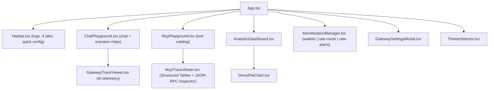

# Frontend UI Reference: Gateway Governance & Semantic Cache Surfaces

> **Repository path**: `ui/`
> **Status**: Reconciled against source on 2026-09-15. Sections are explicitly labelled
> **Implemented** or **Proposal (not built)**.
> **Associated proxies**: [`apigee/proxies/ai-gateway-v1`](file:///Users/maloosatyam/Codebase/AI%20Code/apigee/proxies/ai-gateway-v1),
> [`apigee/proxies/mcp`](file:///Users/maloosatyam/Codebase/AI%20Code/apigee/proxies/mcp)

> [!IMPORTANT]
> This document previously specified a `SemanticCacheView.tsx` component and a fifth
> `semantic-cache` studio tab. **Neither was ever implemented.** Semantic cache behaviour
> ships today through the [ChatPlayground](file:///Users/maloosatyam/Codebase/AI%20Code/ui/src/components/ChatPlayground.tsx)
> scenario chips and the Semantic Cache card in
> [GatewayTraceViewer](file:///Users/maloosatyam/Codebase/AI%20Code/ui/src/components/GatewayTraceViewer.tsx#L217-L266).
> The unbuilt design is preserved — clearly marked — in [Section 9](#9-proposal--not-built-semanticcacheviewtsx).

---

## 1. What ships today

| Capability | Where it actually lives | Built? |
| --- | --- | --- |
| Semantic cache demo (seed → hit) | Two-step chip in `ChatPlayground` + `useCache` setting | ✅ |
| Cache outcome display | `GatewayTraceViewer` "Semantic Cache" + "Latency" cards | ✅ |
| Cache on/off toggle | `GatewayTraceViewer` header pill and `ChatPlayground` footer pill | ✅ |
| MCP JSON-RPC tracing | `McpPlayground` + `McpTraceViewer` | ✅ |
| Prepaid wallet balance readout | `GatewayTraceViewer` "Wallet" card (from response headers) | ✅ |
| Wallet top-up | `MonetizationManager` "Top-Up Prepaid Wallet" modal | ✅ |
| Dedicated cache explorer screen | — | ❌ never built |
| Cache KPI dashboard / vector entries table | — | ❌ never built |
| Fifth `semantic-cache` navigation tab | — | ❌ never built |

---

## 2. Component inventory (Implemented)

Thirteen components exist under
[`ui/src/components/`](file:///Users/maloosatyam/Codebase/AI%20Code/ui/src/components).

| Component | Purpose | Mounted today? |
| --- | --- | --- |
| [AnalyticsDashboard.tsx](file:///Users/maloosatyam/Codebase/AI%20Code/ui/src/components/AnalyticsDashboard.tsx) | Fleet consumption / cost KPIs | Yes — `analytics` tab |
| [ApigeeLogo.tsx](file:///Users/maloosatyam/Codebase/AI%20Code/ui/src/components/ApigeeLogo.tsx) | Exports `ApigeeLogo` and `ApigeeColorSymbol` | Yes — Navbar, ChatPlayground |
| [ChatPlayground.tsx](file:///Users/maloosatyam/Codebase/AI%20Code/ui/src/components/ChatPlayground.tsx) | Chat pane + scenario chips + trace pane | Yes — `ai-gateway` tab |
| [DonutPieChart.tsx](file:///Users/maloosatyam/Codebase/AI%20Code/ui/src/components/DonutPieChart.tsx) | Chart primitive | Yes — AnalyticsDashboard |
| [GatewaySettingsModal.tsx](file:///Users/maloosatyam/Codebase/AI%20Code/ui/src/components/GatewaySettingsModal.tsx) | Settings modal, heading **"Gateway Configuration"** | Yes — App |
| [GatewayTraceViewer.tsx](file:///Users/maloosatyam/Codebase/AI%20Code/ui/src/components/GatewayTraceViewer.tsx) | AI Gateway telemetry panel | Yes — ChatPlayground |
| [McpPlayground.tsx](file:///Users/maloosatyam/Codebase/AI%20Code/ui/src/components/McpPlayground.tsx) | MCP tool catalog + execution | Yes — `mcp-gateway` tab |
| [McpTraceViewer.tsx](file:///Users/maloosatyam/Codebase/AI%20Code/ui/src/components/McpTraceViewer.tsx) | Structured result tables + collapsible JSON-RPC/headers inspector | Yes — McpPlayground |
| [ModelRateCardView.tsx](file:///Users/maloosatyam/Codebase/AI%20Code/ui/src/components/ModelRateCardView.tsx) | Standalone KVM rate-card screen | **No — not imported anywhere** |
| [MonetizationManager.tsx](file:///Users/maloosatyam/Codebase/AI%20Code/ui/src/components/MonetizationManager.tsx) | Wallets, rate cards, rate plans | Yes — `monetization` tab |
| [Navbar.tsx](file:///Users/maloosatyam/Codebase/AI%20Code/ui/src/components/Navbar.tsx) | Header, tabs, quick config | Yes — App |
| [ScenarioPresets.tsx](file:///Users/maloosatyam/Codebase/AI%20Code/ui/src/components/ScenarioPresets.tsx) | Grid renderer for `SCENARIO_PRESETS` | **No — not imported anywhere** |
| [ThemeSelector.tsx](file:///Users/maloosatyam/Codebase/AI%20Code/ui/src/components/ThemeSelector.tsx) | Theme switcher | Yes — App |

> [!NOTE]
> `ModelRateCardView.tsx` and `ScenarioPresets.tsx` compile but are never rendered. Rate cards
> are served by the `rate-cards` sub-tab inside `MonetizationManager`, and the chat scenario grid
> is built inline in `ChatPlayground` from the `sampleChips` array. Treat both files as dead code
> pending a decision to wire them up or delete them.

### 2.1 Component graph



---

## 3. Tab routing (Implemented)

### 3.1 `AppTab` type

[`ui/src/types/index.ts#L131`](file:///Users/maloosatyam/Codebase/AI%20Code/ui/src/types/index.ts#L131):

```ts
export type AppTab =
  | 'ai-gateway'
  | 'mcp-gateway'
  | 'kvm-pricing'
  | 'monetization'
  | 'analytics'
  | 'rate-cards';
```

`kvm-pricing` and `rate-cards` are legacy aliases: all three monetization-family values render the
same [MonetizationManager](file:///Users/maloosatyam/Codebase/AI%20Code/ui/src/App.tsx#L350-L351).

The initial tab can be deep-linked with `?tab=`, but
[App.tsx#L169-L177](file:///Users/maloosatyam/Codebase/AI%20Code/ui/src/App.tsx#L169-L177) only accepts
`ai-gateway`, `mcp-gateway`, `monetization`, `kvm-pricing`, `analytics` — `rate-cards` is **not**
accepted from the URL. Anything else falls back to `ai-gateway`.

Non-admin personas are bounced off the monetization family back to a permitted tab
([App.tsx#L294-L298](file:///Users/maloosatyam/Codebase/AI%20Code/ui/src/App.tsx#L294-L298)).

### 3.2 Navbar tabs

[Navbar.tsx#L120-L178](file:///Users/maloosatyam/Codebase/AI%20Code/ui/src/components/Navbar.tsx#L120-L178)
renders the 4-colour logo symbol (no wordmark) followed by these buttons:

| Order | Visible label | Target tab | Icon | Visibility |
| --- | --- | --- | --- | --- |
| 1 | `AI Gateway` | `ai-gateway` | `Sparkles` | Always |
| 2 | `MCP Gateway` | `mcp-gateway` | `Terminal` | Always |
| 3 | `Analytics & Cost` | `analytics` | `BarChart3` | Always |
| 4 | `Monetization` | `monetization` | `Coins` | Admin view only |

Admin view is `analyticsControls?.viewMode === 'admin'` on the analytics tab, otherwise
`settings.activeUser === 'admin'`
([Navbar.tsx#L107-L110](file:///Users/maloosatyam/Codebase/AI%20Code/ui/src/components/Navbar.tsx#L107-L110)).

> [!CAUTION]
> The word "Apigee" is deliberately absent from all rendered UI text; only the logo symbol remains.
> Quote only the strings above. Code identifiers (`ApigeeLogo`, `sendPromptToApigee`,
> `apigeeClient.ts`) intentionally retain the name and are not user-facing.

---

## 4. Request header contract (Implemented)

### 4.1 AI Gateway — [`apigeeClient.ts`](file:///Users/maloosatyam/Codebase/AI%20Code/ui/src/services/apigeeClient.ts#L131-L148)

```ts
const headersSent: Record<string, string> = {
  'Content-Type': 'application/json',
  'x-apikey': effectiveApiKey,
};
if (!settings.omitEmailHeader) {
  if (effectiveIdToken) headersSent['Authorization'] = `Bearer ${effectiveIdToken}`;
  if (effectiveEmail) headersSent['X-User-Email'] = effectiveEmail;
}
if (settings.useCache) headersSent['use-cache'] = 'true';
```

| Header | Sent when | Notes |
| --- | --- | --- |
| `Content-Type: application/json` | Always | — |
| `x-apikey` | Always | Resolved from `settings.apiKey`, the active persona, or `/api/me` |
| `Authorization: Bearer <id_token>` | SSO token present **and** `omitEmailHeader` false | Used by the 401 identity demo when omitted |
| `X-User-Email` | Email present **and** `omitEmailHeader` false | Fallback identity for the proxy |
| `use-cache: true` | `settings.useCache === true` | Only emitted when true; never sent as `false` |

> [!NOTE]
> The `ai-gateway-v1` proxy also accepts `x-use-cache` as an alias
> ([default.xml#L79-L83](file:///Users/maloosatyam/Codebase/AI%20Code/apigee/proxies/ai-gateway-v1/apiproxy/proxies/default.xml#L79-L83)),
> but the UI never sends it. Do not document `x-use-cache` as a UI behaviour.

[`exhaustLlmQuota()`](file:///Users/maloosatyam/Codebase/AI%20Code/ui/src/services/apigeeClient.ts#L363-L399)
is a helper that fires a large `gemini-3.1-flash-lite` prompt with only
`Content-Type`, `x-apikey`, `X-User-Email`.

### 4.2 MCP Gateway — [`mcpClient.ts`](file:///Users/maloosatyam/Codebase/AI%20Code/ui/src/services/mcpClient.ts#L27-L48)

Identical identity contract, minus the cache header:
`Content-Type`, `x-apikey`, optional `Authorization: Bearer …`, optional `X-User-Email`.
Both `tools/list` and `tools/call` POST JSON-RPC 2.0 envelopes to the resolved MCP endpoint.

---

## 5. Response headers the UI consumes (Implemented)

The gateway sets these in
[`AM-SetResponseHeaders.xml`](file:///Users/maloosatyam/Codebase/AI%20Code/apigee/proxies/ai-gateway-v1/apiproxy/policies/AM-SetResponseHeaders.xml).
`apigeeClient` lower-cases and stores **every** response header in `telemetry.headersReceived`, then
reads the following explicitly:

| Header | Read at | Used for |
| --- | --- | --- |
| `x-gateway-cache-status` | [apigeeClient.ts#L195-L204](file:///Users/maloosatyam/Codebase/AI%20Code/ui/src/services/apigeeClient.ts#L195-L204) | `telemetry.cacheStatus` (`HIT` / `MISS` / `DISABLED`) |
| `x-gateway-cached` | same | Fallback when `x-gateway-cache-status` is absent |
| `x-gateway-model` | L264 | Resolved model name |
| `x-gateway-provider` | L242 | Upstream provider |
| `x-auto-routed` | L247, L266 | Auto-routing badge |
| `x-gateway-cost-usd` | L243 | Cost readout (client-side estimate if absent) |
| `x-gateway-cost-tier` | L244 | Cost tier label |
| `x-gateway-prompt-tokens` | L239 | Prompt tokens when the body has no usage block |
| `x-gateway-completion-tokens` | L240 | Completion tokens |
| `x-gateway-total-tokens` | L241 | Total tokens |
| `x-gateway-category` / `x-gateway-intent` | L245 | Routing intent label |
| `x-gateway-monetization-status` | [GatewayTraceViewer.tsx#L309](file:///Users/maloosatyam/Codebase/AI%20Code/ui/src/components/GatewayTraceViewer.tsx#L309) | Wallet-depleted (403) styling |
| `x-gateway-prepaid-balance` | [L340](file:///Users/maloosatyam/Codebase/AI%20Code/ui/src/components/GatewayTraceViewer.tsx#L340) | "Start Balance" tile |
| `x-gateway-balance-remaining` | [L346](file:///Users/maloosatyam/Codebase/AI%20Code/ui/src/components/GatewayTraceViewer.tsx#L346) | "Remaining" tile |

The proxy also emits `x-gateway-currency` and `x-gateway-prepaid-currency`; the UI does not read
them today, though both appear in the raw headers accordion.

> [!WARNING]
> Both balance tiles fall back to the hardcoded literal `109.988` when the headers are missing, so a
> plausible-looking balance can render even with no monetization data. Do not read those tiles as
> authoritative during a demo without confirming the headers are present.

MCP responses are filtered — [`extractResponseHeaders()`](file:///Users/maloosatyam/Codebase/AI%20Code/ui/src/services/mcpClient.ts#L53-L75)
keeps only: `content-type`, `x-request-id`, `x-cloud-trace-context`, `x-b3-traceid`, `x-b3-spanid`,
`date`, `server`, `via`, `x-powered-by`. `x-gateway-*` headers are therefore **not** visible in the
MCP trace even if the gateway sends them.

---

## 6. Backend proxy endpoints (Implemented)

Two equivalent implementations exist: Vite dev middleware in
[`ui/vite.config.ts`](file:///Users/maloosatyam/Codebase/AI%20Code/ui/vite.config.ts#L385-L1080)
and the production Node server [`ui/server.js`](file:///Users/maloosatyam/Codebase/AI%20Code/ui/server.js).
Both mint a GCP access token server-side and call the Apigee Management API.

| Route | Methods | Server handler | Client wrapper |
| --- | --- | --- | --- |
| `/api/me` | GET | [server.js#L438](file:///Users/maloosatyam/Codebase/AI%20Code/ui/server.js#L438) | inline `fetch` in `apigeeClient` |
| `/api/kvm/rates` | GET, PUT | [server.js#L476](file:///Users/maloosatyam/Codebase/AI%20Code/ui/server.js#L476) | `fetchModelRates`, `updateModelRates` |
| `/api/monetization/balance` | GET (`?dev=`) | [server.js#L579](file:///Users/maloosatyam/Codebase/AI%20Code/ui/server.js#L579) | `fetchDeveloperBalance` |
| `/api/monetization/credit` | POST | [server.js#L611](file:///Users/maloosatyam/Codebase/AI%20Code/ui/server.js#L611) | `creditDeveloperBalance` |
| `/api/monetization/rateplans` | GET | [server.js#L673](file:///Users/maloosatyam/Codebase/AI%20Code/ui/server.js#L673) | `fetchRatePlans` |
| `/api/monetization/subscriptions` | GET, POST | [server.js#L725](file:///Users/maloosatyam/Codebase/AI%20Code/ui/server.js#L725) | `fetchDeveloperSubscriptions`, `subscribeDeveloper` |
| `/api/monetization/config` | GET, PUT | [server.js#L794](file:///Users/maloosatyam/Codebase/AI%20Code/ui/server.js#L794) | `fetchDeveloperMonetizationConfig`, `updateDeveloperMonetizationConfig` |
| `/api/analytics/fleet-stats` | GET (`?timeRange=&env=`) | [server.js#L852](file:///Users/maloosatyam/Codebase/AI%20Code/ui/server.js#L852) | `fetchFleetAnalytics` |
| `/api/monetization/attributions` | GET | [server.js#L1006](file:///Users/maloosatyam/Codebase/AI%20Code/ui/server.js#L1006) | `fetchDeveloperAttributions` |

Pass-through proxies (prefix match,
[server.js#L1109-L1157](file:///Users/maloosatyam/Codebase/AI%20Code/ui/server.js#L1109-L1157)):
`/api/ai-dev`, `/api/ai-prod`, `/api/claude-dev`, `/api/claude-prod`, `/api/vertexai-dev`,
`/api/vertexai-prod`, `/api/mcp-dev`, `/api/mcp-prod`.

### 6.1 Actual payload shapes

`GET /api/monetization/balance` returns the raw Apigee response nested under `data` — **not** a
flattened `balance` number:

```json
{
  "status": "ok",
  "developer": "maloosatyam@google.com",
  "org": "bap-apac-demo2",
  "data": {
    "wallets": [
      { "balance": { "currencyCode": "USD", "units": "109", "nanos": 996920000 } }
    ]
  }
}
```

`POST /api/monetization/credit` takes `{ "units": "50", "developer": "…" }` (units is a **string**;
there is no `amount` or `currency` field) and returns:

```json
{
  "status": "ok",
  "developer": "maloosatyam@google.com",
  "credited": "50",
  "transactionId": "topup-1726309876",
  "data": { }
}
```

Currency is hardcoded to `USD` server-side
([server.js#L645-L652](file:///Users/maloosatyam/Codebase/AI%20Code/ui/server.js#L645-L652)).

---

## 7. How semantic cache is actually demonstrated (Implemented)

### 7.1 Gateway side

| Policy | Detail |
| --- | --- |
| [`SCL-Semantic-Cache-Lookup`](file:///Users/maloosatyam/Codebase/AI%20Code/apigee/proxies/ai-gateway-v1/apiproxy/policies/SCL-Semantic-Cache-Lookup.xml) | Embeddings via `text-embedding-004`; `findNeighbors` on index endpoint `3889166141490200576`; deployed index `semantic_cache`; `Threshold` `0.95` |
| [`SCP-Semantic-Cache-Populate`](file:///Users/maloosatyam/Codebase/AI%20Code/apigee/proxies/ai-gateway-v1/apiproxy/policies/SCP-Semantic-Cache-Populate.xml) | `upsertDatapoints` on index `3211563513570918400`; `TTLInSeconds` `600` |

Both run only when `use-cache` (or `x-use-cache`) is `true`.

### 7.2 UI side — the two-step chip

[ChatPlayground.tsx#L270-L283](file:///Users/maloosatyam/Codebase/AI%20Code/ui/src/components/ChatPlayground.tsx#L270-L283)
renders a single **Semantic Cache** chip whose label flips with `cacheStep`:

| Step | Chip label | Prompt source | Effect |
| --- | --- | --- | --- |
| 0 | `⚡ Cache: Seed (Miss)` | `CACHE_EXAMPLES[0]` | Long zero-trust security prompt, executed live and seeded |
| 1 | `⚡ Cache: Instant Hit ($0)` | `CACHE_EXAMPLES[1]` | Semantically equivalent paraphrase, expected to hit |

[`handleCacheStep()`](file:///Users/maloosatyam/Codebase/AI%20Code/ui/src/components/ChatPlayground.tsx#L353-L370)
forces `useCache: true`, `model: 'gemini-3.1-flash-lite'`, `omitEmailHeader: false` before executing,
and clicking the chip body auto-advances 0 → 1 → 0. Two sub-buttons labelled `Seed (Miss)` and
`Instant Hit ($0)` let a presenter jump directly to either step
([L635-L659](file:///Users/maloosatyam/Codebase/AI%20Code/ui/src/components/ChatPlayground.tsx#L635-L659)).

A sibling chip labelled `🌐 Direct (No Cache)` runs the same seed prompt with `useCache: false` for
latency contrast (preset `no-cache` in
[defaultSettings.ts#L385-L394](file:///Users/maloosatyam/Codebase/AI%20Code/ui/src/services/defaultSettings.ts#L385-L394)).

The chat footer also carries a persistent toggle rendering `Cache:` + `ENABLED` / `OFF`
([L878-L894](file:///Users/maloosatyam/Codebase/AI%20Code/ui/src/components/ChatPlayground.tsx#L878-L894)).

> [!NOTE]
> The six chips are defined inline as `sampleChips`; their titles and badges are looked up from
> `SCENARIO_PRESETS` in [defaultSettings.ts#L334-L395](file:///Users/maloosatyam/Codebase/AI%20Code/ui/src/services/defaultSettings.ts#L334-L395).
> The default session starts with `useCache: false`
> ([defaultSettings.ts#L200](file:///Users/maloosatyam/Codebase/AI%20Code/ui/src/services/defaultSettings.ts#L200)).

---

## 8. Trace viewers (Implemented)

### 8.1 `GatewayTraceViewer.tsx`

Empty state reads **"Ready for Gateway Traffic"**. Once telemetry exists, the panel header shows
`Gateway Telemetry` plus an `HTTP <status> <statusText>` pill, followed by six cards:

| # | Card heading | Key behaviour |
| --- | --- | --- |
| 1 | `Model Routing` | Model, provider, cost tier, intent, `Auto-Routed` pill, cost chip |
| 2 | `Token` | Prompt / Output / Total tiles; on 429 swaps to a quota-exceeded banner |
| 3 | `Latency` | Round-trip ms, colour-banded; on a hit shows `Vector Cache (~90% Faster)` |
| 4 | `Semantic Cache` | Toggle pill + outcome line (see below) |
| 5 | `Model Armor` | `Secured` or `Blocked (400)` with the guardrail message |
| 6 | `Wallet` | `Prepaid Active` or `❌ Depleted (403)`; Start Balance / Remaining tiles |

Semantic Cache card states
([L217-L266](file:///Users/maloosatyam/Codebase/AI%20Code/ui/src/components/GatewayTraceViewer.tsx#L217-L266)):

| Condition | Toggle pill | Outcome text |
| --- | --- | --- |
| `useCache` on, `cacheStatus === 'HIT'` | `use-cache: true` | `Vector Cache Hit` + `$0 Token Cost` |
| `useCache` on, not a hit | `use-cache: true` | `Cache Miss (Seeded to Vector DB)` |
| `useCache` off | `use-cache: omitted` | `Bypassed (Direct LLM Inference)` |

The pill is a button wired to `onToggleCache`, so cache can be flipped mid-demo from the trace pane.

A collapsible **"Inspect HTTP Headers & Raw JSON"** accordion
([L353-L435](file:///Users/maloosatyam/Codebase/AI%20Code/ui/src/components/GatewayTraceViewer.tsx#L353-L435))
exposes three blocks:

- **Gateway Response Headers (`x-gateway-*`)** — filtered to keys starting `x-gateway`, `x-auto`,
  `content-type`, `x-accel`.
- **Request Headers Sent** — any key containing `apikey` is masked as `first8…last6`; a `Bearer`
  value renders as `Bearer <12 chars>…<8 chars> (Google SSO Token)`.
- **Raw JSON Response** — with a `Copy` button that copies `telemetry.rawResponse` only.

### 8.2 `McpTraceViewer.tsx`

The MCP Gateway trace inspector mirrors the executive layout of `GatewayTraceViewer.tsx` so that non-technical viewers see structured business data first, while technical architects can expand the wire protocol on demand:

1. **Executive Telemetry Summary Cards** (2-column grid at top):
   - **MCP Operation Card**: Displays the JSON-RPC method (`tools/list` or `tools/call (<toolName>)`), a `JSON-RPC 2.0` protocol badge, and round-trip latency (`ms`) with color-coded thresholds.
   - **Access Governance Card**: Displays the caller email (`Caller:`), active persona badge (`ADMIN` / `SALES AGENT` / `LOANS AGENT`), and policy enforcement status (`Policies Verified` or `Quota Breached`).

2. **Structured Visual Result View** (Primary default view, replacing raw JSON dumps):
   - **Tool Discovery Catalog (`tools/list`)**: Renders a 4-column table (`Tool Name`, `Domain`, `Parameters`, `Description`) categorizing tools into `Sales & Inventory` or `Loans & Banking` and highlighting required input fields.
   - **Array Result Table (`tools/call` returning arrays, e.g. `listAllDiscounts`)**: Dynamically constructs columns from returned object keys (`Part SKU`, `Discounted Price`, etc.) with formatted currency values (`$10.99`) and monospace SKU chips.
   - **Business Entity Record Table (`tools/call` returning single objects, e.g. `getDiscountForSku`, `getLoanApplication`)**: Flattens nested objects into a 2-column property table with section headers (`Customer Segment`, `Loan Details`, etc.) and styled status badges (`APPROVED`, `PENDING`).
   - **Gateway & Service Diagnostic Card (HTTP 429 / 401 / 403 or upstream faults)**: Displays a clear policy enforcement banner alongside a structured table of diagnostic fields (`Diagnostic Message`, `Error Code`).

3. **Collapsible Technical Accordion (`Inspect JSON-RPC Wire Payload & HTTP Headers`)**:
   - Collapsed by default (`showTechnicalDetails = false`) so raw JSON never intimidates users; automatically opens if deep-linked via `?subtab=response|request|headers`.
   - When expanded, reveals three tabs: **JSON-RPC Response**, **JSON-RPC Request**, and **Headers**, plus a tab-aware **Copy** button.
   - The **Headers** tab displays two theme-aware cards (**"Headers Received from Gateway"** and **"Headers Sent by Client"**) with live header count badges and `x-apikey` masking (`first8...last4`).

---

## 9. Proposal — NOT BUILT: `SemanticCacheView.tsx`

> [!WARNING]
> Everything in this section is an unimplemented design proposal retained for historical context.
> No file, tab, route, or component described here exists in the repository. Do not cite it as
> current behaviour.

The original proposal called for:

1. A fifth studio tab `semantic-cache` in `Navbar.tsx`, labelled `Semantic Cache`, using a
   `Database` or `Zap` icon.
2. A new `ui/src/components/SemanticCacheView.tsx` containing:
   - Four KPI cards: Cache Hit Rate, Latency Reduction, Cumulative Cost Avoidance, Vector Search
     Health.
   - A two-stage interactive simulator (seed request, then a paraphrased near-match query).
   - A table of cached vector entries with per-row "Test Hit" actions.
   - Query history and simulated cache-invalidation controls.
3. A wallet balance chip in the header or trace viewer, plus an in-trace "Add Credits" trigger
   posting to `/api/monetization/credit` with preset amounts.

What was delivered instead:

| Proposed | Delivered |
| --- | --- |
| `semantic-cache` tab | None — cache demo lives in the `ai-gateway` tab |
| KPI cards | Aggregate cache hit-rate / savings surface only in `AnalyticsDashboard` via `/api/analytics/fleet-stats` |
| Two-stage simulator | Two-step chip in `ChatPlayground` (Section 7.2) |
| Cached vector entries table | Not built — no UI enumerates cache datapoints |
| Cache invalidation controls | Not built — the only expiry is the 600 s `TTLInSeconds` in `SCP-Semantic-Cache-Populate` |
| Wallet chip + in-trace top-up | Trace viewer shows read-only balance tiles and the text `Prepaid balance exhausted ($0.00). Top up in Monetization tab.` Top-up lives in the `MonetizationManager` modal **"Top-Up Prepaid Wallet"** with quick amounts `+$10 / +$25 / +$50 / +$100` and a `Confirm Top-Up` button |

The proposed KPI figures (`68.4%` hit rate, `~98.5% Speedup`, `$12.84 Saved`) were illustrative
placeholders and were never backed by data. Any revived design should compute them from
`/api/analytics/fleet-stats`, which already returns `cacheHitRate` and `cacheCostSavingsUsd`
([api.ts#L219-L230](file:///Users/maloosatyam/Codebase/AI%20Code/ui/src/services/api.ts#L219-L230)).

---

## 10. Development & verification checklist

Completed:

- [x] `SemanticCacheView.tsx` decision resolved — not built; documented as a proposal above.
- [x] Tab routing verified: 4 Navbar buttons over a 6-value `AppTab` union.
- [x] Request/response header contracts verified against `apigeeClient.ts` and `mcpClient.ts`.
- [x] Monetization and analytics routes verified against `server.js` and `vite.config.ts`.
- [x] `McpTraceViewer` Headers tab rebuilt: theme-aware cards, header counts, `x-apikey` masking,
      combined JSON export on Copy.
- [x] Brand word removed from rendered UI text; logo symbol retained.

Still to run per change:

- [ ] `npm run build` in `ui/` (`tsc && vite build`) — must pass with no TypeScript errors.
- [ ] `npm run dev` — Vite dev server listens on `http://localhost:3000`
      ([vite.config.ts#L1085](file:///Users/maloosatyam/Codebase/AI%20Code/ui/vite.config.ts#L1085)).
- [ ] Exercise tab switching across *AI Gateway*, *MCP Gateway*, *Analytics & Cost* and
      *Monetization* (admin persona required for the last one).
- [ ] `npm run test:live` — runs
      [`tests/gateway-live.test.mjs`](file:///Users/maloosatyam/Codebase/AI%20Code/ui/tests/gateway-live.test.mjs)
      (**22 tests**; last recorded run 18 passed, 0 failed, 4 skipped for environmental reasons).
- [ ] `npm run test:unit` — runs
      [`tests/autorouting.unit.test.mjs`](file:///Users/maloosatyam/Codebase/AI%20Code/ui/tests/autorouting.unit.test.mjs).

---

## 11. Known UI inaccuracies worth fixing in code

These are defects in the application, not in this document:

| Location | Issue |
| --- | --- |
| [GatewayTraceViewer.tsx#L160](file:///Users/maloosatyam/Codebase/AI%20Code/ui/src/components/GatewayTraceViewer.tsx#L160) | 429 banner hardcodes "200 tokens/min limit on Standard tier"; the Standard AI Tier product sets **100** tokens/min for `gemini-2.5-flash`, and other operations are 2000/min |
| [apigeeClient.ts#L359-L362](file:///Users/maloosatyam/Codebase/AI%20Code/ui/src/services/apigeeClient.ts#L359-L362) | `exhaustLlmQuota` docstring repeats the stale "200 token/min" figure |
| [GatewayTraceViewer.tsx#L340-L346](file:///Users/maloosatyam/Codebase/AI%20Code/ui/src/components/GatewayTraceViewer.tsx#L340-L346) | Wallet tiles fall back to a hardcoded `109.988` |
| [GatewayTraceViewer.tsx#L387](file:///Users/maloosatyam/Codebase/AI%20Code/ui/src/components/GatewayTraceViewer.tsx#L387) | Empty-state guard destructures an array of key **strings** as `([k]) =>`, so `k` is only the first character and the filter is always empty — the "No custom x-gateway headers" notice renders even when such headers are present |
| `ModelRateCardView.tsx`, `ScenarioPresets.tsx` | Dead components — exported but never imported |
