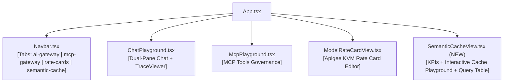

# Frontend UI Specification: Semantic Cache Explorer & Gateway Governance

> **Target Audience**: Frontend Engineer / UI Subagent  
> **Status**: Ready for Implementation  
> **Repository Path**: `ui/`  
> **Target Environments**: Apigee X `dev` (`/api/ai-dev`) and `prod` (`/api/ai-prod`)  
> **Associated Proxy**: `apigee/proxies/ai-gateway-v1` (Active: Revision 41 on `prod`, Revision 40 on `dev`)

---

## 1. Executive Summary & Goals

This document specifies the exact UI architecture, component requirements, and data contracts for introducing a dedicated **Semantic Cache Explorer** screen to the demonstration application and aligning the existing **Live Gateway Trace Inspector** with our standardized telemetry headers.

### Objectives for the UI Agent:
1. **Add a 4th Studio Tab (`semantic-cache`)**: Integrate a dedicated *Semantic Cache Explorer* navigation item in `Navbar.tsx`.
2. **Build `SemanticCacheView.tsx`**: A dashboard visualizing:
   - Real-time cache performance KPIs (Hit Ratio %, Latency Reduction %, Cost Avoided in $ USD).
   - Interactive Cache Playground demonstrating the contrast between a sub-50ms Cache Hit ($0.00 cost) and a multi-second live LLM generation.
   - Vector Search similarity inspection (Vertex AI Vector Search index `3211563513570918400`, Endpoint `3889166141490200576`, Threshold `0.95`).
   - Query history & simulated cache invalidation controls.
3. **Align `GatewayTraceViewer.tsx`**:
   - Ensure the cache badge and telemetry inspects `x-gateway-cache-status: "HIT" | "MISS" | "DISABLED"` and `x-gateway-cached: "true" | "false"`.
   - Note: The redundant `x-cache` header has been deprecated and removed in Apigee proxy revisions 40/41.

---

## 2. API Contract & Header Specifications

### 2.1 Request Headers
When triggering requests to Apigee AI Gateway (`/api/ai-prod/auto` or `/api/ai-dev/auto`):
| Header Name | Type | Value / Description | Required? |
| :--- | :--- | :--- | :--- |
| `x-apikey` | String | Consumer developer API key (e.g. Bronze, Silver, Gold product key) | **Yes** |
| `X-User-Email` | String | Caller identity (e.g. `demo.user@google.com` or decoded from Bearer token) | **Yes** |
| `use-cache` | String / Boolean | Set to `'true'` to trigger Vertex AI Vector Search semantic cache lookup | Optional |
| `x-use-cache` | String / Boolean | Alternate header alias supported identically by Apigee | Optional |
| `Content-Type` | String | `application/json` | **Yes** |

### 2.2 Response Headers Injected by Apigee
All gateway telemetry is standardized under the `x-gateway-*` namespace:
| Header Name | Sample Value | Meaning |
| :--- | :--- | :--- |
| `x-gateway-cached` | `"true"` or `"false"` | Boolean string indicating whether response was served from cache |
| `x-gateway-cache-status` | `"HIT"`, `"MISS"`, `"DISABLED"` | Exact cache outcome |
| `x-gateway-model` | `gemini-3.1-flash-lite`, `claude-opus-4-5` | The foundation model resolved or retrieved |
| `x-gateway-provider` | `google` or `anthropic` | Upstream provider |
| `x-auto-routed` | `"true"` or `"false"` | Whether dynamic auto-routing selected the model |
| `x-gateway-cost-tier` | `low`, `medium`, `high` | Cost classification tier |
| `x-gateway-cost-usd` | `"0.000000"` (HIT) or `"0.000003"` (MISS) | Computed transaction cost in USD |
| `x-gateway-prompt-tokens` | `45` | Integer prompt token count |
| `x-gateway-completion-tokens` | `128` | Integer completion token count |
| `x-gateway-total-tokens` | `173` | Total token volume |
| `x-gateway-monetization-status` | `"limits_check_success"` | Status of the Apigee Monetization limits check (`MLC-EnforceMonetizationLimits`) |
| `x-gateway-prepaid-balance` | `"109.996920"` | Starting prepaid wallet balance in USD prior to transaction |
| `x-gateway-prepaid-currency` | `"USD"` | Currency of the prepaid developer account |
| `x-gateway-balance-remaining` | `"109.996866"` | Exact balance remaining after deducting current transaction cost |

### 2.3 UI Backend Monetization Proxy Endpoints
The local Vite server (`ui/vite.config.ts`) provides authenticated backend proxy endpoints interfacing directly with the Apigee Monetization Management API:
1. **`GET /api/monetization/balance`**:
   - **Response Payload**:
     ```json
     {
       "success": true,
       "balance": 109.99692,
       "currency": "USD",
       "developer": "maloosatyam@google.com",
       "billingType": "PREPAID"
     }
     ```
   - **Usage**: Invoked on UI load and tab navigation to display current available funds.
2. **`POST /api/monetization/credit`**:
   - **Request Payload**:
     ```json
     {
       "amount": 50,
       "currency": "USD"
     }
     ```
   - **Response Payload**:
     ```json
     {
       "success": true,
       "balance": 159.99692,
       "currency": "USD",
       "transactionId": "topup-1726309876",
       "developer": "maloosatyam@google.com"
     }
     ```
   - **Usage**: Interactive wallet top-up button to restore or add balance during live customer demos.


---

## 3. UI Component Architecture



### 3.1 `AppTab` Type Definition (`ui/src/types/index.ts`)
Update `AppTab` to include `'semantic-cache'`:
```typescript
export type AppTab = 'ai-gateway' | 'mcp-gateway' | 'rate-cards' | 'semantic-cache';
```

### 3.2 Navbar Integration (`ui/src/components/Navbar.tsx`)
Add the tab button next to `rate-cards`:
- **Label**: `Semantic Cache`
- **Icon**: `Database` or `Zap` from `lucide-react`
- **Badge / Subtitle**: Sub-100ms / $0.00 Spend

---

## 4. `SemanticCacheView.tsx` Component Specification

Create `ui/src/components/SemanticCacheView.tsx` with the following sub-views:

### 4.1 Top KPI Metrics Cards
Grid of 4 cards highlighting the business value of Apigee Semantic Caching:
1. **Cache Hit Rate**:
   - Value: `68.4%` (or computed dynamically from live session requests).
   - Subtext: `Sub-100ms response fast-path`.
   - Color: Emerald green (`text-emerald-400`).
2. **Latency Reduction**:
   - Value: `~98.5% Speedup`.
   - Subtext: `35ms cached vs ~2,100ms live inference`.
   - Color: Cyan (`text-cyan-400`).
3. **Cumulative Cost Avoidance**:
   - Value: `$12.84 Saved`.
   - Subtext: `Billed at $0.000000 USD on cache hit`.
   - Color: Amber (`text-amber-400`).
4. **Vector Search Health**:
   - Value: `Deployed & Active`.
   - Subtext: `Threshold: 0.95 | Model: text-embedding-004`.
   - Color: Blue (`text-blue-400`).

### 4.2 Two-Stage Interactive Cache Simulator
An interactive panel allowing executives and engineers to see semantic caching in action:
- **Seed Prompt Input**:
  - Sample button 1: *"Why should enterprise developers use Apigee for AI Gateway?"*
  - Sample button 2: *"How does Apigee protect LLMs with Model Armor?"*
- **Step 1: Execute Seed Request (`use-cache: true`)**:
  - Sends query to `/api/ai-prod/auto` with `use-cache: true`.
  - First execution returns `x-gateway-cache-status: MISS` and takes ~1,500ms.
  - UI displays: `🌱 Cache Miss: Prompt vector embeddings generated & stored in Vertex AI Vector Search`.
- **Step 2: Execute Semantic Near-Match Query**:
  - User can type a slight variation: *"Tell me why enterprise teams choose Apigee as an AI gateway"*
  - Sends query with `use-cache: true`.
  - Second execution returns `x-gateway-cache-status: HIT` in **< 50ms** with `x-gateway-cost-usd: 0.000000`.
  - UI displays: `⚡ Cache Hit! Vector cosine similarity matched with sub-50ms latency and $0 cost!`.

### 4.3 Cached Vector Entries Table
A table displaying recently cached prompts:
| Prompt / Query | Similarity Threshold | Model Cached | Status | Latency | Cost | Actions |
| :--- | :--- | :--- | :--- | :--- | :--- | :--- |
| "Why should enterprises use Apigee AI Gateway?" | $\ge 0.95$ | `gemini-3-flash` | `ACTIVE` | 32ms | $0.000000 | [Test Hit] |
| "Write a python function for fibonacci" | $\ge 0.95$ | `claude-opus-4-5` | `ACTIVE` | 41ms | $0.000000 | [Test Hit] |
| "Compare BigQuery and Cloud Spanner trade-offs" | $\ge 0.95$ | `gemini-3.1-pro-preview` | `ACTIVE` | 48ms | $0.000000 | [Test Hit] |

---

## 5. Updates to `GatewayTraceViewer.tsx`

In `ui/src/components/GatewayTraceViewer.tsx`:
1. **Cache Status Badge**:
   ```tsx
   const isCacheHit = telemetry?.cacheStatus === 'HIT';
   const isCacheMiss = telemetry?.cacheStatus === 'MISS';
   ```
   Render distinct visual badges:
   - `HIT`: `⚡ Vector Cache Hit` (Green pill, emerald border).
   - `MISS`: `Cache Miss (Seeded)` (Yellow pill, amber border).
   - `DISABLED`: `Cache Bypassed` (Gray pill).
2. **Cost Display**:
   - If `isCacheHit`: Highlight cost in green: `$0.000000 (Free / Cached)`.
### 5.2 Prepaid Balance & Consumption Visualization (`GatewayTraceViewer.tsx` & Header Bar)
1. **Wallet Balance Chip / Meter**:
   - In the header or trace viewer, display the developer's prepaid wallet balance:
     ```tsx
     <div className="flex items-center space-x-2 bg-slate-800/80 px-3 py-1.5 rounded-lg border border-slate-700">
       <Wallet className="w-4 h-4 text-emerald-400" />
       <span className="text-xs text-slate-400">Prepaid Wallet:</span>
       <span className="text-sm font-semibold text-emerald-300">
         ${balanceRemaining || prepaidBalance || "0.00"} {currency}
       </span>
     </div>
     ```
2. **Consumption Against Balance**:
   - Trace viewer shows both starting balance (`x-gateway-prepaid-balance`) and remaining balance (`x-gateway-balance-remaining`).
   - Transaction deduction delta: `-$0.000054 USD` tagged against the current call.
   - If `x-gateway-cached === "true"`, highlight `$0.000000 deducted (Zero Balance Impact)`.
3. **Top-Up Modal / Trigger**:
   - Provide a quick "Add Credits" / "Top-Up Balance" trigger invoking `POST /api/monetization/credit` with selectable amounts ($10, $50, $100) to demonstrate replenishing a depleted wallet.


---

## 6. Development & Verification Checklist for the UI Agent

When starting work:
- [ ] Run `npm run build` in `ui/` to ensure no TypeScript or packaging errors exist.
- [ ] Ensure the Vite dev server is running on `http://localhost:3000`.
- [ ] Verify that switching tabs between *Chat Playground*, *MCP Agent*, *Rate Cards*, and the new *Semantic Cache* is seamless and responsive.
- [ ] Run automated tests: `node --env-file=ui/.env ui/tests/gateway-live.test.mjs` and ensure all 16 tests continue to pass.
