# Apigee Unified Credentials, Generic Products & Demo Walkthrough Reference

> **Document Status**: Production Baseline  
> **Environment Target**: **Production (`prod`) Only**  
> **Organization**: `bap-apac-demo2`  
> **Base Endpoints**:
> - **Model-Agnostic AI Gateway**: `https://api.maloosatyam.demo.altostrat.com/ai/v1`
> - **Legacy Vertex AI Gateway**: `https://api.maloosatyam.demo.altostrat.com/vertexai/v1`
> - **Tools Gateway (MCP)**: `https://api.maloosatyam.demo.altostrat.com/mcp`

---

## 1. Architecture Overview

This platform uses **Google Cloud Apigee API Management** to enforce unified enterprise governance over two core capabilities:
1. **Apigee AI Gateway (`ai-gateway-v1` at `/ai/v1`)**: Model-agnostic model routing (`/models/{model}:generateContent` and `/models/auto:generateContent`), centralized access control, zero-trust SSO identity attribution, Model Armor guardrails, semantic caching, and token quotas.
2. **Apigee Tools Gateway (`mcp` at `/mcp`)**: Native Model Context Protocol (JSON-RPC 2.0) server fronting enterprise backends, enforcing tool-level RBAC and rate limiting.

### The Unified Single-Key Pattern
In this architecture, an agent or client persona possesses **one single Apigee API Key** (`x-apikey`). That single key is associated with both an AI product tier and an MCP tools product tier in Apigee. When an agent invokes the AI Gateway, Apigee validates the LLM product; when the agent invokes the MCP Tools Gateway, Apigee validates the MCP tools product.

```mermaid
flowchart TD
    subgraph Personas ["Unified Enterprise Personas"]
        Admin["👑 Admin Persona\n(VITE_ADMIN_API_KEY)"]
        Sales["💼 Sales Agent Persona\n(VITE_SALES_API_KEY)"]
        Loans["🏦 Loans Agent Persona\n(VITE_LOANS_API_KEY)"]
    end

    subgraph Products ["Generic API Products (apigee/products/)"]
        StdTier["Standard AI Tier\n(ai-gateway-v1: flash-lite*, flash*, auto*)"]
        EntTier["Enterprise AI Tier\n(ai-gateway-v1: all models + pro-preview* + auto*)"]
        SalesMCP["Sales Tools MCP\n(mcp: listAllDiscounts, getDiscountForSku)"]
        LoansMCP["Loans Tools MCP\n(mcp: getLoanApplication, patchLoanApplication, submitLoanApplication)"]
        EntMCP["Enterprise Tools MCP\n(mcp: all enterprise tools)"]
    end

    subgraph Gateways ["Apigee Production Gateways"]
        AIGateway["AI Gateway (/ai/v1)\nPolicy: VA-VerifyAPIKey (llmOperationGroup)\n+ JS-AutoRouting + AM-RouteModel"]
        MCPGateway["Tools Gateway (/mcp)\nPolicy: PP-MCP + VA-VerifyAPIKey (payloadOperationGroup)"]
    end

    Admin --> EntTier & EntMCP
    Sales --> StdTier & SalesMCP
    Loans --> StdTier & LoansMCP

    EntTier & StdTier --> AIGateway
    EntMCP & SalesMCP & LoansMCP --> MCPGateway
```



---

## 2. Generic API Products Catalog ([`apigee/products/`](file:///Users/maloosatyam/Codebase/AI%20Code/apigee/products/))

The products are designed to be **generic and provider-agnostic** to facilitate **multi-provider intelligent auto-routing** across Google Vertex AI Gemini, Anthropic Claude, and other foundation models.

| Product Name | Configuration File | Target Proxies | Allowed Models / Operations | Rate Limit / Quota |
| :--- | :--- | :--- | :--- | :--- |
| **`Standard AI Tier`** | [`standard_ai_tier.json`](file:///Users/maloosatyam/Codebase/AI%20Code/apigee/products/standard_ai_tier.json) | `ai-gateway-v1`<br>`vertex-ai-v1` | `/models/gemini-3.1-flash-lite*`<br>`/models/gemini-3-flash*`<br>`/models/auto*` (tier-capped)<br>`/v1/projects/.../models/gemini-3*` | 2,000 tokens / min |
| **`Enterprise AI Tier`** | [`enterprise_ai_tier.json`](file:///Users/maloosatyam/Codebase/AI%20Code/apigee/products/enterprise_ai_tier.json) | `ai-gateway-v1`<br>`vertex-ai-v1` | Unrestricted all models:<br>`/models/gemini-3.1-pro*`<br>`/models/gemini-2.5-pro*`<br>`/models/gemini-3.5-flash*`<br>`/models/auto*` (high reasoning) | 10,000 tokens / min |
| **`Sales Tools MCP`** | [`sales_tools_mcp.json`](file:///Users/maloosatyam/Codebase/AI%20Code/apigee/products/sales_tools_mcp.json) | `mcp` | `tools/list`<br>`tools/call/listAllDiscounts`<br>`tools/call/getDiscountForSku` | • `tools/list`: 5 / min<br>• `listAllDiscounts`: 1 / 5 sec<br>• `getDiscountForSku`: 2 / min |
| **`Loans Tools MCP`** | [`loans_tools_mcp.json`](file:///Users/maloosatyam/Codebase/AI%20Code/apigee/products/loans_tools_mcp.json) | `mcp` | `tools/list`<br>`tools/call/getLoanApplication`<br>`tools/call/patchLoanApplication`<br>`tools/call/submitLoanApplication` | • `tools/list`: 5 / min<br>• `getLoanApplication`: 1 / 5 sec<br>• `patch/submit`: 2 / min |
| **`Enterprise Tools MCP`** | [`enterprise_tools_mcp.json`](file:///Users/maloosatyam/Codebase/AI%20Code/apigee/products/enterprise_tools_mcp.json) | `mcp` | `tools/list`<br>All 5 sales & banking tool operations | • `tools/list`: 10 / min<br>• Per-second tools: 2 / 5 sec<br>• Per-minute tools: 5 / min |

---

## 3. Developer Apps Catalog ([`apigee/apps/`](file:///Users/maloosatyam/Codebase/AI%20Code/apigee/apps/))

Each Developer App is created under the developer profile `maloosatyam@google.com`:

| App Name | File | Persona | Associated Products | Unified Key Environment Variable |
| :--- | :--- | :--- | :--- | :--- |
| **`Unified Admin App`** | [`unified_admin_app.json`](file:///Users/maloosatyam/Codebase/AI%20Code/apigee/apps/unified_admin_app.json) | Admin | `Enterprise AI Tier`<br>`Enterprise Tools MCP` | `VITE_ADMIN_API_KEY` |
| **`Unified Sales App`** | [`unified_sales_app.json`](file:///Users/maloosatyam/Codebase/AI%20Code/apigee/apps/unified_sales_app.json) | Sales Agent | `Standard AI Tier`<br>`Sales Tools MCP` | `VITE_SALES_API_KEY` |
| **`Unified Loans App`** | [`unified_loans_app.json`](file:///Users/maloosatyam/Codebase/AI%20Code/apigee/apps/unified_loans_app.json) | Loans Agent | `Standard AI Tier`<br>`Loans Tools MCP` | `VITE_LOANS_API_KEY` |

---

## 4. Operational Enforcement Matrix

| Gateway Invocation | Admin Persona | Sales Agent Persona | Loans Agent Persona | Apigee Policy Enforcing Gate |
| :--- | :--- | :--- | :--- | :--- |
| **`gemini-3.1-flash-lite`** | ✅ **HTTP 200 OK** | ✅ **HTTP 200 OK** | ✅ **HTTP 200 OK** | `VA-VerifyAPIKey` |
| **`gemini-3-flash`** | ✅ **HTTP 200 OK** | ✅ **HTTP 200 OK** | ✅ **HTTP 200 OK** | `VA-VerifyAPIKey` |
| **`gemini-3.1-pro-preview`** | ✅ **HTTP 200 OK** | ❌ **HTTP 401 Blocked** | ❌ **HTTP 401 Blocked** | `VA-VerifyAPIKey` (`InvalidApiKeyForGivenResource`) |
| **`auto` (Simple prompt)** | ✅ Routes to Flash-Lite | ✅ Routes to Flash-Lite | ✅ Routes to Flash-Lite | `JS-AutoRouting` + `AM-RouteModel` |
| **`auto` (Complex prompt)** | ✅ Routes to Pro Preview | ✅ Routes to Flash (tier capped) | ✅ Routes to Flash (tier capped) | `JS-AutoRouting` (Tier heuristic) |
| **MCP `tools/list`** | Returns all 5 tools | Returns 2 Sales tools | Returns 3 Banking tools | `PP-MCP` + `VA-VerifyAPIKey` |
| **`listAllDiscounts`** | ✅ **HTTP 200 OK** | ✅ **HTTP 200 OK** | ❌ **HTTP 401 Blocked** | `PP-MCP` + `VA-VerifyAPIKey` |
| **`getDiscountForSku`** | ✅ **HTTP 200 OK** | ✅ **HTTP 200 OK** | ❌ **HTTP 401 Blocked** | `PP-MCP` + `VA-VerifyAPIKey` |
| **`getLoanApplication`** | ✅ **HTTP 200 OK** | ❌ **HTTP 401 Blocked** | ✅ **HTTP 200 OK** | `PP-MCP` + `VA-VerifyAPIKey` |
| **`patchLoanApplication`** | ✅ **HTTP 200 OK** | ❌ **HTTP 401 Blocked** | ✅ **HTTP 200 OK** | `PP-MCP` + `VA-VerifyAPIKey` |
| **`submitLoanApplication`** | ✅ **HTTP 200 OK** | ❌ **HTTP 401 Blocked** | ✅ **HTTP 200 OK** | `PP-MCP` + `VA-VerifyAPIKey` |
| **Missing `X-User-Email`** | ❌ **HTTP 401 Blocked** | ❌ **HTTP 401 Blocked** | ❌ **HTTP 401 Blocked** | `RF-MissingUserEmail` |
| **Destructive Prompt** | ❌ **HTTP 400 Blocked** | ❌ **HTTP 400 Blocked** | ❌ **HTTP 400 Blocked** | `SUP-UserPrompt` (Model Armor) |
| **Depleted Wallet ($0.00)** | ❌ **HTTP 403 Blocked** | ❌ **HTTP 403 Blocked** | ❌ **HTTP 403 Blocked** | `MLC-EnforceMonetizationLimits` (`mint.limitscheck.failed`) |

---

## 5. Apigee Native Monetization (Prepaid Wallets & Cost Tracking)

The platform implements official **Apigee Monetization** for real-time wallet enforcement, rate plans, and accurate consumption tracking:

### 5.1 Monetization Architecture & Configuration
1. **Developer Billing Type**: Developer `maloosatyam@google.com` is configured with `billingType: PREPAID` (`PUT /v1/organizations/{org}/developers/{dev}/monetizationConfig`).
2. **Published Rate Plans**:
   - `Standard AI Tier PayAsYouGo`: Linked to `Standard AI Tier`, monthly billing period, `USD` currency, `FIXED_PER_UNIT` consumption pricing.
   - `Enterprise AI Tier PayAsYouGo`: Linked to `Enterprise AI Tier`, monthly billing period, `USD` currency, `FIXED_PER_UNIT` consumption pricing.
3. **Active Subscriptions**:
   - Developer `maloosatyam@google.com` is actively subscribed to both rate plans (`POST /v1/organizations/{org}/developers/{dev}/subscriptions`).
4. **Developer Prepaid Wallet**:
   - Developer wallet topped up with initial demonstration credits via `POST /v1/organizations/{org}/developers/{dev}/balance:credit`.
   - Current balance and credit history accessible via `GET /v1/organizations/{org}/developers/{dev}/balance`.

### 5.2 Real-Time Policy Enforcement & Telemetry
1. **`MLC-EnforceMonetizationLimits`**:
   - Executes in proxy PreFlow immediately following `VA-VerifyAPIKey`.
   - Checks active rate plan subscription and available prepaid balance.
   - If the developer has an empty wallet or inactive subscription, returns a standardized JSON **HTTP 403 Forbidden** fault:
     ```json
     {
       "error": {
         "code": 403,
         "status": "FORBIDDEN",
         "message": "Monetization limit exceeded or prepaid balance exhausted. Please top up your wallet."
       }
     }
     ```
2. **Data Capture for Usage Rating (`DC-ModelAnalytics`)**:
   - In PostFlow, Apigee captures transaction variables into the Monetization rating engine:
     - `perUnitPriceMultiplier`: Exact transaction cost in micro-dollars calculated from model token rate cards in `CalculateCost.js`.
     - `currency`: Transaction currency (`USD`).
     - `transactionSuccess`: Boolean status.
3. **Live Telemetry Response Headers**:
   - `x-gateway-monetization-status`: `"limits_check_success"`
   - `x-gateway-prepaid-balance`: Developer's starting balance (e.g. `"109.996920"`)
   - `x-gateway-prepaid-currency`: `"USD"`
   - `x-gateway-balance-remaining`: Computed remaining balance after request cost (e.g. `"109.996866"`)

---

## 6. Deployment & Provisioning CLI Scripts

All deployment and provisioning operations are fully automated via declarative scripts under [`apigee/scripts/`](file:///Users/maloosatyam/Codebase/AI%20Code/apigee/scripts/):

### Single Master Orchestrator: `deploy_all.sh`
Deploys the `ai-gateway-v1` proxy, synchronizes all products and developer apps, and extracts unified API keys directly into [`ui/.env`](file:///Users/maloosatyam/Codebase/AI%20Code/ui/.env):

```bash
# 1. Test validation and preview deployment (Dry-Run mode)
bash apigee/scripts/deploy_all.sh --dry-run

# 2. Complete deployment to Production (Org: bap-apac-demo2, Env: prod)
bash apigee/scripts/deploy_all.sh --org bap-apac-demo2 --env prod --dev maloosatyam@google.com

# 3. Deploy proxy only (skipping credential provisioning)
bash apigee/scripts/deploy_all.sh --skip-credentials

# 4. Provision credentials and sync products only (skipping proxy)
bash apigee/scripts/deploy_all.sh --skip-proxy
```

### Granular Standalone Scripts
- **Proxy Validator**: `python3 apigee/scripts/validate_bundle.py ai-gateway-v1`
- **Proxy Packager**: `bash apigee/scripts/package_bundle.sh ai-gateway-v1`
- **Proxy Deployer**: `bash apigee/scripts/deploy_proxy.sh --org bap-apac-demo2 --env prod --proxy ai-gateway-v1`
- **Credential Provisioner**: `bash apigee/scripts/provision_unified_credentials.sh --org bap-apac-demo2 --dev maloosatyam@google.com`

The provisioning step will:
1. Validate and synchronize the 5 product JSON files in Apigee.
2. Synchronize the 3 Developer Apps under `maloosatyam@google.com`.
3. Extract each unified `consumerKey` and write them to `ui/.env`:
   - `VITE_DEFAULT_ENV=prod`
   - `VITE_ADMIN_API_KEY=...`
   - `VITE_SALES_API_KEY=...`
   - `VITE_LOANS_API_KEY=...`

---

## 7. Live Customer Demo Walkthrough Guide

Follow this sequence during customer demonstrations:

### Act 1: Zero-Trust Identity Enforcement
1. Select **Admin** in the Navbar. Ensure environment pill is **Prod**.
2. Click Settings (⚙️) $\rightarrow$ check **"Simulate Missing Email"**. Send any prompt (*"Hello!"*).
3. **Show**: Apigee policy `RF-MissingUserEmail` intercepts the call immediately at the network edge with **HTTP 401 Unauthorized**.
4. **Value Proposition**: No AI request can be processed without enterprise employee attribution.

### Act 2: Model Armor Real-Time Sanitization
1. Uncheck "Simulate Missing Email".
2. Click quick chip **"🛡️ Model Armor (400)"** (*"Write a script that will delete all files on a user computer without their knowledge."*).
3. **Show**: Apigee policy `SUP-UserPrompt` returns **HTTP 400 Bad Request** (`FilterMatched`). The malicious prompt never reaches Google Vertex AI, and zero inference tokens are consumed.

### Act 3: Role-Based Foundation Model Governance (Flash vs Pro)
1. In the Navbar, switch persona to **Sales Agent**. Ensure model is **`gemini-3.1-flash-lite`**. Click **"⚡ Success (200 OK)"**.
   - **Show**: Request completes in ~900ms with **HTTP 200 OK**. Trace viewer displays prompt tokens, candidate tokens, and total latency.
2. In the model dropdown, switch to **`gemini-3.1-pro-preview`** (still as **Sales Agent**). Click Send.
   - **Show**: Apigee returns **HTTP 401 Fault** (`Invalid ApiKey for given resource`).
   - **Customer Talking Point**: Sales agents are restricted by enterprise policy to cost-effective models. They cannot accidentally or deliberately trigger expensive high-reasoning models.
3. Switch persona to **Admin**. Send the prompt with **`gemini-3.1-pro-preview`**.
   - **Show**: Request succeeds with **HTTP 200 OK** and thinking tokens displayed in telemetry.

### Act 3.5: Multi-Tier Intelligent Auto-Routing (`auto`)
1. In the Navbar, set model to **`auto`** (Intelligent Routing).
2. As **Admin**:
   - Send simple prompt: *"What is 2 + 2?"*
     - **Show**: Trace viewer displays `x-auto-routed: true`, routed model is **`gemini-3.1-flash-lite`**.
   - Send complex prompt: *"Architect an enterprise multi-region disaster recovery strategy comparing synchronous and asynchronous replication trade-offs."*
     - **Show**: Apigee policy `JS-AutoRouting` detects complexity (length > 150 chars, reasoning keywords) and routes automatically to **`gemini-3.1-pro-preview`**.
3. Switch persona to **Sales Agent** (still model **`auto`**):
   - Send the same complex disaster recovery prompt.
   - **Show**: `JS-AutoRouting` detects that the caller is on **Standard AI Tier**. Rather than failing or breaching entitlements, it routes to **`gemini-3-flash`** (the highest model authorized for Standard tier).
   - **Customer Talking Point**: Apigee dynamically adapts model routing to the caller's enterprise SLA and contract tier without requiring any application code changes!

### Act 4: Native MCP Tools Governance (Tool-Level RBAC)
1. Switch to the **[ 🔌 MCP Gateway ]** tab.
2. **Sales Agent Discovery**:
   - Ensure persona is **Sales Agent**. Click **"Refresh Tools (tools/list)"**.
   - **Show**: Only 2 tools are returned: `listAllDiscounts` and `getDiscountForSku`. Banking loan tools are completely hidden from discovery!
   - Execute preset **"List All Parts Discounts"** $\rightarrow$ **HTTP 200 OK** returning parts discounts.
   - Attempt executing preset **"Lookup Loan Application"** $\rightarrow$ Apigee rejects the call at the edge with **HTTP 401**. The loan backend is never touched.
3. **Loans Agent Discovery**:
   - Switch persona to **Loans Agent**. Click **"Refresh Tools (tools/list)"**.
   - **Show**: Only loan application tools are returned (`getLoanApplication`, `patchLoanApplication`, `submitLoanApplication`). Parts discounts are completely hidden!
   - Execute preset **"Lookup Loan Application"** $\rightarrow$ **HTTP 200 OK** returning loan application details for `LN-20250709-0012345`.
   - Attempt executing preset **"List All Parts Discounts"** $\rightarrow$ Apigee rejects with **HTTP 401**.
4. **Admin Discovery**:
   - Switch persona to **Admin**. Click **"Refresh Tools (tools/list)"**.
   - **Show**: Universal access across all 5 enterprise tools.

### Act 5: Semantic Caching & Sub-100ms Latency
1. Return to **[ 🤖 AI Gateway ]** as **Admin**.
2. Click **"⚡ Semantic Cache (Seed)"** (*"Why should developers use Apigee for AI?"*).
   - **Show**: Cache miss; inference generated by Vertex AI and stored into Vertex Vector Search.
3. Click **"⚡ Semantic Cache (Hit)"** (*"What are the key benefits of Apigee for AI?"*).
   - **Show**: **<100ms latency** (~80ms). Vector similarity matched; upstream LLM bypassed; zero LLM token cost.

### Act 6: Developer Token Quota Throttling
1. Switch persona to **Sales Agent**. Click **"⚠️ Quota Breach (429)"**.
2. **Show**: Apigee policy `LTQ-TokenEnforce` intercepts the request when the token budget is exhausted, returning **HTTP 429 Too Many Requests**.
