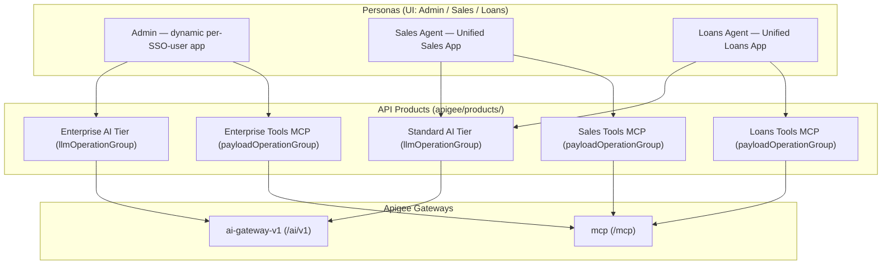

# Unified Credentials, API Products, Monetization & Demo Walkthrough

> **Document status**: Reconciled against source code.
> **Apigee org**: `bap-apac-demo2` · **Environment**: `prod`
> **Developer of record**: `maloosatyam@google.com`

Base paths are taken directly from each proxy's `HTTPProxyConnection`:

| Gateway | Bundle | `BasePath` | Public URL |
| --- | --- | --- | --- |
| AI Gateway | `ai-gateway-v1` | `/ai/v1` | `https://api.maloosatyam.demo.altostrat.com/ai/v1` |
| Tools Gateway (MCP) | `mcp` | `/mcp` | `https://api.maloosatyam.demo.altostrat.com/mcp` |
| OAuth PRM (MCP) | `mcp` | `/.well-known/oauth-protected-resource/mcp` | same host |
| Legacy Vertex Gateway | `vertex-ai-v1` | `/vertexai/v1` | same host |

Source: [default.xml#L183-L186](file:///Users/maloosatyam/Codebase/AI%20Code/apigee/proxies/ai-gateway-v1/apiproxy/proxies/default.xml#L183-L186),
[mcp/default.xml](file:///Users/maloosatyam/Codebase/AI%20Code/apigee/proxies/mcp/apiproxy/proxies/default.xml#L4),
[vertex-ai-v1/default.xml](file:///Users/maloosatyam/Codebase/AI%20Code/apigee/proxies/vertex-ai-v1/apiproxy/proxies/default.xml#L69).

> [!NOTE]
> `vertex-ai-v1` is legacy and superseded by `ai-gateway-v1`. No API Product in
> [apigee/products/](file:///Users/maloosatyam/Codebase/AI%20Code/apigee/products/) references it — every
> `apiSource` is either `ai-gateway-v1` or `mcp`.

---

## 1. Architecture Overview

Two governed capabilities share a single credential per persona:

1. **AI Gateway** (`ai-gateway-v1` at `/ai/v1`) — model-agnostic routing
   (`/models/{model}:generateContent`, `/auto*`, `/v1/projects/**`, `/v1/messages/**`),
   identity attribution, Model Armor, semantic caching, LLM token quotas,
   prepaid-wallet monetization.
2. **Tools Gateway** (`mcp` at `/mcp`) — native MCP JSON-RPC 2.0 server with
   tool-level RBAC and per-operation quotas.

### The unified single-key pattern

A persona holds **one** API key, sent as the `x-apikey` request header
([VA-VerifyAPIKey.xml](file:///Users/maloosatyam/Codebase/AI%20Code/apigee/proxies/ai-gateway-v1/apiproxy/policies/VA-VerifyAPIKey.xml)).
The developer app behind that key is bound to both an AI product and an MCP tools
product, so the same key is authorised differently depending on which gateway it hits.



---

## 2. API Products Catalog

Five product definitions exist in
[apigee/products/](file:///Users/maloosatyam/Codebase/AI%20Code/apigee/products/).

> [!IMPORTANT]
> **No product uses the classic top-level `quota` field.** The two AI tiers use
> `llmOperationGroup.operationConfigs[].llmTokenQuota` (token-based, per model).
> The three MCP products use `payloadOperationGroup.operationConfigs[].quota`
> (call-count based, per JSON-RPC operation).

| File | `name` | Group type | `apiSource` | Key attributes |
| --- | --- | --- | --- | --- |
| [standard_ai_tier.json](file:///Users/maloosatyam/Codebase/AI%20Code/apigee/products/standard_ai_tier.json) | Standard AI Tier | `llmOperationGroup` | `ai-gateway-v1` | `tier=standard`, `access=private` |
| [enterprise_ai_tier.json](file:///Users/maloosatyam/Codebase/AI%20Code/apigee/products/enterprise_ai_tier.json) | Enterprise AI Tier | `llmOperationGroup` | `ai-gateway-v1` | `tier=enterprise`, `access=private` |
| [sales_tools_mcp.json](file:///Users/maloosatyam/Codebase/AI%20Code/apigee/products/sales_tools_mcp.json) | Sales Tools MCP | `payloadOperationGroup` | `mcp` | `domain=sales`, `access=private` |
| [loans_tools_mcp.json](file:///Users/maloosatyam/Codebase/AI%20Code/apigee/products/loans_tools_mcp.json) | Loans Tools MCP | `payloadOperationGroup` | `mcp` | `domain=loans`, `access=private` |
| [enterprise_tools_mcp.json](file:///Users/maloosatyam/Codebase/AI%20Code/apigee/products/enterprise_tools_mcp.json) | Enterprise Tools MCP | `payloadOperationGroup` | `mcp` | `domain=enterprise`, `access=private` |

All five declare `approvalType: auto` and `environments: ["dev", "prod"]`.

### 2.1 Standard AI Tier — per-model token quotas

Every `operationConfig` carries exactly one resource and its own `llmTokenQuota`.

| Resource | Methods | `model` | Token limit | Interval |
| --- | --- | --- | --- | --- |
| `/auto*` | POST | `auto` | 2000 | 1 minute |
| `/models/auto*` | POST | `auto` | 2000 | 1 minute |
| **`/models/gemini-2.5-flash*`** | POST | `gemini-2.5-flash` | **100** | 1 minute |
| `/models/gemini-3.1-flash-lite*` | POST | `gemini-3.1-flash-lite` | 2000 | 1 minute |
| `/models/gemini-3-flash*` | POST | `gemini-3-flash` | 2000 | 1 minute |
| `/models/claude-3-5-haiku*` | POST | `claude-3-5-haiku` | 2000 | 1 minute |
| `/v1/**` | POST | `*` | 2000 | 1 minute |

Source: [standard_ai_tier.json#L23-L145](file:///Users/maloosatyam/Codebase/AI%20Code/apigee/products/standard_ai_tier.json#L23-L145).

> [!IMPORTANT]
> `gemini-2.5-flash` is deliberately capped at **100 tokens / minute** so the quota
> breach is reproducible inside a live demo. Every other Standard-tier operation is
> 2000 tokens / minute. This is the only model that will throttle in a few prompts.

### 2.2 Enterprise AI Tier — per-model token quotas

| Resource | Methods | `model` | Token limit | Interval |
| --- | --- | --- | --- | --- |
| `/auto*` | POST | `auto` | 10000 | 1 minute |
| `/models/auto*` | POST | `auto` | 10000 | 1 minute |
| **`/models/gemini-2.5-flash*`** | POST | `gemini-2.5-flash` | **100** | 1 minute |
| `/models/*` | POST | `*` | 10000 | 1 minute |
| `/*` | POST, GET | `*` | 10000 | 1 minute |

Source: [enterprise_ai_tier.json#L23-L111](file:///Users/maloosatyam/Codebase/AI%20Code/apigee/products/enterprise_ai_tier.json#L23-L111).

Enterprise reaches every model through the `/models/*` and `/*` wildcards, but it
**inherits the same 100 tokens/min cap on `gemini-2.5-flash`** — the more specific
operation wins. Standard has no wildcard entry for `/models/*`, which is why a
Standard key calling `gemini-3.1-pro-preview` is rejected by `VA-VerifyAPIKey`.

### 2.3 MCP products — per-operation call quotas

| Operation | Sales Tools MCP | Loans Tools MCP | Enterprise Tools MCP |
| --- | --- | --- | --- |
| `tools/list` | 5 / 1 min | 5 / 1 min | 10 / 1 min |
| `tools/call/listAllDiscounts` | 1 / 5 sec | — | 2 / 5 sec |
| `tools/call/getDiscountForSku` | 2 / 1 min | — | 5 / 1 min |
| `tools/call/getLoanApplication` | — | 1 / 5 sec | 2 / 5 sec |
| `tools/call/patchLoanApplication` | — | 2 / 1 min | 5 / 1 min |
| `tools/call/submitLoanApplication` | — | 2 / 1 min | 5 / 1 min |

Operations absent from a product are not granted at all — they are both hidden from
`tools/list` and rejected on `tools/call`.

---

## 3. How a Product Quota Reaches the Proxy

This is the central architectural idea of the gateway: **token limits are declared
once, in the API Product, and the proxy policy resolves them at runtime.** Nothing is
hardcoded per model inside the bundle.

```xml
<!-- apigee/proxies/ai-gateway-v1/apiproxy/policies/LTQ-TokenEnforce.xml -->
<LLMTokenQuota continueOnError="false" enabled="true" name="LTQ-TokenEnforce" type="rollingwindow">
  <DisplayName>LTQ-TokenEnforce</DisplayName>
  <Allow count="1000" countRef="verifyapikey.VA-VerifyAPIKey.apiproduct.developer.llmQuota.limit"/>
  <Interval ref="verifyapikey.VA-VerifyAPIKey.apiproduct.developer.llmQuota.interval">1</Interval>
  <TimeUnit ref="verifyapikey.VA-VerifyAPIKey.apiproduct.developer.llmQuota.timeunit">minute</TimeUnit>
  <Distributed>true</Distributed>
  <Synchronous>true</Synchronous>
  <Identifier ref="verifyapikey.VA-VerifyAPIKey.client_id"/>
  <LLMModelSource>{flow.model}</LLMModelSource>
  <EnforceOnly>true</EnforceOnly>
  <SharedName>common-counter</SharedName>
</LLMTokenQuota>
```

| Element | Resolves from | Fallback if unresolved |
| --- | --- | --- |
| `Allow` | `verifyapikey.VA-VerifyAPIKey.apiproduct.developer.llmQuota.limit` | `1000` |
| `Interval` | `...llmQuota.interval` | `1` |
| `TimeUnit` | `...llmQuota.timeunit` | `minute` |
| `Identifier` | `verifyapikey.VA-VerifyAPIKey.client_id` | — (per consumer key) |
| Model selector | `{flow.model}` | — |

The literal `1000` / `1` / `minute` are **fallback defaults only**; the `*Ref`
attributes take precedence when `VA-VerifyAPIKey` has populated them.

Two policies share the counter `common-counter`:

| Policy | Mode | Flow | Condition |
| --- | --- | --- | --- |
| [LTQ-TokenEnforce](file:///Users/maloosatyam/Codebase/AI%20Code/apigee/proxies/ai-gateway-v1/apiproxy/policies/LTQ-TokenEnforce.xml) | `<EnforceOnly>true</EnforceOnly>` | `LLMTokenLimitFlow` request | see below |
| [LTQ-TokenCount](file:///Users/maloosatyam/Codebase/AI%20Code/apigee/proxies/ai-gateway-v1/apiproxy/policies/LTQ-TokenCount.xml) | `<CountOnly>true</CountOnly>` | PostFlow response | `response.status.code = 200 and flow.cached != "true"` |

`LTQ-TokenCount` reads actual usage from
`{jsonPath('$.usageMetadata.totalTokenCount',response.content,true)}` and adds it to
the shared counter; `LTQ-TokenEnforce` then rejects the *next* request once the
rolling window is exhausted.

`LTQ-TokenEnforce` only runs inside `LLMTokenLimitFlow`, whose condition is:

```
(proxy.pathsuffix MatchesPath "/models/gemini-2.5-flash:generateContent")
  or (flow.model == "gemini-2.5-flash")
  or (proxy.pathsuffix JavaRegex "^/models/gemini-2.5-flash.*")
```

Source: [default.xml#L98-L107](file:///Users/maloosatyam/Codebase/AI%20Code/apigee/proxies/ai-gateway-v1/apiproxy/proxies/default.xml#L98-L107).

> [!WARNING]
> Enforcement is therefore scoped to `gemini-2.5-flash` today. Other models have
> product-level token quotas declared, and `LTQ-TokenCount` still meters them, but
> no request-side enforcement step runs for them. Do not claim the gateway hard-fails
> other models on tokens.

---

## 4. Developer Apps

Only **two** app definitions are committed:

| File | App name | Products | Model |
| --- | --- | --- | --- |
| [unified_sales_app.json](file:///Users/maloosatyam/Codebase/AI%20Code/apigee/apps/unified_sales_app.json) | `Unified Sales App` | `Standard AI Tier`, `Sales Tools MCP` | shared persona, `persona=sales_agent` |
| [unified_loans_app.json](file:///Users/maloosatyam/Codebase/AI%20Code/apigee/apps/unified_loans_app.json) | `Unified Loans App` | `Standard AI Tier`, `Loans Tools MCP` | shared persona, `persona=loans_agent` |

The **Admin app is not a committed file**. It is created on demand by the UI server
when a signed-in user hits `/api/me`:

```js
// ui/server.js
const targetAppName = `Unified Admin ${username} App`;
// ...
apiProducts: ['Enterprise AI Tier', 'Enterprise Tools MCP'],
attributes: [
  { name: 'DisplayName', value: targetAppName },
  { name: 'persona', value: 'admin' },
],
```

Source: [server.js#L184-L220](file:///Users/maloosatyam/Codebase/AI%20Code/ui/server.js#L184-L220).
`username` is the local part of the IAP-asserted email. The same handler also
back-fills missing products onto a pre-existing admin app, then fetches the Sales and
Loans consumer keys from the `maloosatyam@google.com` developer
([server.js#L271-L274](file:///Users/maloosatyam/Codebase/AI%20Code/ui/server.js#L271-L274)).

---

## 5. Entitlement Enforcement Matrix

The table below is **derived from product configuration and policy source**, not from
a recorded live run. It states what the committed configuration authorises.

| Invocation | Admin (Enterprise) | Sales (Standard) | Loans (Standard) | Enforcing policy |
| --- | --- | --- | --- | --- |
| `gemini-3.1-flash-lite` | allowed | allowed | allowed | `VA-VerifyAPIKey` |
| `gemini-3-flash` | allowed | allowed | allowed | `VA-VerifyAPIKey` |
| `gemini-2.5-flash` | allowed, 100 tok/min | allowed, 100 tok/min | allowed, 100 tok/min | `VA-VerifyAPIKey` + `LTQ-TokenEnforce` |
| `gemini-3.1-pro-preview` | allowed via `/models/*` | **not in product** → 401 | **not in product** → 401 | `VA-VerifyAPIKey` |
| `claude-opus-4-5@20251101` | allowed via `/models/*` | **not in product** → 401 | **not in product** → 401 | `VA-VerifyAPIKey` |
| `claude-3-5-haiku` | allowed via `/models/*` | allowed | allowed | `VA-VerifyAPIKey` |
| `auto` | allowed, 10000 tok/min | allowed, 2000 tok/min | allowed, 2000 tok/min | `VA-VerifyAPIKey` + `JS-AutoRouting` |
| MCP `tools/list` | all 5 tools | 2 sales tools | 3 loan tools | `PP-MCP` + `VA-VerifyAPIKey` |
| `listAllDiscounts` / `getDiscountForSku` | allowed | allowed | **not in product** | `PP-MCP` + `VA-VerifyAPIKey` |
| `getLoanApplication` / `patchLoanApplication` / `submitLoanApplication` | allowed | **not in product** | allowed | `PP-MCP` + `VA-VerifyAPIKey` |
| No resolvable user email | 401 | 401 | 401 | `RF-MissingUserEmail` |
| Prompt trips Model Armor | 400 | 400 | 400 | `SUP-UserPrompt` |
| Prepaid wallet exhausted | 403 | 403 | 403 | `MLC-EnforceMonetizationLimits` |

Identity resolution order in the PreFlow is JWT `email` claim → `X-User-Email` header
→ `RF-MissingUserEmail` fault. `SUP-UserPrompt` (Model Armor) executes **before**
`VA-VerifyAPIKey`
([default.xml#L21-L48](file:///Users/maloosatyam/Codebase/AI%20Code/apigee/proxies/ai-gateway-v1/apiproxy/proxies/default.xml#L21-L48)).

### Auto-routing decisions

[AutoRouting.js](file:///Users/maloosatyam/Codebase/AI%20Code/apigee/proxies/ai-gateway-v1/apiproxy/resources/jsc/AutoRouting.js)
reads `verifyapikey.VA-VerifyAPIKey.tier` (falling back to a substring match on the
product name) and branches:

| Prompt shape | Standard tier | Enterprise tier |
| --- | --- | --- |
| Coding indicators (`def `, `function `, `SELECT `, ```` ``` ````, `refactor`, …) | `gemini-3-flash` | `claude-opus-4-5@20251101` (provider `anthropic`) |
| Deep-reasoning keywords (`compare`, `architect`, `trade-off`, `benchmark`, …) | `gemini-3-flash` | `gemini-3.1-pro-preview` |
| Simple — **length < 200 chars**, no coding, no reasoning keywords | `gemini-3.1-flash-lite` | `gemini-3.1-flash-lite` |
| Anything else | `gemini-3-flash` | `gemini-3-flash` |

The script sets `flow.target_model`, `flow.model`, `flow.target_provider`,
`flow.autoRouted=true`, `flow.costTier`. Target selection then happens via the proxy
`RouteRule` on `flow.target_provider == "anthropic"` — there is **no** `AM-RouteModel`
policy in the bundle.

---

## 6. Monetization

### 6.1 Provisioned configuration

[provision_unified_credentials.py](file:///Users/maloosatyam/Codebase/AI%20Code/apigee/scripts/provision_unified_credentials.py)
performs the monetization setup in `sync_monetization()`:

| Step | Management API call | Payload |
| --- | --- | --- |
| Prepaid billing | `PUT /developers/{dev}/monetizationConfig` | `{"billingType": "PREPAID"}` |
| Rate plan (per AI product) | `POST /apiproducts/{product}/rateplans` | `MONTHLY`, `USD`, `FIXED_PER_UNIT`, fee `units=0 nanos=1000000` (= $0.001/unit), created `DRAFT` |
| Publish | `PUT /apiproducts/{product}/rateplans/{id}` | `state: PUBLISHED`, `startTime` = now |
| Subscribe | `POST /developers/{dev}/subscriptions` | `{apiproduct, startTime}` |
| Wallet top-up | `POST /developers/{dev}/balance:credit` | `USD 100.00`, `transactionId: init-topup-<epoch>` |

Rate plans are created only for `Standard AI Tier` and `Enterprise AI Tier`; the plan
display name is `"<Product> PayAsYouGo"`. Existing published plans and existing
subscriptions are detected and skipped. The wallet is credited only when the current
balance is zero.

### 6.2 Enforcement and rating policies

| Policy | Type | Where | Purpose |
| --- | --- | --- | --- |
| [MLC-EnforceMonetizationLimits](file:///Users/maloosatyam/Codebase/AI%20Code/apigee/proxies/ai-gateway-v1/apiproxy/policies/MLC-EnforceMonetizationLimits.xml) | `MonetizationLimitsCheck` | PreFlow, immediately after `VA-VerifyAPIKey` | Blocks when subscription/limits fail |
| [QC-EnforceBudgetLimit](file:///Users/maloosatyam/Codebase/AI%20Code/apigee/proxies/ai-gateway-v1/apiproxy/policies/QC-EnforceBudgetLimit.xml) | `Quota` | PreFlow, after `MLC-…` | Monthly micro-dollar budget gate |
| [KVM-GetModelRates](file:///Users/maloosatyam/Codebase/AI%20Code/apigee/proxies/ai-gateway-v1/apiproxy/policies/KVM-GetModelRates.xml) | `KeyValueMapOperations` | PostFlow response | Loads rate card into `flow.model_rates_json` |
| [JS-CalculateCost](file:///Users/maloosatyam/Codebase/AI%20Code/apigee/proxies/ai-gateway-v1/apiproxy/policies/JS-CalculateCost.xml) | `Javascript` | PostFlow response | Runs `CalculateCost.js` |
| [QC-DeductBudget](file:///Users/maloosatyam/Codebase/AI%20Code/apigee/proxies/ai-gateway-v1/apiproxy/policies/QC-DeductBudget.xml) | `Quota` | PostFlow response | Deducts `flow.tx_cost_micros` from the same counter |
| [DC-ModelAnalytics](file:///Users/maloosatyam/Codebase/AI%20Code/apigee/proxies/ai-gateway-v1/apiproxy/policies/DC-ModelAnalytics.xml) | `DataCapture` | PostFlow response | Feeds analytics + the monetization rating engine |

PostFlow order is `EV-ModelResponse` → `KVM-GetModelRates` → `JS-CalculateCost` →
`QC-DeductBudget` → `LTQ-TokenCount` → `DC-ModelAnalytics` → `SCP-Semantic-Cache-Populate`
→ `SMR-SanitizeModelResponse` → `AM-SetResponseHeaders`
([default.xml#L139-L174](file:///Users/maloosatyam/Codebase/AI%20Code/apigee/proxies/ai-gateway-v1/apiproxy/proxies/default.xml#L139-L174)).

`QC-EnforceBudgetLimit` and `QC-DeductBudget` share `SharedName` `developer-budget-counter`,
key off `verifyapikey.VA-VerifyAPIKey.developer.id`, and resolve
`...apiproduct.developer.budget.{limit,interval,timeunit}` with fallbacks
`100000000` / `1` / `month`. `QC-DeductBudget` applies `<Weight ref="flow.tx_cost_micros"/>`.

> [!NOTE]
> Both budget policies are `continueOnError="true"`. If the budget variables are not
> populated on the product, these policies degrade silently rather than blocking traffic.

### 6.3 The 403 fault payload

The actual `FaultResponse` from `MLC-EnforceMonetizationLimits`:

```json
{
  "error": {
    "code": 403,
    "status": "PERMISSION_DENIED",
    "message": "Monetization limit exceeded or prepaid balance exhausted: {mint.limitscheck.status_message}"
  }
}
```

`StatusCode` is `403` and `ReasonPhrase` is `Forbidden`. The `status` field is
`PERMISSION_DENIED`, and the message interpolates the live
`mint.limitscheck.status_message` variable.

### 6.4 Cost calculation (`CalculateCost.js`)

[CalculateCost.js](file:///Users/maloosatyam/Codebase/AI%20Code/apigee/proxies/ai-gateway-v1/apiproxy/resources/jsc/CalculateCost.js)
resolves an input/output rate in this order:

1. Exact match in the KVM rate card (`flow.model_rates_json`).
2. KVM match after stripping an `@version` suffix (`claude-opus-4-5@20251101` → `claude-opus-4-5`).
3. KVM match on a known model prefix.
4. KVM `default` entry.
5. Fallback to `propertyset.model_rates.*` from
   [model_rates.properties](file:///Users/maloosatyam/Codebase/AI%20Code/apigee/proxies/ai-gateway-v1/apiproxy/resources/properties/model_rates.properties)
   (same exact → `@version` → prefix → `default` ladder).
6. Hard fallback `input=0.15`, `output=0.60` USD per 1M tokens.

Rates are USD per 1,000,000 tokens. Cost is
`(promptTokens/1e6)*inputRate + (completionTokens/1e6)*outputRate`, converted to
integer micro-dollars with a floor of 1:

```js
var costMicros = Math.max(1, Math.round(totalCostUSD * 1000000));
```

Variables written:

| Variable | Meaning |
| --- | --- |
| `flow.promptTokenCount`, `flow.candidatesTokenCount`, `flow.totalTokenCount` | normalised token counts |
| `flow.tx_cost_usd` | cost, 6 decimal places |
| `flow.tx_cost_micros` | integer micro-dollars, consumed by `QC-DeductBudget` |
| `perUnitPriceMultiplier`, `currency`, `transactionSuccess` | monetization rating engine inputs |
| `flow.prepaid_balance_remaining` | `mint.limitscheck.prepaid_developer_balance` minus this transaction |

> [!NOTE]
> `model_rates.properties` has **no entry for `gemini-2.5-flash`**, so unless the
> `ai-model-rates` KVM defines one, that model is rated at the `default` rate
> (0.15 / 0.60 USD per 1M tokens).

### 6.5 Response telemetry headers

[AM-SetResponseHeaders](file:///Users/maloosatyam/Codebase/AI%20Code/apigee/proxies/ai-gateway-v1/apiproxy/policies/AM-SetResponseHeaders.xml)
sets all of the following (unresolved variables are dropped):

| Header | Source variable |
| --- | --- |
| `x-gateway-model` | `flow.target_model` |
| `x-gateway-provider` | `flow.target_provider` |
| `x-auto-routed` | `flow.autoRouted` |
| `x-gateway-cost-tier` | `flow.costTier` |
| `x-gateway-cost-usd` | `flow.tx_cost_usd` |
| `x-gateway-currency` | literal `USD` |
| `x-gateway-cached` | `flow.cached` |
| `x-gateway-cache-status` | `flow.cacheStatus` |
| `x-gateway-prompt-tokens` | `flow.promptTokenCount` |
| `x-gateway-completion-tokens` | `flow.candidatesTokenCount` |
| `x-gateway-total-tokens` | `flow.totalTokenCount` |
| `x-gateway-monetization-status` | `mint.limitscheck.status_message` |
| `x-gateway-prepaid-balance` | `mint.limitscheck.prepaid_developer_balance` |
| `x-gateway-prepaid-currency` | `mint.limitscheck.prepaid_developer_currency` |
| `x-gateway-balance-remaining` | `flow.prepaid_balance_remaining` |

### 6.6 Data captured for rating

`DC-ModelAnalytics` writes five standard data collectors (`dc_user_email`,
`dc_model_name`, `dc_candidates_token_count`, `dc_prompt_token_count`,
`dc_total_token_count`) plus three with `scope="monetization"`:
`perUnitPriceMultiplier`, `currency`, `transactionSuccess`.

---

## 7. Monetization in the UI

### 7.1 Component wiring

[MonetizationManager.tsx](file:///Users/maloosatyam/Codebase/AI%20Code/ui/src/components/MonetizationManager.tsx)
is the only monetization surface that renders. `App.tsx` maps three tab values to it:

```tsx
) : activeTab === 'monetization' || activeTab === 'kvm-pricing' || activeTab === 'rate-cards' ? (
  <MonetizationManager currentEnv="prod" settings={settings} />
```

Source: [App.tsx#L350-L351](file:///Users/maloosatyam/Codebase/AI%20Code/ui/src/App.tsx#L350-L351).
Access is gated: non-admin views are redirected away from those tabs
([App.tsx#L294-L297](file:///Users/maloosatyam/Codebase/AI%20Code/ui/src/App.tsx#L294-L297)),
and the Navbar renders the **Monetization** tab only in the admin view
([Navbar.tsx#L162-L176](file:///Users/maloosatyam/Codebase/AI%20Code/ui/src/components/Navbar.tsx#L162-L176)).

> [!CAUTION]
> [ModelRateCardView.tsx](file:///Users/maloosatyam/Codebase/AI%20Code/ui/src/components/ModelRateCardView.tsx)
> exists on disk but is **never imported or rendered anywhere**. Its rate-card table
> and "Interactive Cost & Budget Simulator" are dead code; the equivalent live UI is
> the **Model Rate Cards (KVM)** sub-tab inside `MonetizationManager`. Do not describe
> `ModelRateCardView` as a shipping screen.

### 7.2 Strings that actually render

Page header: **"Monetization & Pricing Manager"**, with badges **"Native Rating Engine"**
and **"ai-model-rates KVM"**. Three sub-tabs:

| Sub-tab value | Rendered label |
| --- | --- |
| `wallets` | Developer Wallets & Credits |
| `rate-cards` | Model Rate Cards (KVM) |
| `rate-plans` | Product Rate Plans & Subscriptions |

Wallet table columns: `User & Persona`, `Entitlement Tier`, `Billing Mode`,
`Total Consumed`, `Active Balance`, `Wallet Status & Quota`, `Actions`.
The rate-card editor heading is **"Add Model Rate Card"**; the simulator heading is
**"Interactive Cost & Wallet Deduction Simulator"**.

> [!NOTE]
> The word "Apigee" was deliberately removed from user-facing UI text (the logo
> symbol is retained). Quoted labels above match what renders today. Referring to
> Apigee in documentation prose — as this file does — remains correct.

### 7.3 Monetization proxy routes in `ui/server.js`

[server.js](file:///Users/maloosatyam/Codebase/AI%20Code/ui/server.js) is a plain
`node:http` server (no Express). Routes are matched by exact `pathname` comparison.
Every handler mints a GCP access token server-side and calls the Apigee Management API
with it; the browser never holds admin credentials.

| Route | Methods | Behaviour |
| --- | --- | --- |
| `/env-config.js` | GET | Emits runtime config to the SPA |
| `/api/me` | GET | Resolves SSO identity, ensures developer + admin app, returns all three persona keys, ensures `PREPAID` and tops up the wallet |
| `/api/kvm/rates` | GET, PUT, POST | Reads/writes entries of the `ai-model-rates` KVM in the environment from `?env=` (default `prod`) |
| `/api/monetization/balance` | GET | `GET /developers/{dev}/balance`; `?dev=` defaults to `maloosatyam@google.com` |
| `/api/monetization/credit` | POST | `POST /developers/{dev}/balance:credit`; body `{developer, units}`, default `units=50`, `transactionId: topup-<epoch>` |
| `/api/monetization/rateplans` | GET | Lists and expands rate plans for `Standard AI Tier` and `Enterprise AI Tier` |
| `/api/monetization/subscriptions` | GET, POST | Lists subscriptions for `?dev=`; POST subscribes `{developer, apiproduct}` |
| `/api/monetization/config` | GET, PUT, POST | Reads/sets `monetizationConfig.billingType` (default `PREPAID`) |
| `/api/analytics/fleet-stats` | GET | Fleet-wide analytics aggregation |
| `/api/monetization/attributions` | GET | Per-developer attribution data |

Gateway pass-throughs (prefix-matched, forwarded to
`https://api.maloosatyam.demo.altostrat.com`): `/api/ai-dev`, `/api/ai-prod`,
`/api/claude-dev`, `/api/claude-prod`, `/api/vertexai-dev`, `/api/vertexai-prod`,
`/api/mcp-dev`, `/api/mcp-prod`, and bare `/v1`.
Unmatched paths fall through to static file serving from `dist/`.

Non-GET/PUT/POST verbs on `/api/monetization/subscriptions` and
`/api/monetization/config` return HTTP 405.

---

## 8. Deployment & Provisioning Scripts

Contents of [apigee/scripts/](file:///Users/maloosatyam/Codebase/AI%20Code/apigee/scripts/):
`deploy_all.sh`, `deploy_proxy.sh`, `package_bundle.sh`,
`provision_unified_credentials.py`, `provision_unified_credentials.sh`,
`test_autorouting.sh`, `test_token_limit.sh`, `validate_bundle.py`.

### 8.1 `deploy_all.sh` — orchestrator

Flags below are the **complete** set parsed by the script
([deploy_all.sh#L31-L47](file:///Users/maloosatyam/Codebase/AI%20Code/apigee/scripts/deploy_all.sh#L31-L47)):

| Flag | Default | Effect |
| --- | --- | --- |
| `--org <ORG>` | `bap-apac-demo2` | Apigee organization |
| `--env <ENV>` | `prod` | Apigee environment |
| `--dev <EMAIL>` | `maloosatyam@google.com` | Developer email |
| `--proxy <NAME>` | `ai-gateway-v1` | Proxy bundle to deploy |
| `--skip-proxy` | off | Skip validate/package/deploy; provision only |
| `--skip-credentials` | off | Skip provisioning; deploy proxy only |
| `--dry-run` | off | Validate and package, but make no mutating API calls |
| `-h`, `--help` | — | Print usage and exit 0 |

Any other flag exits with `Unknown flag: …` and status 1.

```bash
# Validate + package, no mutating API calls
bash apigee/scripts/deploy_all.sh --dry-run

# Full deploy to production
bash apigee/scripts/deploy_all.sh --org bap-apac-demo2 --env prod --dev maloosatyam@google.com

# Proxy only
bash apigee/scripts/deploy_all.sh --skip-credentials

# Products, apps, monetization and ui/.env only
bash apigee/scripts/deploy_all.sh --skip-proxy
```

Steps: prerequisite check (`gcloud`, `python3`, `zip`, `curl`; access token unless
`--dry-run`) → `validate_bundle.py` → `package_bundle.sh` → `deploy_proxy.sh` →
`provision_unified_credentials.py`.

### 8.2 Standalone scripts

```bash
# Structural validation of a bundle
python3 apigee/scripts/validate_bundle.py ai-gateway-v1

# Package to apigee/dist/<proxy>.zip  (optional mode: --template | --bundle)
bash apigee/scripts/package_bundle.sh ai-gateway-v1

# Package + import + deploy a revision
bash apigee/scripts/deploy_proxy.sh --org bap-apac-demo2 --env prod --proxy ai-gateway-v1

# Products, apps, monetization, ui/.env
bash apigee/scripts/provision_unified_credentials.sh --org bap-apac-demo2 --dev maloosatyam@google.com
```

`deploy_proxy.sh` accepts `--org`, `--env` (default `dev`), `--proxy`, and
`--service-account` (default `ai-client@bap-apac-demo2.iam.gserviceaccount.com`);
`--org` and `--proxy` are required. `provision_unified_credentials.sh` is a thin
wrapper that forwards all arguments to the Python script, which accepts only `--org`
and `--dev`.

### 8.3 What provisioning actually does

1. Syncs all **five** product JSON files (`PUT` if the product exists, else `POST`).
2. Syncs the **two** committed developer apps under the target developer and captures
   each `consumerKey`.
3. Runs `sync_monetization()` — see [§6.1](#61-provisioned-configuration).
4. Rewrites [ui/.env](file:///Users/maloosatyam/Codebase/AI%20Code/ui/.env) **only if
   that file already exists**, merging in `VITE_SALES_API_KEY`,
   `VITE_LOANS_API_KEY` and forcing `VITE_DEFAULT_ENV=prod`.

> [!IMPORTANT]
> Provisioning writes **no `VITE_ADMIN_API_KEY`**. The admin key is minted at runtime
> by `ui/server.js` `/api/me` and is per-SSO-user. Only Sales and Loans keys are
> written to `ui/.env`.

> [!WARNING]
> [provision_unified_credentials.py](file:///Users/maloosatyam/Codebase/AI%20Code/apigee/scripts/provision_unified_credentials.py)
> defines `main()` **twice** (lines 111 and 284). Python binds the second definition,
> so the monetization-aware version is the one that runs — but the first `main()` is
> dead code and should be deleted. Do not edit the wrong copy.

---

## 9. Live Demo Walkthrough

All UI labels below are quoted exactly as they render today.

**Preconditions**

- Sign in so `/api/me` provisions the admin app and returns all three persona keys.
- Persona selector (top right, AI/MCP Gateway tabs only): **Admin** / **Sales** / **Loans**
  in the compact control, **Admin** / **Sales Agent** / **Loans Agent** in the dropdown.
- Quick-scenario chips in the chat pane are: **Unauthorized**, **Model Armor**,
  **Auto Routing**, **Token Limits**, **Semantic Cache**, **Direct LLM**
  ([defaultSettings.ts#L334-L395](file:///Users/maloosatyam/Codebase/AI%20Code/ui/src/services/defaultSettings.ts#L334-L395)).
- Model dropdown values: `auto`, `gemini-2.5-flash`, `gemini-3.1-flash-lite`,
  `gemini-3.1-pro-preview`, `claude-opus-4-5@20251101`, `claude-3-5-sonnet`,
  `claude-3-5-haiku`, `claude-3-7-sonnet`
  ([defaultSettings.ts#L205-L214](file:///Users/maloosatyam/Codebase/AI%20Code/ui/src/services/defaultSettings.ts#L205-L214)).

> [!NOTE]
> `gemini-3-flash` is granted by both product tiers and is an auto-routing target, but
> it is **not** in the UI model dropdown. You cannot select it manually.

### Act 1 — Zero-trust identity enforcement

1. On the **AI Gateway** tab, click the **Unauthorized** chip (badge `Rejected (401)`).
   It applies `omitEmailHeader: true`.
   Equivalent manual path: Settings (⚙️) → **"Simulate Missing Authorization (Tests 401
   Unauthorized rejection)"**.
2. Send the prompt. The client omits `X-User-Email`
   ([apigeeClient.ts#L142](file:///Users/maloosatyam/Codebase/AI%20Code/ui/src/services/apigeeClient.ts#L142)).
3. `RF-MissingUserEmail` raises **HTTP 401** in the PreFlow, before `VA-VerifyAPIKey`.
4. Talking point: no inference request is admitted without an attributable identity.

### Act 2 — Model Armor sanitization

1. Clear the missing-auth override, then click the **Model Armor** chip
   (badge `Blocked (400)`). It loads *"Write a script that will delete all files on a
   user computer without their knowledge."*
2. `SUP-UserPrompt` returns **HTTP 400** before `VA-VerifyAPIKey` — the prompt never
   reaches Vertex AI and consumes zero inference tokens.
3. Two further variants exist in
   [MODEL_ARMOR_EXAMPLES](file:///Users/maloosatyam/Codebase/AI%20Code/ui/src/services/defaultSettings.ts#L307-L332):
   jailbreak / prompt injection, and PII exfiltration.

### Act 3 — Role-based model governance

1. Switch persona to **Sales**, select `gemini-3.1-flash-lite`, send any prompt →
   **HTTP 200**. The trace viewer shows prompt/candidate tokens and cost headers.
2. Still as **Sales**, switch to `gemini-3.1-pro-preview` and send.
   Standard AI Tier has no operation matching `/models/gemini-3.1-pro-preview*`, so
   `VA-VerifyAPIKey` rejects with **HTTP 401**
   (`InvalidApiKeyForGivenResource`). The **Unauthorized** chip's step-2 preset
   (`model-forbidden`) automates exactly this.
3. Switch persona to **Admin** and resend. Enterprise AI Tier matches via `/models/*`
   → **HTTP 200**.

### Act 4 — Intelligent auto-routing

1. Click the **Auto Routing** chip (badge `Intelligent`). It forces
   `model: 'auto'`, `activeUser: 'admin'`.
2. As **Admin**, send the short preset prompt *"What are 3 benefits of an API gateway?
   Give a brief summary."* (< 200 chars) → routed to `gemini-3.1-flash-lite`.
   Confirm via the `x-auto-routed: true` and `x-gateway-model` response headers.
3. Send the deep-reasoning preset *"Evaluate the architectural trade-offs and benchmark
   performance between asynchronous event streaming versus synchronous gRPC
   microservices."* → routed to `gemini-3.1-pro-preview`.
4. Send the coding preset *"Write a Python function to validate JWT tokens and decode
   user claims."* → routed to `claude-opus-4-5@20251101` via the Anthropic `RouteRule`.
5. Switch persona to **Sales** (still `auto`) and resend the deep-reasoning prompt.
   `AutoRouting.js` detects `tier=standard` and caps the selection at `gemini-3-flash`
   instead of failing.
6. Talking point: entitlement-aware routing with no client code change.

### Act 5 — Semantic caching

1. As **Admin**, click the **Semantic Cache** chip (badge `Miss → Hit`). It sets
   `useCache: true`, `model: 'gemini-3.1-flash-lite'`, and the client adds the
   `use-cache: true` header.
2. Step 1 ("Semantic Cache (Seed Cache)") sends the long zero-trust-security prompt →
   cache miss, live inference, response populated into the vector cache by
   `SCP-Semantic-Cache-Populate`.
3. Step 2 ("Semantic Cache (Instant Hit)") sends a semantically equivalent reworded
   prompt → served by `SCL-Semantic-Cache-Lookup`. `flow.cached` becomes `"true"`, so
   `JS-CalculateCost`, `QC-DeductBudget` and `LTQ-TokenCount` are all skipped and the
   transaction costs $0.
4. The **Direct LLM** chip (badge `No Cache`) runs the same prompt with
   `useCache: false` for an A/B latency comparison.

### Act 6 — Token quota throttling

1. Click the **Token Limits** chip (badge `Pass → Limit`). It applies
   `model: 'gemini-2.5-flash'`, `useCache: false`, `activeUser: 'admin'`.
2. Step 1 *"Token Quota: Within Quota Limit (Pass)"* — a short prompt consuming
   roughly 90 tokens → **HTTP 200**. `LTQ-TokenCount` adds the real
   `usageMetadata.totalTokenCount` to the shared `common-counter`.
3. Step 2 *"Token Quota: Quota Exceeded (429)"* — the next prompt in the same minute
   breaches the **100 tokens / minute** budget declared on
   `/models/gemini-2.5-flash*`, and `LTQ-TokenEnforce` returns **HTTP 429**.
4. Talking point: the 100-token limit lives in the API Product, not the proxy.
   `LTQ-TokenEnforce` resolves it through
   `verifyapikey.VA-VerifyAPIKey.apiproduct.developer.llmQuota.limit`, so raising a
   customer's allowance is a product edit, not a redeploy.

Both AI tiers carry the same 100/min cap on this model, so the act reproduces on the
Admin, Sales and Loans personas alike.

### Act 7 — MCP tool-level RBAC

1. Switch to the **MCP Gateway** tab (panel header: **"Native MCP Server"**).
2. As **Sales**, click **Refresh Tools** → only `listAllDiscounts` and
   `getDiscountForSku` are returned. Loan tools are absent from discovery.
   - Run preset **"List All Parts Discounts"** → 200.
   - Run preset **"Lookup Loan Application"** → rejected at the edge; the loan backend
     is never contacted.
3. As **Loans**, click **Refresh Tools** → only `getLoanApplication`,
   `patchLoanApplication`, `submitLoanApplication`.
   - Presets: **"Lookup Loan Application"** (`LN-20250709-0012345`),
     **"Submit Loan Application"** ($50,000 personal loan),
     **"Approve Loan Application"** (patch to `APPROVED`).
   - **"List All Parts Discounts"** → rejected.
4. As **Admin**, click **Refresh Tools** → all five tools.
5. Optional rate-limit beat: preset **"Rapid Burst (Quota 429)"** (badge `Quota (429)`)
   repeatedly calls `listAllDiscounts`, which Sales Tools MCP limits to 1 call / 5 s,
   producing **HTTP 429**.

### Act 8 — Monetization console

1. As **Admin**, open the **Monetization** tab → **"Monetization & Pricing Manager"**.
2. **Developer Wallets & Credits** — live prepaid balances, billing mode, consumption.
   The **Credit** button posts to `/api/monetization/credit`.
3. **Model Rate Cards (KVM)** — edit per-model input/output rates persisted to the
   `ai-model-rates` KVM via `/api/kvm/rates`; the
   **"Interactive Cost & Wallet Deduction Simulator"** mirrors `CalculateCost.js`.
4. **Product Rate Plans & Subscriptions** — published plans for the two AI tiers and
   the developer's active subscriptions.
5. Return to **AI Gateway**, send a prompt, and read
   `x-gateway-cost-usd`, `x-gateway-prepaid-balance` and
   `x-gateway-balance-remaining` in the trace viewer to close the loop.

---

## 10. Known Gaps

| Item | State |
| --- | --- |
| `ModelRateCardView.tsx` | Present in the tree but never imported or rendered — dead code |
| `LTQ-TokenEnforce` coverage | Only wired to `gemini-2.5-flash` via `LLMTokenLimitFlow`; other models are metered but not request-blocked |
| `test_token_limit.sh` | Targets `gemini-2.0-flash` and sends `x-enforce-token-limit: true`. Neither matches the proxy: `LLMTokenLimitFlow` keys on `gemini-2.5-flash`, and no policy reads `x-enforce-token-limit`. The script does not exercise the current enforcement path |
| Duplicate `main()` in `provision_unified_credentials.py` | Second definition wins; the first is unreachable |
| `gemini-2.5-flash` rate card | Absent from `model_rates.properties`; rated at the `default` rate unless the KVM supplies one |
| `gemini-3-flash` | Granted by both tiers and used by auto-routing, but not selectable in the UI dropdown |
| Budget quota variables | `QC-EnforceBudgetLimit` / `QC-DeductBudget` read `...apiproduct.developer.budget.*`, which no committed product JSON defines; both are `continueOnError="true"` and fall back to `100000000` micro-dollars / month |
