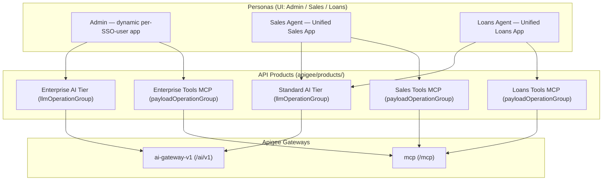

# Unified Credentials, API Products, Monetization & Demo Walkthrough

> **Document status**: Reconciled against source code.
> **Apigee org**: `bap-apac-demo2` · **Environment**: `prod`
> **Developer of record**: `maloosatyam@google.com` — still the default for the
> provisioning scripts, the prepaid wallet and every `?dev=` parameter, **but** the
> `Unified Sales App` / `Unified Loans App` keys now resolve from
> `maloosatyam@gmail.com` first (see [§4](#4-developer-apps)).

Base paths are taken directly from each proxy's `HTTPProxyConnection`:

| Gateway | Bundle | `BasePath` | Public URL |
| --- | --- | --- | --- |
| AI Gateway | `ai-gateway-v1` | `/ai/v1` | `https://api.maloosatyam.demo.altostrat.com/ai/v1` |
| Tools Gateway (MCP) | `mcp` | `/mcp` | `https://api.maloosatyam.demo.altostrat.com/mcp` |
| OAuth PRM (MCP) | `mcp` | `/.well-known/oauth-protected-resource/mcp` | same host |
| Legacy Vertex Gateway | `vertex-ai-v1` | `/vertexai/v1` | same host |

Source: [default.xml#L183-L186](file:///Users/maloosatyam/Codebase/AI%20Code/apigee/proxies/ai-gateway-v1/apiproxy/proxies/default.xml#L183-L186),
[mcp/default.xml](file:///Users/maloosatyam/Codebase/AI%20Code/apigee/proxies/mcp/apiproxy/proxies/default.xml#L4),
[vertex-ai-v1/default.xml](file:///Users/maloosatyam/Codebase/AI%20Code/apigee/proxies/vertex-ai-v1/apiproxy/proxies/default.xml#L69).

> [!NOTE]
> `vertex-ai-v1` is legacy and superseded by `ai-gateway-v1`. No API Product in
> [apigee/products/](file:///Users/maloosatyam/Codebase/AI%20Code/apigee/products/) references it — every
> `apiSource` is either `ai-gateway-v1` or `mcp`.

---

## 1. Architecture Overview

Two governed capabilities share a single credential per persona:

1. **AI Gateway** (`ai-gateway-v1` at `/ai/v1`) — model-agnostic routing
   (`/models/{model}:generateContent` and `/auto`),
   identity attribution, Model Armor, semantic caching, LLM token quotas,
   prepaid-wallet monetization.
2. **Tools Gateway** (`mcp` at `/mcp`) — native MCP JSON-RPC 2.0 server with
   tool-level RBAC and per-operation quotas.

### The unified single-key pattern

A persona holds **one** API key, sent as the `x-apikey` request header
([VA-VerifyAPIKey.xml](file:///Users/maloosatyam/Codebase/AI%20Code/apigee/proxies/ai-gateway-v1/apiproxy/policies/VA-VerifyAPIKey.xml)).
The developer app behind that key is bound to both an AI product and an MCP tools
product, so the same key is authorised differently depending on which gateway it hits.



---

## 2. API Products Catalog

Five product definitions exist in
[apigee/products/](file:///Users/maloosatyam/Codebase/AI%20Code/apigee/products/).

> [!IMPORTANT]
> **No product uses the classic top-level `quota` field.** The two AI tiers use
> `llmOperationGroup.operationConfigs[].llmTokenQuota` (token-based, per model).
> The three MCP products use `payloadOperationGroup.operationConfigs[].quota`
> (call-count based, per JSON-RPC operation).

| File | `name` | Group type | `apiSource` | Attributes |
| --- | --- | --- | --- | --- |
| [standard_ai_tier.json](file:///Users/maloosatyam/Codebase/AI%20Code/apigee/products/standard_ai_tier.json) | Standard AI Tier | `llmOperationGroup` | `ai-gateway-v1` | `access=private`, `developer.budget.limit=5000000` ($5/mo), `.interval=1`, `.timeunit=month` |
| [enterprise_ai_tier.json](file:///Users/maloosatyam/Codebase/AI%20Code/apigee/products/enterprise_ai_tier.json) | Enterprise AI Tier | `llmOperationGroup` | `ai-gateway-v1` | `access=private`, `developer.budget.limit=20000000` ($20/mo), `.interval=1`, `.timeunit=month` |
| [sales_tools_mcp.json](file:///Users/maloosatyam/Codebase/AI%20Code/apigee/products/sales_tools_mcp.json) | Sales Tools MCP | `payloadOperationGroup` | `mcp` | `access=private` |
| [loans_tools_mcp.json](file:///Users/maloosatyam/Codebase/AI%20Code/apigee/products/loans_tools_mcp.json) | Loans Tools MCP | `payloadOperationGroup` | `mcp` | `access=private` |
| [enterprise_tools_mcp.json](file:///Users/maloosatyam/Codebase/AI%20Code/apigee/products/enterprise_tools_mcp.json) | Enterprise Tools MCP | `payloadOperationGroup` | `mcp` | `access=private` |

> [!WARNING]
> This table previously listed `tier=standard`, `tier=enterprise` and `domain=sales|loans|enterprise`.
> **Those attributes do not exist** — they were removed from every product, as section 10 of this
> same document already recorded. The table contradicted it. Nothing reads a `tier` or `domain`
> attribute: routing tier comes from the product **name**, and MCP persona comes from the
> credential's product grants.

All five declare `approvalType: auto` and `environments: ["dev", "prod"]`.

### 2.1 Standard AI Tier — per-model token quotas

**6 `operationConfigs` covering 5 models.** Every `operationConfig` carries exactly
**one** `llmOperation` and its own `llmTokenQuota`; the Management API rejects more with
`Operations must contain exactly one entity`, and rejects a config with none at all with
`Operations must contain exactly one entity but found 0 entities`. Every operation is
`apiSource: ai-gateway-v1`, method `POST`.

| # | Resource | `model` | Token limit | Interval |
| --- | --- | --- | --- | --- |
| 1 | `/auto` | `auto` | 2000 | 1 minute |
| 2 | `/auto:*` | `auto` | 2000 | 1 minute |
| 3 | **`/models/claude-haiku-4-5@20251001:*`** | `claude-haiku-4-5@20251001` | **50** | 1 minute |
| 4 | `/models/gemini-3.1-flash-lite:*` | `gemini-3.1-flash-lite` | 2000 | 1 minute |
| 5 | `/models/gemini-3-flash-preview:*` | `gemini-3-flash-preview` | 2000 | 1 minute |
| 6 | `/models/claude-haiku-4-5@20251001:*` | `claude-haiku-4-5@20251001` | 2000 | 1 minute |

Source: [standard_ai_tier.json#L15-L118](file:///Users/maloosatyam/Codebase/AI%20Code/apigee/products/standard_ai_tier.json#L15-L118).

> [!IMPORTANT]
> `claude-haiku-4-5@20251001` is deliberately capped at **50 tokens / minute** so the quota
> breach is reproducible inside a live demo. Every other Standard-tier operation is
> 2000 tokens / minute. This is the only model that will throttle in a few prompts.

### 2.2 Enterprise AI Tier — per-model token quotas

**8 `operationConfigs` covering 7 models.** Same shape as Standard: one
`llmOperation` per `operationConfig`, `apiSource: ai-gateway-v1`, method `POST`.

| # | Resource | `model` | Token limit | Interval |
| --- | --- | --- | --- | --- |
| 1 | `/auto` | `auto` | 10000 | 1 minute |
| 2 | `/auto:*` | `auto` | 10000 | 1 minute |
| 3 | **`/models/claude-haiku-4-5@20251001:*`** | `claude-haiku-4-5@20251001` | **50** | 1 minute |
| 4 | `/models/gemini-3.1-flash-lite:*` | `gemini-3.1-flash-lite` | 10000 | 1 minute |
| 5 | `/models/gemini-3-flash-preview:*` | `gemini-3-flash-preview` | 10000 | 1 minute |
| 6 | `/models/gemini-3.1-pro-preview:*` | `gemini-3.1-pro-preview` | 10000 | 1 minute |
| 7 | `/models/claude-haiku-4-5@20251001:*` | `claude-haiku-4-5@20251001` | 10000 | 1 minute |
| 8 | `/models/claude-opus-4-5@20251101:*` | `claude-opus-4-5@20251101` | 10000 | 1 minute |

Source: [enterprise_ai_tier.json#L15-L152](file:///Users/maloosatyam/Codebase/AI%20Code/apigee/products/enterprise_ai_tier.json#L15-L152).

Enterprise is a **superset of Standard by enumeration**, not by wildcard: it adds
`gemini-3.1-pro-preview` and `claude-opus-4-5@20251101` and raises every non-capped
limit from 2000 to 10000 tokens/minute. It **inherits the same 50 tokens/min cap on
`claude-haiku-4-5@20251001`**, so the token-quota demo reproduces on every persona. Standard
simply has no operation naming the Pro or Opus models, which is why a Standard key
calling `gemini-3.1-pro-preview` is rejected by `VA-VerifyAPIKey`.

### 2.3 Resource patterns and glob semantics

Each entitled model gets exactly one resource, the gateway-shaped path:

```text
/models/<model>:*
```

`auto` is the exception, with two exact resources:

```text
/auto        /auto:*
```

Apigee glob rules that drive these shapes:

| Pattern | Meaning | Consequence here |
| --- | --- | --- |
| `*` | matches **within one path segment** and requires at least one character | `/auto*` does **not** match a bare `/auto`, so `/auto` is granted as its own exact resource |
| `:*` | absorbs only the method suffix after the model name | Grants `:generateContent` and `:streamGenerateContent` without reaching sibling models |
| `**` | matches across segments | **Not used in any product** |

> [!WARNING]
> A trailing `*` placed directly after a model name leaks sibling models. The previous
> `/models/gemini-2.5-flash*` also granted `gemini-2.5-flash-lite` — confirmed reaching
> the backend — because `*` continues matching inside the same segment. Always anchor
> the glob on the `:` separator (`/models/gemini-2.5-flash:*`) so the match stops at
> the model name.

The UI uses exactly one shape per call: `auto` posts to bare `/auto`, and every other
model — Gemini and Claude alike — posts to `/models/{model}:generateContent`
([apigeeClient.ts#L11-L24](file:///Users/maloosatyam/Codebase/AI%20Code/ui/src/services/apigeeClient.ts#L11-L24),
[#L42-L68](file:///Users/maloosatyam/Codebase/AI%20Code/ui/src/services/apigeeClient.ts#L42-L68)).
The native Vertex and Anthropic Messages shapes are no longer sent, entitled, or accepted.

### 2.4 Removed wildcard entitlements — do not reintroduce

Three blanket entitlements previously existed and have been deleted. They granted
`model="*"`, i.e. **every** model the upstream project can serve, which defeats the
entire entitlement story this demo exists to tell:

| Product | Removed resource | Removed `model` |
| --- | --- | --- |
| Standard AI Tier | `/v1/**` | `*` |
| Enterprise AI Tier | `/models/*` | `*` |
| Enterprise AI Tier | `/*` | `*` |

> [!CAUTION]
> No product may reintroduce a `model="*"` entitlement or a `**` resource glob. Doing so
> silently re-grants unreleased and restricted models — including `gemini-3.1-ultra` —
> and breaks both the Restricted Model scenario and the Standard-vs-Enterprise
> governance demo. Add an explicit pair of `:*` resources per model instead.

### 2.5 `gemini-3.1-ultra` — the deliberately unentitled model

`gemini-3.1-ultra` appears in **no** product file. Verify with:

```bash
grep -r "gemini-3.1-ultra" apigee/products/   # expected: no matches
```

It is offered in the UI model dropdown, tagged `Restricted (Not Entitled)`, purely to
drive the **Restricted Model** step of the Unauthorized scenario: an Admin key bound to
`Enterprise AI Tier` — the strongest credential in the demo — is still rejected at
`VA-VerifyAPIKey` with **401** before any upstream call is made
([defaultSettings.ts#L259-L262](file:///Users/maloosatyam/Codebase/AI%20Code/ui/src/services/defaultSettings.ts#L259-L262),
[#L347-L360](file:///Users/maloosatyam/Codebase/AI%20Code/ui/src/services/defaultSettings.ts#L347-L360)).

> [!NOTE]
> This only stays true while §2.4 holds. Any wildcard entitlement would grant
> `gemini-3.1-ultra` by accident and turn a 401 into an upstream error, which tells a
> completely different — and wrong — story on stage.

### 2.6 MCP products — per-operation call quotas

| Operation | Sales Tools MCP | Loans Tools MCP | Enterprise Tools MCP |
| --- | --- | --- | --- |
| `tools/list` | 5 / 1 min | 5 / 1 min | 10 / 1 min |
| `tools/call/listAllDiscounts` | 1 / 5 sec | — | 2 / 5 sec |
| `tools/call/getDiscountForSku` | 2 / 1 min | — | 5 / 1 min |
| `tools/call/getLoanApplication` | — | 1 / 5 sec | 2 / 5 sec |
| `tools/call/patchLoanApplication` | — | 2 / 1 min | 5 / 1 min |
| `tools/call/submitLoanApplication` | — | 2 / 1 min | 5 / 1 min |

Operations absent from a product are not granted at all — they are both hidden from
`tools/list` and rejected on `tools/call`.

---

## 3. How a Product Quota Reaches the Proxy

This is the central architectural idea of the gateway: **token limits are declared
once, in the API Product, and the proxy policy resolves them at runtime.** Nothing is
hardcoded per model inside the bundle.

```xml
<!-- apigee/proxies/ai-gateway-v1/apiproxy/policies/LTQ-TokenEnforce.xml -->
<LLMTokenQuota continueOnError="false" enabled="true" name="LTQ-TokenEnforce" type="rollingwindow">
  <DisplayName>LTQ-TokenEnforce</DisplayName>
  <Allow count="1000" countRef="verifyapikey.VA-VerifyAPIKey.apiproduct.developer.llmQuota.limit"/>
  <Interval ref="verifyapikey.VA-VerifyAPIKey.apiproduct.developer.llmQuota.interval">1</Interval>
  <TimeUnit ref="verifyapikey.VA-VerifyAPIKey.apiproduct.developer.llmQuota.timeunit">minute</TimeUnit>
  <Distributed>true</Distributed>
  <Synchronous>true</Synchronous>
  <Identifier ref="verifyapikey.VA-VerifyAPIKey.client_id"/>
  <LLMModelSource>{flow.model}</LLMModelSource>
  <EnforceOnly>true</EnforceOnly>
  <SharedName>common-counter</SharedName>
</LLMTokenQuota>
```

| Element | Resolves from | Fallback if unresolved |
| --- | --- | --- |
| `Allow` | `verifyapikey.VA-VerifyAPIKey.apiproduct.developer.llmQuota.limit` | `1000` |
| `Interval` | `...llmQuota.interval` | `1` |
| `TimeUnit` | `...llmQuota.timeunit` | `minute` |
| `Identifier` | `verifyapikey.VA-VerifyAPIKey.client_id` | — (per consumer key) |
| Model selector | `{flow.model}` | — |

The literal `1000` / `1` / `minute` are **fallback defaults only**; the `*Ref`
attributes take precedence when `VA-VerifyAPIKey` has populated them.

Two policies share the counter `common-counter`:

| Policy | Mode | Flow | Condition |
| --- | --- | --- | --- |
| [LTQ-TokenEnforce](file:///Users/maloosatyam/Codebase/AI%20Code/apigee/proxies/ai-gateway-v1/apiproxy/policies/LTQ-TokenEnforce.xml) | `<EnforceOnly>true</EnforceOnly>` | `LLMTokenLimitFlow` request | see below |
| [LTQ-TokenCount](file:///Users/maloosatyam/Codebase/AI%20Code/apigee/proxies/ai-gateway-v1/apiproxy/policies/LTQ-TokenCount.xml) | `<CountOnly>true</CountOnly>` | PostFlow response | `response.status.code = 200 and flow.cached != "true"` |

`LTQ-TokenCount` reads actual usage from
`{jsonPath('$.usageMetadata.totalTokenCount',response.content,true)}` and adds it to
the shared counter; `LTQ-TokenEnforce` then rejects the *next* request once the
rolling window is exhausted.

`LTQ-TokenEnforce` only runs inside `LLMTokenLimitFlow`, whose condition is:

```
(proxy.pathsuffix MatchesPath "/models/claude-haiku-4-5@20251001:generateContent")
  or (flow.model == "claude-haiku-4-5@20251001")
  or (proxy.pathsuffix JavaRegex "^/models/claude-haiku-4-5.*")
```

Source: [default.xml#L98-L107](file:///Users/maloosatyam/Codebase/AI%20Code/apigee/proxies/ai-gateway-v1/apiproxy/proxies/default.xml#L98-L107).

> [!WARNING]
> Enforcement is therefore scoped to `claude-haiku-4-5@20251001` today. Other models have
> product-level token quotas declared, and `LTQ-TokenCount` still meters them, but
> no request-side enforcement step runs for them. Do not claim the gateway hard-fails
> other models on tokens.

---

## 4. Developer Apps

Only **two** app definitions are committed:

| File | App name | Products | Model |
| --- | --- | --- | --- |
| [unified_sales_app.json](file:///Users/maloosatyam/Codebase/AI%20Code/apigee/apps/unified_sales_app.json) | `Unified Sales App` | `Standard AI Tier`, `Sales Tools MCP` | shared persona, `persona=sales_agent` |
| [unified_loans_app.json](file:///Users/maloosatyam/Codebase/AI%20Code/apigee/apps/unified_loans_app.json) | `Unified Loans App` | `Standard AI Tier`, `Loans Tools MCP` | shared persona, `persona=loans_agent` |

The **Admin app is not a committed file**. It is created on demand by the UI server
when a signed-in user hits `/api/me`:

```js
// ui/server.js
const targetAppName = `Unified Admin ${username} App`;
// ...
apiProducts: ['Enterprise AI Tier', 'Enterprise Tools MCP'],
attributes: [
  { name: 'DisplayName', value: targetAppName },
  { name: 'persona', value: 'admin' },
],
```

Source: [server.js#L429-L470](file:///Users/maloosatyam/Codebase/AI%20Code/ui/server.js#L429-L470).
`username` is the local part of the IAP-asserted email. The same handler also
back-fills missing products onto a pre-existing admin app, then fetches the Sales and
Loans consumer keys — trying **`maloosatyam@gmail.com` first** and using
`maloosatyam@google.com` only as a `||` fallback:

```js
// ui/server.js — check maloosatyam@gmail.com first, fallback to maloosatyam@google.com
apiKeys.sales_agent =
  (await fetchAppConsumerKey(org, token, 'maloosatyam@gmail.com', 'Unified Sales App')) ||
  (await fetchAppConsumerKey(org, token, 'maloosatyam@google.com', 'Unified Sales App'));
```

Source: [server.js#L516-L522](file:///Users/maloosatyam/Codebase/AI%20Code/ui/server.js#L516-L522), mirrored in the Vite dev
middleware at [vite.config.ts#L540-L546](file:///Users/maloosatyam/Codebase/AI%20Code/ui/vite.config.ts#L540-L546).

> [!IMPORTANT]
> The demo developer apps were migrated to `maloosatyam@gmail.com` with every
> `consumerKey` and `consumerSecret` **preserved**, so existing `ui/.env` values remain
> valid and no key rotation is required. `maloosatyam@google.com` is retained as the
> fallback and remains the developer of record for the wallet, the rate-plan
> subscriptions and the `--dev` / `?dev=` defaults.

---

## 5. Entitlement Enforcement Matrix

The table below is **derived from product configuration and policy source**, not from
a recorded live run. It states what the committed configuration authorises.

| Invocation | Admin (Enterprise) | Sales (Standard) | Loans (Standard) | Enforcing policy |
| --- | --- | --- | --- | --- |
| `gemini-3.1-flash-lite` | allowed, 10000 tok/min | allowed, 2000 tok/min | allowed, 2000 tok/min | `VA-VerifyAPIKey` |
| `gemini-3-flash-preview` | allowed, 10000 tok/min | allowed, 2000 tok/min | allowed, 2000 tok/min | `VA-VerifyAPIKey` |
| `gemini-2.5-flash` | **retired — 401** | **retired — 401** | **retired — 401** | `VA-VerifyAPIKey` (entitled by no product) |
| `claude-haiku-4-5@20251001` | allowed, 10000 tok/min | allowed, 2000 tok/min | allowed, 2000 tok/min | `VA-VerifyAPIKey` |
| `gemini-3.1-pro-preview` | allowed, 10000 tok/min | **not in product** → 401 | **not in product** → 401 | `VA-VerifyAPIKey` |
| `claude-opus-4-5@20251101` | allowed, 10000 tok/min | **not in product** → 401 | **not in product** → 401 | `VA-VerifyAPIKey` |
| `gemini-3.1-ultra` | **not in any product** → 401 | **not in any product** → 401 | **not in any product** → 401 | `VA-VerifyAPIKey` |
| `auto` (bare `/auto`) | allowed, 10000 tok/min | allowed, 2000 tok/min | allowed, 2000 tok/min | `VA-VerifyAPIKey` + `JS-AutoRouting` |
| MCP `tools/list` | all 5 tools | 2 sales tools | 3 loan tools | `PP-MCP` + `VA-VerifyAPIKey` |
| `listAllDiscounts` / `getDiscountForSku` | allowed | allowed | **not in product** | `PP-MCP` + `VA-VerifyAPIKey` |
| `getLoanApplication` / `patchLoanApplication` / `submitLoanApplication` | allowed | **not in product** | allowed | `PP-MCP` + `VA-VerifyAPIKey` |
| No resolvable user email | 401 | 401 | 401 | `RF-MissingUserEmail` |
| Prompt trips Model Armor | 400 | 400 | 400 | `SUP-UserPrompt` |
| Prepaid wallet exhausted | 403 | 403 | 403 | `MLC-EnforceMonetizationLimits` |

Sales and Loans hold the same product (`Standard AI Tier`) on the AI side, so their AI
rows are identical by construction; they differ only in their MCP tools product.

Identity resolution in the PreFlow is the JWT `email` claim, or `RF-MissingUserEmail`. There
is **no `X-User-Email` fallback** on the AI Gateway — `AM-SetUserEmailFromHeader` was deleted,
and a request bearing only that header is rejected with 401. `SUP-UserPrompt` (Model Armor)
executes **before** `VA-VerifyAPIKey`
([default.xml#L21-L48](file:///Users/maloosatyam/Codebase/AI%20Code/apigee/proxies/ai-gateway-v1/apiproxy/proxies/default.xml#L21-L48)).

### Auto-routing decisions

[AutoRouting.js](file:///Users/maloosatyam/Codebase/AI%20Code/apigee/proxies/ai-gateway-v1/apiproxy/resources/jsc/AutoRouting.js#L9-L21)
derives the tier from `verifyapikey.VA-VerifyAPIKey.apiproduct.name`: any product whose
name contains `"enterprise"` gets the premium routing branch.

> [!WARNING]
> This section previously stated that the script reads
> `verifyapikey.VA-VerifyAPIKey.apiproduct.tier` and falls back to a name match only when
> that is empty. **It does not** — there is no `tier` read in the script and no product
> defines a `tier` attribute, so the described primary path never existed. The name match
> is the only mechanism.

> [!IMPORTANT]
> Routing **fails closed**. Premium models (Pro / Opus) require a positive enterprise
> signal; an unresolved tier downgrades to the constrained Standard branch rather than
> handing out the expensive models. The decision is exposed as `flow.routingTier` for
> tracing.

| Prompt shape | Standard tier | Enterprise tier |
| --- | --- | --- |
| Coding indicators (`def `, `function `, `SELECT `, ```` ``` ````, `refactor`, …) | `gemini-3-flash-preview` | `claude-opus-4-5@20251101` (provider `anthropic`) |
| Deep-reasoning keywords (`compare`, `architect`, `trade-off`, `benchmark`, …) | `gemini-3-flash-preview` | `gemini-3.1-pro-preview` |
| Simple — **length < 200 chars**, no coding, no reasoning keywords | `gemini-3.1-flash-lite` | `gemini-3.1-flash-lite` |
| Anything else | `gemini-3-flash-preview` | `gemini-3-flash-preview` |

On the Enterprise branch the tests are evaluated in the order coding → deep reasoning →
simple, so a short prompt containing a coding indicator still routes to Claude Opus.
Every model the router can select is entitled in the tier that can reach it.

The script sets `flow.target_model`, `flow.model`, `flow.target_provider`,
`flow.autoRouted=true` and `flow.routingTier`. Target selection then
happens via the proxy `RouteRule` on `flow.target_provider == "anthropic"` — there is
**no** `AM-RouteModel` policy in the bundle.

> [!NOTE]
> The router does **not** set `flow.costTier`. Routing picks a model; costing is done
> once, downstream, by `JS-CalculateCost` from the `ai-model-rates` KVM.


---

## 6. Monetization

### 6.1 Provisioned configuration

[provision_unified_credentials.py](file:///Users/maloosatyam/Codebase/AI%20Code/apigee/scripts/provision_unified_credentials.py)
performs the monetization setup in `sync_monetization()`:

| Step | Management API call | Payload |
| --- | --- | --- |
| Prepaid billing | `PUT /developers/{dev}/monetizationConfig` | `{"billingType": "PREPAID"}` |
| Rate plan (per AI product) | `POST /apiproducts/{product}/rateplans` | `MONTHLY`, `USD`, `FIXED_PER_UNIT`, fee `units=0 nanos=1000000` (= $0.001/unit), created `DRAFT` |
| Publish | `PUT /apiproducts/{product}/rateplans/{id}` | `state: PUBLISHED`, `startTime` = now |
| Subscribe | `POST /developers/{dev}/subscriptions` | `{apiproduct, startTime}` |
| Wallet top-up | `POST /developers/{dev}/balance:credit` | `USD 100.00`, `transactionId: init-topup-<epoch>` |

Rate plans are created only for `Standard AI Tier` and `Enterprise AI Tier`; the plan
display name is `"<Product> PayAsYouGo"`. Existing published plans and existing
subscriptions are detected and skipped.

The wallet is credited only when the current balance is judged to be zero — and that
judgement reads **`balance.units` only**:

```python
units = int(wallets[0].get("balance", {}).get("units", "0"))
if units > 0:
    needs_credit = False
```

> [!WARNING]
> `nanos` is **ignored** ([provision_unified_credentials.py#L192-L197](file:///Users/maloosatyam/Codebase/AI%20Code/apigee/scripts/provision_unified_credentials.py#L192-L197)).
> Any sub-dollar balance — `$0.99`, held entirely in `nanos` with `units = 0` — is treated
> as zero and re-credited with a further `$100.00`. Re-running the provisioning script
> against a nearly-drained wallet therefore tops it up rather than leaving it alone.
> Note the script credits **$100.00**, while the UI server's first-run path credits
> **$20.00**.

### 6.2 Enforcement and rating policies

| Policy | Type | Where | Purpose |
| --- | --- | --- | --- |
| [MLC-EnforceMonetizationLimits](file:///Users/maloosatyam/Codebase/AI%20Code/apigee/proxies/ai-gateway-v1/apiproxy/policies/MLC-EnforceMonetizationLimits.xml) | `MonetizationLimitsCheck` | PreFlow, immediately after `VA-VerifyAPIKey` | Blocks when subscription/limits fail |
| [QC-EnforceBudgetLimit](file:///Users/maloosatyam/Codebase/AI%20Code/apigee/proxies/ai-gateway-v1/apiproxy/policies/QC-EnforceBudgetLimit.xml) | `Quota` | PreFlow, after `MLC-…` | Monthly micro-dollar budget gate |
| [KVM-GetModelRates](file:///Users/maloosatyam/Codebase/AI%20Code/apigee/proxies/ai-gateway-v1/apiproxy/policies/KVM-GetModelRates.xml) | `KeyValueMapOperations` | PostFlow response | Loads rate card into `flow.model_rates_json` |
| [JS-CalculateCost](file:///Users/maloosatyam/Codebase/AI%20Code/apigee/proxies/ai-gateway-v1/apiproxy/policies/JS-CalculateCost.xml) | `Javascript` | PostFlow response | Runs `CalculateCost.js` |
| [QC-DeductBudget](file:///Users/maloosatyam/Codebase/AI%20Code/apigee/proxies/ai-gateway-v1/apiproxy/policies/QC-DeductBudget.xml) | `Quota` | PostFlow response | Deducts `flow.tx_cost_micros` from the same counter |
| [DC-ModelAnalytics](file:///Users/maloosatyam/Codebase/AI%20Code/apigee/proxies/ai-gateway-v1/apiproxy/policies/DC-ModelAnalytics.xml) | `DataCapture` | PostFlow response | Feeds analytics + the monetization rating engine |

PostFlow order is `EV-ModelResponse` → `KVM-GetModelRates` → `JS-CalculateCost` →
`QC-DeductBudget` → `JS-AuditBudgetAccounting` → `LTQ-TokenCount` → `DC-ModelAnalytics` →
`SCP-Semantic-Cache-Populate` → `SMR-SanitizeModelResponse` → `AM-SetResponseHeaders`
([default.xml#L139-L174](file:///Users/maloosatyam/Codebase/AI%20Code/apigee/proxies/ai-gateway-v1/apiproxy/proxies/default.xml#L139-L174)).

`QC-EnforceBudgetLimit` and `QC-DeductBudget` share `SharedName` `developer-budget-counter`,
key off `verifyapikey.VA-VerifyAPIKey.developer.id`, and resolve
`...apiproduct.developer.budget.{limit,interval,timeunit}` from the API product attributes:
**Enterprise AI Tier $20/month** (`20000000` micros) and **Standard AI Tier $5/month**
(`5000000`). `QC-DeductBudget` applies `<Weight ref="flow.tx_cost_micros"/>`.

> [!IMPORTANT]
> Both budget policies are `continueOnError="true"` so their raw `QuotaViolation` never
> reaches the client. Enforcement is done by the separate `RF-BudgetExceeded` step in the
> PreFlow, which returns **429 `RESOURCE_EXHAUSTED`**. Delete that step and the cap stops
> applying with no other symptom. `QC-EnforceBudgetLimit` is `<EnforceOnly>true</EnforceOnly>`
> (reads, never counts); `QC-DeductBudget` carries the `<Weight>` (counts, never rejects).
> The `100000000` / `1` / `month` literals in the XML are a **fallback only**, for a product
> that omits the attributes — they are not the effective limit. Keep the two policies'
> limit configuration identical, or enforcement and counting would target different buckets.

`JS-AuditBudgetAccounting` runs unconditionally after `QC-DeductBudget` and names the
outcome in `flow.budget_status` (`ok`, `skipped_cached`, `skipped_no_cost`,
`skipped_not_run`, `violation`, `error`). It is emitted as `x-gateway-budget-status` and
logged to Cloud Logging as `budgetStatus`, alongside `budgetExceeded`, `budgetUsedUsd` and
`budgetLimitUsd`. The two `skipped_no_cost` / `error` values are the previously invisible
failure modes; everything else is normal operation.

### 6.3 The 403 fault payload

The actual `FaultResponse` from `MLC-EnforceMonetizationLimits`:

```json
{
  "error": {
    "code": 403,
    "status": "PERMISSION_DENIED",
    "message": "Monetization limit exceeded or prepaid balance exhausted: {mint.limitscheck.status_message}"
  }
}
```

`StatusCode` is `403` and `ReasonPhrase` is `Forbidden`. The `status` field is
`PERMISSION_DENIED`, and the message interpolates the live
`mint.limitscheck.status_message` variable.

### 6.4 Cost calculation (`CalculateCost.js`)

[CalculateCost.js](file:///Users/maloosatyam/Codebase/AI%20Code/apigee/proxies/ai-gateway-v1/apiproxy/resources/jsc/CalculateCost.js)
resolves an input/output rate in this order:

1. Exact match in the KVM rate card (`flow.model_rates_json`).
2. KVM match after stripping an `@version` suffix (`claude-opus-4-5@20251101` → `claude-opus-4-5`).
3. KVM match on a known model prefix.
4. KVM `default` entry.
5. Fallback to `propertyset.model_rates.*` from
   [model_rates.properties](file:///Users/maloosatyam/Codebase/AI%20Code/apigee/proxies/ai-gateway-v1/apiproxy/resources/properties/model_rates.properties)
   (same exact → `@version` → prefix → `default` ladder).
6. Hard fallback `input=0.15`, `output=0.60` USD per 1M tokens.

Rates are USD per 1,000,000 tokens. Cost is
`(promptTokens/1e6)*inputRate + (completionTokens/1e6)*outputRate`, converted to
integer micro-dollars with a floor of 1:

```js
var costMicros = Math.max(1, Math.round(totalCostUSD * 1000000));
```

Variables written:

| Variable | Meaning |
| --- | --- |
| `flow.promptTokenCount`, `flow.candidatesTokenCount`, `flow.totalTokenCount` | normalised token counts |
| `flow.tx_cost_usd` | cost, 6 decimal places |
| `flow.tx_cost_micros` | integer micro-dollars, consumed by `QC-DeductBudget` |
| `perUnitPriceMultiplier`, `currency`, `transactionSuccess` | monetization rating engine inputs |
| `flow.prepaid_balance_remaining` | `mint.limitscheck.prepaid_developer_balance` minus this transaction |

Committed fallback rates in
[model_rates.properties](file:///Users/maloosatyam/Codebase/AI%20Code/apigee/proxies/ai-gateway-v1/apiproxy/resources/properties/model_rates.properties),
USD per 1M tokens (entries for models no product entitles are omitted here):

| Key | Input | Output |
| --- | --- | --- |
| `gemini-2.5-flash` *(retired; rate kept for historical analytics)* | 0.30 | 2.50 |
| `gemini-3.1-flash-lite` | 0.075 | 0.30 |
| `gemini-3-flash-preview` | 0.15 | 0.60 |
| `gemini-3.1-pro-preview` | 1.25 | 5.00 |
| `claude-haiku-4-5` | 1.00 | 5.00 |
| `claude-opus-4-5` | 15.00 | 75.00 |
| `default` | 0.15 | 0.60 |

> [!NOTE]
> `gemini-2.5-flash` now has its own entry, so the headline demo model is no longer
> billed at the `default` rate. The Claude keys are stored without an `@version`
> suffix; `CalculateCost.js` strips the suffix before lookup, so
> `claude-opus-4-5@20251101` resolves through `claude-opus-4-5`. The KVM
> (`ai-model-rates`) still wins over this file when it defines the same key.

### 6.5 Response telemetry headers

[AM-SetResponseHeaders](file:///Users/maloosatyam/Codebase/AI%20Code/apigee/proxies/ai-gateway-v1/apiproxy/policies/AM-SetResponseHeaders.xml)
sets all of the following (unresolved variables are dropped):

| Header | Source variable |
| --- | --- |
| `x-gateway-model` | `flow.target_model` |
| `x-gateway-provider` | `flow.target_provider` |
| `x-auto-routed` | `flow.autoRouted` |
| `x-gateway-cost-tier` | `flow.costTier` |
| `x-gateway-cost-usd` | `flow.tx_cost_usd` |
| `x-gateway-currency` | literal `USD` |
| `x-gateway-cached` | `flow.cached` |
| `x-gateway-cache-status` | `flow.cacheStatus` |
| `x-gateway-prompt-tokens` | `flow.promptTokenCount` |
| `x-gateway-completion-tokens` | `flow.candidatesTokenCount` |
| `x-gateway-total-tokens` | `flow.totalTokenCount` |
| `x-gateway-budget-status` | `flow.budget_status` |
| `x-gateway-budget-used-usd` | `flow.budget_used_usd` |
| `x-gateway-budget-limit-usd` | `flow.budget_limit_usd` |
| `x-gateway-monetization-status` | `mint.limitscheck.status_message` |
| `x-gateway-prepaid-balance` | `mint.limitscheck.prepaid_developer_balance` |
| `x-gateway-prepaid-currency` | `mint.limitscheck.prepaid_developer_currency` |
| `x-gateway-balance-remaining` | `flow.prepaid_balance_remaining` |

### 6.6 Data captured for rating

`DC-ModelAnalytics` writes five standard data collectors (`dc_user_email`,
`dc_model_name`, `dc_candidates_token_count`, `dc_prompt_token_count`,
`dc_total_token_count`) plus three with `scope="monetization"`:
`perUnitPriceMultiplier`, `currency`, `transactionSuccess`. It sits in the
response flow and therefore only runs for requests that reached a model.

`DC-FaultAnalytics` covers the fault path from the proxy's `DefaultFaultRule`,
writing `dc_user_email` and `dc_model_name` only. This is what lets a blocked
call (Model Armor, LLM token quota, budget, unentitled model) be attributed to
the caller who made it.

> [!IMPORTANT]
> `DC-FaultAnalytics` writes **no** monetization-scoped collectors. A fault must
> not produce a `transactionSuccess` record, or the wallet would be rated for a
> request that was never served.

---

## 7. Monetization in the UI

### 7.1 Component wiring

[MonetizationManager.tsx](file:///Users/maloosatyam/Codebase/AI%20Code/ui/src/components/MonetizationManager.tsx)
is the only monetization surface that renders. `App.tsx` maps three tab values to it:

```tsx
) : activeTab === 'monetization' || activeTab === 'kvm-pricing' || activeTab === 'rate-cards' ? (
  <MonetizationManager currentEnv="prod" settings={settings} />
```

Source: [App.tsx#L477-L478](file:///Users/maloosatyam/Codebase/AI%20Code/ui/src/App.tsx#L477-L478).
Access is gated: non-admin views are redirected away from those tabs
([App.tsx#L383-L384](file:///Users/maloosatyam/Codebase/AI%20Code/ui/src/App.tsx#L383-L384)),
and the Navbar renders the **Monetization** tab only in the admin view
([Navbar.tsx#L211-L224](file:///Users/maloosatyam/Codebase/AI%20Code/ui/src/components/Navbar.tsx#L211-L224)).

> [!CAUTION]
> [ModelRateCardView.tsx](file:///Users/maloosatyam/Codebase/AI%20Code/ui/src/components/ModelRateCardView.tsx)
> exists on disk but is **never imported or rendered anywhere**. Its rate-card table
> and "Interactive Cost & Budget Simulator" are dead code; the equivalent live UI is
> the **Model Rate Cards (KVM)** sub-tab inside `MonetizationManager`. Do not describe
> `ModelRateCardView` as a shipping screen.

### 7.2 Strings that actually render

Page header: **"Monetization & Pricing Manager"**, with badges **"Native Rating Engine"**
and **"ai-model-rates KVM"**. Three sub-tabs:

| Sub-tab value | Rendered label |
| --- | --- |
| `wallets` | Developer Wallets & Credits |
| `rate-cards` | Model Rate Cards (KVM) |
| `rate-plans` | Product Rate Plans & Subscriptions |

Wallet table columns: `User & Persona`, `Entitlement Tier`, `Billing Mode`,
`Total Consumed`, `Active Balance`, `Wallet Status & Quota`, `Actions`.
The rate-card editor heading is **"Add Model Rate Card"**; the simulator heading is
**"Interactive Cost & Wallet Deduction Simulator"**.

> [!NOTE]
> The word "Apigee" was deliberately removed from user-facing UI text (the logo
> symbol is retained). Quoted labels above match what renders today. Referring to
> Apigee in documentation prose — as this file does — remains correct.

### 7.3 Monetization proxy routes in `ui/server.js`

[server.js](file:///Users/maloosatyam/Codebase/AI%20Code/ui/server.js) is a plain
`node:http` server (no Express). Routes are matched by exact `pathname` comparison.
Every handler mints a GCP access token server-side and calls the Apigee Management API
with it; the browser never holds admin credentials.

| Route | Methods | Behaviour |
| --- | --- | --- |
| `/env-config.js` | GET | Emits runtime config to the SPA |
| `/api/me` | GET | Resolves SSO identity; if developer does not exist in Apigee (404), returns `needsOnboarding: true` with `suggestedFirstName`/`suggestedLastName` for the UI pop-up modal; if developer exists, returns all three persona keys and ensures `PREPAID` wallet + rate plan subscriptions |
| `/api/me/onboard` / `/api/me/profile` | POST, PUT | Accepts `{ email, firstName, lastName }` from the onboarding/profile modal, creates or updates the Apigee developer with user-validated human name, provisions `Unified Admin <username> App`, sets `PREPAID` billing type, credits `$20.00 USD` starting wallet balance, and subscribes to `Enterprise AI Tier` — plus `Standard AI Tier` when the email is `maloosatyam@google.com` ([server.js#L587-L590](file:///Users/maloosatyam/Codebase/AI%20Code/ui/server.js#L587-L590)) |
| `/api/kvm/rates` | GET, PUT, POST | Reads/writes entries of the `ai-model-rates` KVM in the environment from `?env=` (default `prod`) |
| `/api/monetization/balance` | GET | `GET /developers/{dev}/balance`; `?dev=` defaults to `maloosatyam@google.com` |
| `/api/monetization/debit` | POST only | **In-memory only — does not call the Management API.** Body `{developer, amountUsd, rawApigeeBalanceUsd}`; accumulates into the process-local `sessionLedgerByDev` map and returns `{debitedThisRequestUsd, totalDebitedSessionUsd, startBalanceUsd, remainingBalanceUsd}`. Any other verb returns 405 |
| `/api/monetization/credit` | POST | `POST /developers/{dev}/balance:credit`; body `{developer, units}`, default `units=50`, `transactionId: topup-<epoch>` |
| `/api/monetization/rateplans` | GET | Lists and expands rate plans for `Standard AI Tier` and `Enterprise AI Tier` |
| `/api/monetization/subscriptions` | GET, POST | Lists subscriptions for `?dev=`; POST subscribes `{developer, apiproduct}` |
| `/api/monetization/config` | GET, PUT, POST | Reads/sets `monetizationConfig.billingType` (default `PREPAID`) |
| `/api/analytics/fleet-stats` | GET | Fleet-wide analytics aggregation |
| `/api/monetization/attributions` | GET | Per-developer attribution data |

Gateway pass-throughs (prefix-matched): `/api/ai-dev`, `/api/ai-prod`,
`/api/vertexai-dev`, `/api/vertexai-prod`, `/api/mcp-dev`, `/api/mcp-prod`. The
`-dev` prefixes forward to `https://bap.api.maloosatyam.demo.altostrat.com` and the
`-prod` prefixes to `https://api.maloosatyam.demo.altostrat.com`.
Unmatched paths fall through to static file serving from `dist/`.

**Method enforcement is uneven.** Only seven routes check `req.method` and return
HTTP 405:

| Route | Accepted verbs |
| --- | --- |
| `/api/me/onboard`, `/api/me/onboard/` | POST, PUT |
| `/api/me/profile`, `/api/me/profile/` | POST, PUT |
| `/api/kvm/rates` | GET, PUT, POST |
| `/api/monetization/debit` | POST |
| `/api/monetization/credit` | POST |
| `/api/monetization/subscriptions` | GET, POST |
| `/api/monetization/config` | GET, PUT, POST |

> [!WARNING]
> `/api/monetization/balance`, `/api/monetization/rateplans`,
> `/api/analytics/fleet-stats` and `/api/monetization/attributions` have **no method
> guard at all** — they execute their read path and return 200 for any verb, including
> `DELETE` and `PUT`. `/api/me` is likewise unguarded. The `Methods` column above
> documents intended usage, not enforced behaviour.

### 7.4 First-run developer onboarding — `DeveloperOnboardingModal.tsx`

The onboarding pop-up is
[DeveloperOnboardingModal.tsx](file:///Users/maloosatyam/Codebase/AI%20Code/ui/src/components/DeveloperOnboardingModal.tsx),
mounted by [App.tsx#L528](file:///Users/maloosatyam/Codebase/AI%20Code/ui/src/App.tsx#L528). The full round-trip:

1. **`GET /api/me`** resolves the IAP identity. If the developer does not exist in Apigee
   the response carries `needsOnboarding: true` together with `suggestedFirstName` and
   `suggestedLastName`, derived from the email local part.
2. **The modal opens**, pre-filled with those suggestions, and collects a first and last
   name. Only **first name** is mandatory — submitting a blank one shows
   *"Please enter your First Name."* and aborts; a blank last name silently falls back to
   the first name ([DeveloperOnboardingModal.tsx#L47-L69](file:///Users/maloosatyam/Codebase/AI%20Code/ui/src/components/DeveloperOnboardingModal.tsx#L47-L69)).
3. **`POST /api/me/onboard`** with `{ email, firstName, lastName }`. The server re-validates
   that both `email` and `firstName` are present, returning **400** otherwise, then calls
   `provisionUserDeveloperAndApp(..., { allowCreate: true })`
   ([server.js#L775-L854](file:///Users/maloosatyam/Codebase/AI%20Code/ui/server.js#L775-L854)).
4. **Provisioning** creates the Apigee developer, creates the
   `Unified Admin <username> App` bound to `Enterprise AI Tier` + `Enterprise Tools MCP`,
   sets `billingType: PREPAID`, credits a **$20.00 USD** starting wallet balance, and
   subscribes the developer to `Enterprise AI Tier` (plus `Standard AI Tier` for
   `maloosatyam@google.com`).
5. **The response** returns `status: 'ok'`, the resolved name fields, `username`, the new
   `apiKey`, the full `apiKeys` map and `needsOnboarding: false`; the UI closes the modal
   and continues with live credentials.

The same component and the same handler back the **profile edit** path: `isEditMode`
re-opens the modal for an existing developer, and `/api/me/profile` accepts the identical
payload over `POST` or `PUT`.

---

## 8. Deployment & Provisioning Scripts

Contents of [apigee/scripts/](file:///Users/maloosatyam/Codebase/AI%20Code/apigee/scripts/):
`deploy_all.sh`, `deploy_proxy.sh`, `generate_demo_traffic.py`, `package_bundle.sh`,
`provision_unified_credentials.py`, `provision_unified_credentials.sh`,
`test_autorouting.sh`, `test_token_limit.sh`, `validate_bundle.py`.

### 8.1 `deploy_all.sh` — orchestrator

Flags below are the **complete** set parsed by the script
([deploy_all.sh#L31-L47](file:///Users/maloosatyam/Codebase/AI%20Code/apigee/scripts/deploy_all.sh#L31-L47)):

| Flag | Default | Effect |
| --- | --- | --- |
| `--org <ORG>` | `bap-apac-demo2` | Apigee organization |
| `--env <ENV>` | `prod` | Apigee environment |
| `--dev <EMAIL>` | `maloosatyam@google.com` | Developer email |
| `--proxy <NAME>` | `ai-gateway-v1` | Proxy bundle to deploy |
| `--skip-proxy` | off | Skip validate/package/deploy; provision only |
| `--skip-credentials` | off | Skip provisioning; deploy proxy only |
| `--dry-run` | off | Validate and package, but make no mutating API calls |
| `-h`, `--help` | — | Print usage and exit 0 |

Any other flag exits with `Unknown flag: …` and status 1.

```bash
# Validate + package, no mutating API calls
bash apigee/scripts/deploy_all.sh --dry-run

# Full deploy to production
bash apigee/scripts/deploy_all.sh --org bap-apac-demo2 --env prod --dev maloosatyam@google.com

# Proxy only
bash apigee/scripts/deploy_all.sh --skip-credentials

# Products, apps, monetization and ui/.env only
bash apigee/scripts/deploy_all.sh --skip-proxy
```

Steps: prerequisite check (`gcloud`, `python3`, `zip`, `curl`; access token unless
`--dry-run`) → `validate_bundle.py` → `package_bundle.sh` → `deploy_proxy.sh` →
`provision_unified_credentials.py`.

### 8.2 Standalone scripts

```bash
# Structural validation of a bundle
python3 apigee/scripts/validate_bundle.py ai-gateway-v1

# Package to apigee/dist/<proxy>.zip  (optional mode: --template | --bundle)
bash apigee/scripts/package_bundle.sh ai-gateway-v1

# Package + import + deploy a revision
bash apigee/scripts/deploy_proxy.sh --org bap-apac-demo2 --env prod --proxy ai-gateway-v1

# Products, apps, monetization, ui/.env
bash apigee/scripts/provision_unified_credentials.sh --org bap-apac-demo2 --dev maloosatyam@google.com
```

`deploy_proxy.sh` accepts `--org`, `--env` (default `dev`), `--proxy`, and
`--service-account` (default `ai-client@bap-apac-demo2.iam.gserviceaccount.com`);
`--org` and `--proxy` are required. `provision_unified_credentials.sh` is a thin
wrapper that forwards all arguments to the Python script, which accepts only `--org`
and `--dev`.

### 8.3 What provisioning actually does

1. Syncs all **five** product JSON files (`PUT` if the product exists, else `POST`).
2. Syncs the **two** committed developer apps under the target developer and captures
   each `consumerKey` (printing only a masked preview to stdout).
3. Runs `sync_monetization()` — see [§6.1](#61-provisioned-configuration).
4. Sanitizes [ui/.env](file:///Users/maloosatyam/Codebase/AI%20Code/ui/.env) if that file
   exists, stripping any hardcoded `*_API_KEY` entries and ensuring `VITE_DEFAULT_ENV=prod`.

> [!IMPORTANT]
> Provisioning writes **zero API keys** to `ui/.env` or any file on disk. All consumer keys
> (`admin`, `sales_agent`, and `loans_agent`) are resolved dynamically at runtime by
> `ui/server.js` (`/api/me`) and `ui/tests/gateway-live.test.mjs` via Google Cloud IAM /
> Apigee Management API.

### 8.4 Credential handling in test scripts

> [!CAUTION]
> A real consumer key was once committed to this repository in
> `apigee/scripts/test_token_limit.sh` (commit `26e168b`). The working tree no longer
> contains it, but it is still reachable through git history. Treat that key as
> **compromised**: revoke/rotate it, and never paste a live key into a
> version-controlled file, a doc, or a snippet you are about to share.

Every runnable example takes its key from the environment:

```bash
# Resolve the key at run time from wherever you keep it (secret manager,
# `gcloud apigee` lookup, shell history-less prompt). Never paste it into a file.
read -rs API_KEY && export API_KEY

# Token quota suite — exits 1 if API_KEY is unset
bash apigee/scripts/test_token_limit.sh

# Auto-routing suite: offline unit tests, plus live tests when ui/.env exists
bash apigee/scripts/test_autorouting.sh --all
```

| Script | Credential source | Behaviour without it |
| --- | --- | --- |
| [test_token_limit.sh](file:///Users/maloosatyam/Codebase/AI%20Code/apigee/scripts/test_token_limit.sh#L13-L24) | `API_KEY` env var (`BASE_URL`, `USER_EMAIL` also overridable) | Prints `ERROR: API_KEY is not set.` and exits 1 |
| [test_autorouting.sh](file:///Users/maloosatyam/Codebase/AI%20Code/apigee/scripts/test_autorouting.sh) | Runs `ui/tests/autorouting.unit.test.mjs` offline; live phase loads `ui/.env` via `node --env-file` | Skips the live phase when `ui/.env` is absent |
| [gateway-live.test.mjs](file:///Users/maloosatyam/Codebase/AI%20Code/ui/tests/gateway-live.test.mjs#L4-L45) | `VITE_ADMIN_API_KEY` / `VITE_SALES_API_KEY` / `VITE_LOANS_API_KEY` (or the `*_API_KEY` forms), else `/api/me` | Asserts that `ADMIN_KEY` is present; sales/loans keys are never substituted with the admin key |

`test_token_limit.sh` targets `/models/claude-haiku-4-5@20251001:generateContent` — the model the
50 tokens/minute quota is attached to and the only one `LLMTokenLimitFlow` matches. It
sends `X-User-Email` and `x-apikey` only; there is no `x-enforce-token-limit` header,
because no policy in the bundle reads one.

`ui/.env` is git-ignored — [.gitignore](file:///Users/maloosatyam/Codebase/AI%20Code/.gitignore)
excludes `.env`, `.env.local`, `.env.*.local`, `*.pem`, `*.key` and `*-key.json` — and
[ui/.env.example](file:///Users/maloosatyam/Codebase/AI%20Code/ui/.env.example) is the
committed template.

---

## 9. Live Demo Walkthrough

All UI labels below are quoted exactly as they render today.

**Preconditions**

- Sign in so `/api/me` provisions the admin app and returns all three persona keys.
- Persona selector (top right, **MCP Gateway tab only**): **Admin** / **Sales** / **Loans**.
  The AI Gateway tab always runs as **Admin**; the key is pinned back to Admin on leaving
  the MCP tab, so model entitlement is shown via the model dropdown instead.
  in the compact control, **Admin** / **Sales Agent** / **Loans Agent** in the dropdown.
- Quick-scenario chips in the chat pane are: **Unauthorized**, **Model Armor**,
  **Auto Routing**, **Token Limits**, **Semantic Cache**, **Direct LLM**
  ([defaultSettings.ts#L390-L451](file:///Users/maloosatyam/Codebase/AI%20Code/ui/src/services/defaultSettings.ts#L390-L451)).
- Model dropdown values, in order: `auto`, `gemini-3.1-flash-lite`,
  `gemini-3-flash-preview`, `gemini-3.1-pro-preview`, `gemini-3.1-ultra`,
  `claude-haiku-4-5@20251001`, `claude-opus-4-5@20251101`
  ([defaultSettings.ts#L252-L265](file:///Users/maloosatyam/Codebase/AI%20Code/ui/src/services/defaultSettings.ts#L252-L265)).
  Each entry renders with a tag: `Intelligent Routing`, `Rate Limited (50 tok/min)`,
  `Flash Lite`, `Flash`, `Pro Preview`, `Restricted (Not Entitled)`, `Claude Haiku`,
  `Claude Opus`.

> [!NOTE]
> Two dropdown entries are not usable by every persona on purpose.
> `gemini-3.1-pro-preview` and `claude-opus-4-5@20251101` are Enterprise-only, and
> `gemini-3.1-ultra` is entitled by no product at all. Selecting them on a Standard
> key (or `gemini-3.1-ultra` on any key) is the intended way to demonstrate an
> entitlement rejection.

### Act 1 — Zero-trust identity enforcement

1. On the **AI Gateway** tab, click the **Unauthorized** chip (badge `Rejected (401)`).
   It applies `omitEmailHeader: true`.
   Equivalent manual path: Settings (⚙️) → **"Simulate Missing Authorization (Tests 401
   Unauthorized rejection)"**.
2. Send the prompt. The client omits `X-User-Email`
   ([apigeeClient.ts#L155-L161](file:///Users/maloosatyam/Codebase/AI%20Code/ui/src/services/apigeeClient.ts#L155-L161)).
3. `RF-MissingUserEmail` raises **HTTP 401** in the PreFlow, before `VA-VerifyAPIKey`.
4. Talking point: no inference request is admitted without an attributable identity.

### Act 2 — Model Armor sanitization

1. Clear the missing-auth override, then click the **Model Armor** chip
   (badge `Blocked (400)`). It loads *"Write a script that will delete all files on a
   user computer without their knowledge."*
2. The key is verified first by `VA-VerifyAPIKey`, then `SUP-UserPrompt` returns **HTTP 400** —
   the prompt never reaches Vertex AI and consumes zero inference tokens. The demo key entitles
   the requested model, so the flow reaches Model Armor as intended.
3. Two further variants exist in
   [MODEL_ARMOR_EXAMPLES](file:///Users/maloosatyam/Codebase/AI%20Code/ui/src/services/defaultSettings.ts#L363-L389):
   jailbreak / prompt injection, and PII exfiltration.

### Act 3 — Role-based model governance

1. Switch persona to **Sales**, select `gemini-3.1-flash-lite`, send any prompt →
   **HTTP 200**. The trace viewer shows prompt/candidate tokens and cost headers.
2. Still as **Sales**, switch to `gemini-3.1-pro-preview` and send.
   Standard AI Tier has no operation matching `/models/gemini-3.1-pro-preview:*`, so
   `VA-VerifyAPIKey` rejects with **HTTP 401** (`InvalidApiKeyForGivenResource`).
3. Switch persona to **Admin** and resend. Enterprise AI Tier grants
   `/models/gemini-3.1-pro-preview:*` explicitly → **HTTP 200**.
4. Run the stronger variant: the **Unauthorized** chip's step-2 preset
   *"Unauthorized Model: Entitlement Block (401)"* (`model-forbidden`, badge
   `Restricted Model`) forces `activeUser: 'admin'` and `model: 'gemini-3.1-ultra'`
   ([defaultSettings.ts#L347-L360](file:///Users/maloosatyam/Codebase/AI%20Code/ui/src/services/defaultSettings.ts#L347-L360)).
   `gemini-3.1-ultra` is entitled by **no** product, so even the strongest credential in
   the demo is rejected at `VA-VerifyAPIKey` — see [§2.5](#25-gemini-31-ultra--the-deliberately-unentitled-model).

### Act 4 — Intelligent auto-routing

1. Click the **Auto Routing** chip (badge `Intelligent`). It forces
   `model: 'auto'`, `activeUser: 'admin'`.
2. As **Admin**, send the short preset prompt *"What are 3 benefits of an API gateway?
   Give a brief summary."* (< 200 chars) → routed to `gemini-3.1-flash-lite`.
   Confirm via the `x-auto-routed: true` and `x-gateway-model` response headers.
3. Send the deep-reasoning preset *"Evaluate the architectural trade-offs and benchmark
   performance between asynchronous event streaming versus synchronous gRPC
   microservices."* → routed to `gemini-3.1-pro-preview`.
4. Send the coding preset *"Write a Python function to validate JWT tokens and decode
   user claims."* → routed to `claude-opus-4-5@20251101` via the Anthropic `RouteRule`.
5. Switch persona to **Sales** (still `auto`) and resend the deep-reasoning prompt.
   `AutoRouting.js` resolves `tier=standard` and caps the selection at
   `gemini-3-flash-preview` instead of failing.
6. Talking point: entitlement-aware routing with no client code change.

### Act 5 — Semantic caching

1. As **Admin**, click the **Semantic Cache** chip (badge `Miss → Hit`). It sets
   `useCache: true`, `model: 'gemini-3.1-flash-lite'`, and the client adds the
   `use-cache: true` header.
2. Step 1 ("Semantic Cache (Seed Cache)") sends the long zero-trust-security prompt →
   cache miss, live inference, response populated into the vector cache by
   `SCP-Semantic-Cache-Populate`.
3. Step 2 ("Semantic Cache (Instant Hit)") sends a semantically equivalent reworded
   prompt → served by `SCL-Semantic-Cache-Lookup`. `flow.cached` becomes `"true"`, so
   `JS-CalculateCost`, `QC-DeductBudget` and `LTQ-TokenCount` are all skipped and the
   transaction costs $0.
4. The **Direct LLM** chip (badge `No Cache`) runs the same prompt with
   `useCache: false` for an A/B latency comparison.

### Act 6 — Token quota throttling

1. Click the **Token Limits** chip (badge `Pass → Limit`). It applies
   `model: 'claude-haiku-4-5@20251001'`, `useCache: false`, `activeUser: 'admin'`.
2. Step 1 *"Token Quota: Within Quota Limit (Pass)"* — a short prompt measured at
   **117 tokens** → **HTTP 200**. `LTQ-TokenCount` adds the real
   `usageMetadata.totalTokenCount` to the shared `common-counter`.
3. Step 2 *"Token Quota: Quota Exceeded (429)"* — the next prompt in the same minute
   breaches the **50 tokens / minute** budget declared on
   `/models/claude-haiku-4-5@20251001:*`, and `LTQ-TokenEnforce` returns **HTTP 429**.
4. Talking point: the 50-token limit lives in the API Product, not the proxy.
   `LTQ-TokenEnforce` resolves it through
   `verifyapikey.VA-VerifyAPIKey.apiproduct.developer.llmQuota.limit`, so raising a
   customer's allowance is a product edit, not a redeploy.

Both AI tiers carry the same 50/min cap on this model, so the act reproduces on the
Admin, Sales and Loans personas alike.

> [!NOTE]
> The counter is keyed on `flow.emailId`, not the consumer key, so two people running
> this act at the same time each get their own 50-token window even though they share
> the `Unified Admin … App` credential. Verified on prod: user A is blocked on call 2
> while user B's first call still returns 200 on the same key, and B's traffic does not
> reset A.

### Act 7 — MCP tool-level RBAC

1. Switch to the **MCP Gateway** tab (panel header: **"Native MCP Server"**).
2. As **Sales**, click **Refresh Tools** → only `listAllDiscounts` and
   `getDiscountForSku` are returned. Loan tools are absent from discovery.
   - Run preset **"List All Parts Discounts"** → 200.
   - Run preset **"Lookup Loan Application"** → rejected at the edge; the loan backend
     is never contacted.
3. As **Loans**, click **Refresh Tools** → only `getLoanApplication`,
   `patchLoanApplication`, `submitLoanApplication`.
   - Presets: **"Lookup Loan Application"** (`LN-20250709-0012345`),
     **"Submit Loan Application"** ($50,000 personal loan),
     **"Approve Loan Application"** (patch to `APPROVED`).
   - **"List All Parts Discounts"** → rejected.
4. As **Admin**, click **Refresh Tools** → all five tools.
5. Optional rate-limit beat: preset **"Rapid Burst (Quota 429)"** (badge `Quota (429)`)
   repeatedly calls `listAllDiscounts`, which Sales Tools MCP limits to 1 call / 5 s,
   producing **HTTP 429**.

### Act 8 — Monetization console

1. As **Admin**, open the **Monetization** tab → **"Monetization & Pricing Manager"**.
2. **Developer Wallets & Credits** — live prepaid balances, billing mode, consumption.
   The **Credit** button posts to `/api/monetization/credit`.
3. **Model Rate Cards (KVM)** — edit per-model input/output rates persisted to the
   `ai-model-rates` KVM via `/api/kvm/rates`; the
   **"Interactive Cost & Wallet Deduction Simulator"** mirrors `CalculateCost.js`.
4. **Product Rate Plans & Subscriptions** — published plans for the two AI tiers and
   the developer's active subscriptions.
5. Return to **AI Gateway**, send a prompt, and read
   `x-gateway-cost-usd`, `x-gateway-prepaid-balance` and
   `x-gateway-balance-remaining` in the trace viewer to close the loop.

---

## 10. Known Gaps

| Item | State |
| --- | --- |
| `ModelRateCardView.tsx` | Present in the tree but never imported or rendered — dead code |
| `isSynthetic` | **Resolved.** Removed. Both producers hardcoded `false`, so the two consumers in `AnalyticsDashboard.tsx` were dead branches. It was left over from wallet-drift rows that no longer exist |
| `allocatedBudgetUsd` | **Resolved.** The repeated `20` / `20.05` literals are now `PREPAID_STARTING_BALANCE_USD` and `PREPAID_BALANCE_EPSILON_USD` behind an `allocatedBudgetFor()` helper, duplicated in `server.js` and `vite.config.ts` with a comment noting they must agree. This is the **prepaid wallet**, unrelated to the gateway's $100 budget quota |
| `scenario_presets_review.md` drift | **Resolved.** The file is now generated from `defaultSettings.ts` by `npm run docs:presets`; `--check` fails when stale. It had drifted to claim titles `Unauthorized`, `Auto Routing`, `Token Limits` and `Semantic Cache` long after the code moved to `Access Control`, `Model Routing`, `Tokenomics` and `Cache` |
| `:streamGenerateContent` | **Resolved.** Now 501 `UNIMPLEMENTED` via `RF-StreamingNotSupported`. Previously returned a non-streaming 200 |
| `LTQ-TokenEnforce` coverage | Only wired to `claude-haiku-4-5@20251001` via `LLMTokenLimitFlow`; other models are metered but not request-blocked |
| `/models/auto` entitlement | **Resolved.** Dropped from both AI tiers. No product grants it and no flow routes it; `OAS-ValidateRequest` rejects it with 400. The UI always calls bare `/auto` |
| Stale product `description` attributes | **Resolved.** The descriptive attributes (`description`, `tier`, `domain`) were removed from every product. Products now carry `access: private`, plus the three `developer.budget.*` attributes on the two AI tiers |
| Leaked consumer key in git history | A literal consumer key was committed in `apigee/scripts/test_token_limit.sh` (commit `26e168b`). The working tree no longer contains it, but git history does — treat that key as compromised and rotate it |
| Budget quota variables | **Resolved.** Both AI products now define `developer.budget.{limit,interval,timeunit}` — Enterprise `20000000` micros ($20/month), Standard `5000000` ($5/month). Verified live on dev and prod: `x-gateway-budget-limit-usd` returns `20.000000` for the Enterprise-entitled admin key. The `100000000` literal remains in the XML as a fallback only |
| "Custom product attributes never resolve" | **Disproven 2026-09-20.** This belief was recorded in `GEMINI.md` rule 13 and blocked the product-driven budget design. A custom attribute named `developer.budget.limit` resolves at `verifyapikey.VA-VerifyAPIKey.apiproduct.developer.budget.limit`; `.interval` and `.timeunit` resolve too. Propagation is **~10s and non-uniform across message processors** — a probe that slept a fixed 6s read a stale processor and produced a false negative. Poll until the change is observed |
| Budget cap is not enforced | **Resolved.** `RF-BudgetExceeded` now returns 429 `RESOURCE_EXHAUSTED` when the counter is exhausted. Verified two-sided on dev with the cap forced to 2 micro-dollars: over budget → 429, cap restored → 200 with `exceed.count` back to `0` |
| Enforcer double-counts | **Resolved.** `<EnforceOnly>true</EnforceOnly>` added to `QC-EnforceBudgetLimit`. Verified on dev: the same call that advanced the counter by `0.000002` now advances it by `0.000001` |
| `ratelimit.<policy>.exceeded` does not exist | Referencing it returns null and silently evaluates to false. Use `.failed` together with `.exceed.count`. The first version of the enforcement fix used the non-existent name and did not fire |
